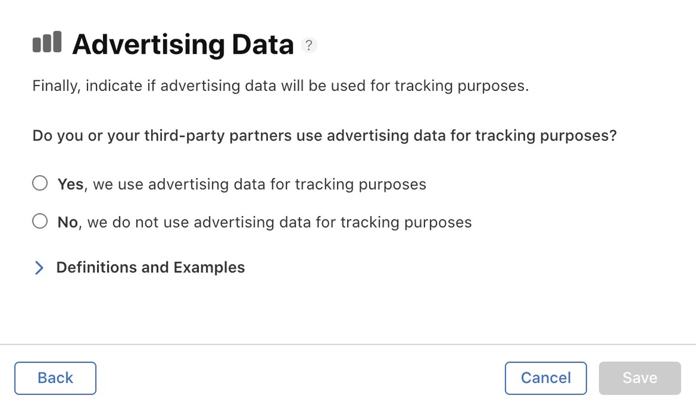

# ATT Questionnaire Part 2

## Introduction

In recent days, we have noticed that Apple sometimes asks additional questions regarding data collected by a developers game.  Though this doesn't always happen, when it does, it can be confusing.

Please see the pictures below for clarification.

**Questions and Answer**

**Answers: 1,3,5**

**Answer: Yes**

**Answer: Yes**

**Answer: Yes**

**Answers: 1,3,5**

**Answer: Yes**

**Answers: Yes**

**Answer: 1,3,5**

**Answer: Yes**

**Answers: 3,5**

**Answer: Yes**

**Answer: Yes**

**Answers: 1,3,5**
