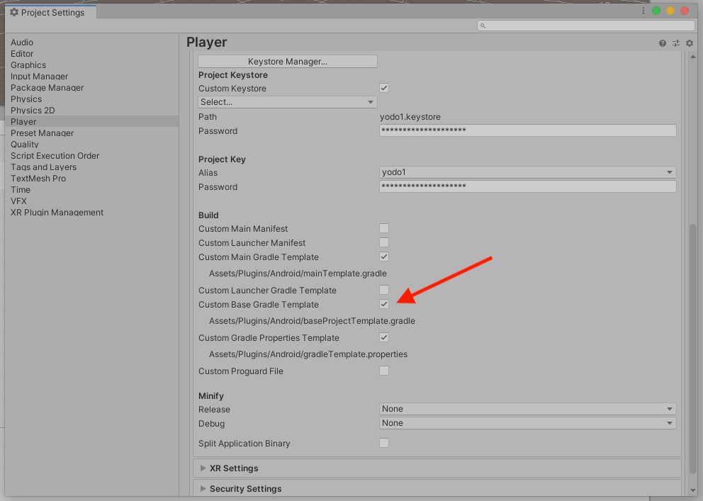
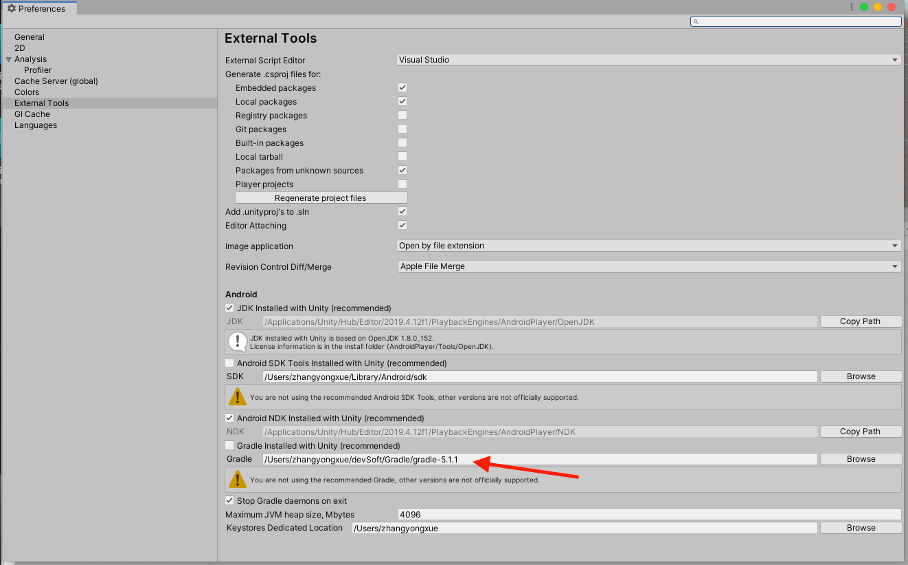
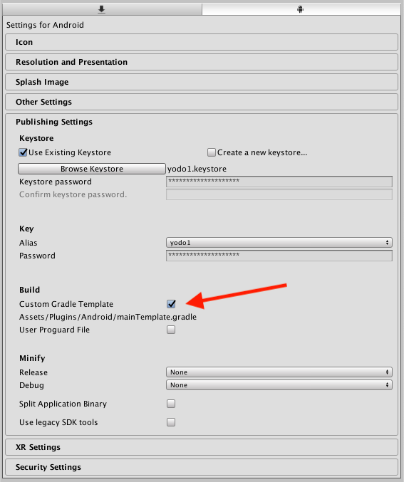
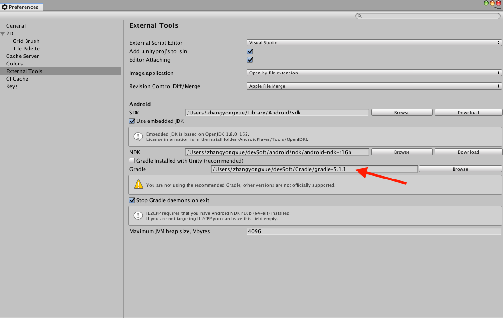

# AdMob Android Manifest Merging Errors

## Unity 2020
默认支持无需特殊设置

## Unity 2019

<center class="half">
    
</center>

* 找到 `File -> Build Setting -> Player Settings -> Publishing Settings -> Build` 如图1，并且勾选箭头所指选项
* 打开`Assets/Plugins/Android/` 目录下的 `baseProjectTemplate.gradle` 文件，修改 `gradle android` 插件版本 如：3.4.3
* 修改 Unity 使用的 Gradle 版本，使其与上面修改的插件版本匹配，如图2
* 点击 `Assets -> External Dependency Manager -> Android Resolver -> Force Resolve`


## Unity 2018

<center class="half">
    
</center>

* 找到`File -> Build Setting -> Player Settings -> Publishing Settings -> Build` 如图1，并且勾选箭头所指选项，
* 打开`Assets/Plugins/Android/` 目录下的 `mainTemplate.gradle` 文件，修改里面的 `gradle android` 插件版本 如：3.4.3
* 修改 Unity 使用的 Gradle 版本，使其与上面修改的 插件版本匹配，如图2
* 点击`Assets -> External Dependency Manager -> Android Resolver -> Force Resolve`,

## Unity 2017

<center class="half">
    
</center>

* 找到`File -> Build Setting -> Player Settings -> Publishing Settings -> Build`如图并且勾选箭头所指选项
* 打开`Assets/Plugins/Android/` 目录下的 `mainTemplate.gradle` 文件，修改里面的 `gradle android` 插件版本 如：3.4.3，
* 在`mainTemplate.gradle` 文件中进行如下设置
    ```
    multiDexEnabled true
    ```
    ```
    compileOptions {

        sourceCompatibility JavaVersion.VERSION_1_8

        targetCompatibility JavaVersion.VERSION_1_8

    }
    ```
 * 点击`Assets -> External Dependency Manager -> Android Resolver -> Force Resolve`
