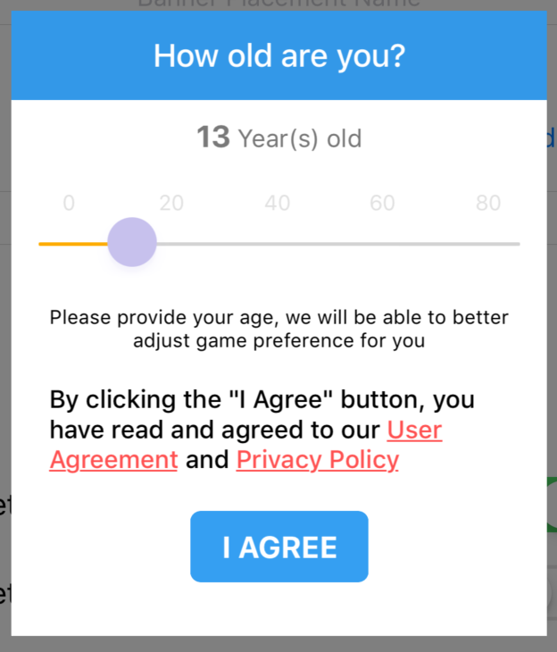

# Android Integration

> MAS supports Android version 4.4.+ (Android API level: 19+) and above
> 
> Need compileSdkVersion 31 from MAS SDK 4.6.1

## The Integration Steps
### 1. Open your project-level `build.gradle` and add the relevant code.

```groovy
mavenCentral()
maven { url "https://artifact.bytedance.com/repository/pangle" }
maven { url "https://android-sdk.is.com" }
maven { url "https://sdk.tapjoy.com/" }
maven {
    url 'http://maven.aliyun.com/nexus/content/repositories/releases/'
    allowInsecureProtocol = true
}
```

Use the code bellow if you need to comply with the Google Family Policy.

```groovy
mavenCentral()
maven { url "https://android-sdk.is.com" }
maven { url "https://sdk.tapjoy.com/" }
maven {
    url 'http://maven.aliyun.com/nexus/content/repositories/releases/'
    allowInsecureProtocol = true
}
```

Use the code bellow if you need to use lightweight SDK.

```groovy
mavenCentral()
```

**Note**: If you create your project under Android Studio Arctic Fox, the repositories should be added to settings.gradle

### 2. Open your app-level `build.gradle` and add the relevant code.
#### 2.1 Add a Gradle dependency

```groovy
implementation 'com.yodo1.mas:full:4.7.2'
```

If you need to comply with Google Family Policy:

```groovy
implementation 'com.yodo1.mas:google:4.7.2'
```

If you need to use lightweight SDK:

```groovy
implementation 'com.yodo1.mas:lite:4.7.2'
```

#### 2.2 Add the `compileOptions` property to the `Android` section
```ruby
android {
	compileOptions {
		sourceCompatibility = 1.8
		targetCompatibility = 1.8
	} 
}
```

### 3. Add the `MultiDex` property to the `defaultConfig` section

```
defaultConfig {
    ...
    multiDexEnabled true
    ...
}
```

### 4. Support AndroidX
Add the following content to the `gradle.properties` file

```ruby
android.useAndroidX=true
android.enableJetifier=true
```

### 5. Add AdMob App ID
* Add your `AdMob App ID` to your app's AndroidManifest.xml file by adding the `<meta-data>` tag 
* You can find your App ID in the MAS dashboard
* Please replace `android:value` with your own AdMob App ID

```xml
<manifest>
	<application>
	<!-- Sample AdMob App ID: ca-app-pub-3940256099942544~3347511713 -->
	<meta-data
		android:name="com.google.android.gms.ads.APPLICATION_ID"
		android:value="YOUR_ADMOB_APP_ID"/>
	</application>
</manifest>
```

### 6. AdMob Android Manifest Merging Errors
The AdMob SDK use the `<queries>` element in their bundled Android Manifest files. If you are on an incompatible version of the Android Gradle plugin, you will encounter the following build errors, respectively:

```xml
com.android.builder.internal.aapt.v2.Aapt2Exception: Android resource linking failed
error: unexpected element <queries> found in <manifest>.
```

You will need to upgrade to one of the following versions of the Android Gradle plugin that supports it:

| **Current Android Gradle Plugin Version** | **Supported Android Gradle Plugin Version** |
|  :-------------------------------------:  | :-----------------------------------------: |
|    4.1.*                                  |            Already Supported                |
|    4.0.*                                  |            4.0.1                            |
|    3.6.*                                  |            3.6.4                            |
|    3.5.*                                  |            3.5.4                            |
|    3.4.*                                  |            3.4.3                            |
|    3.3.*                                  |            3.3.3                            |


### 7. Android P Adaptation

To be compatible with `Android P (API level 28)`, please do the following:

* Create an XML folder in your resources folder
* Create an XML file named `network_security_config.xml` in the XML folder. In the `res/xml/network_security_config.xml` file, please add these lines

```xml
<?xml version="1.0" encoding="utf-8"?>
<network-security-config>
	...
	<base-config cleartextTrafficPermitted="true" />
	<domain-config cleartextTrafficPermitted="true">
	<domain includeSubdomains="true">127.0.0.1</domain>
	</domain-config>
	...
</network-security-config>  
```
* Next, add these lines to the application element in `AndroidManifest.xml`.

```xml
<?xml version="1.0" encoding="utf-8"?>
<manifest ... >
	<application android:networkSecurityConfig="@xml/network_security_config"
	... >
	...
	</application>
</manifest>
```

### 8. Comply With Necessary Legal Frameworks
Please comply with all legal frameworks that apply to your game and its users. You can find references to major legal frameworks and details about how to comply with them while using MAS through these links:

* [GDPR](privacy-gdpr.md)
* [COPPA](privacy-coppa.md)
* [CCPA](privacy-ccpa.md)


If you’re using MAS 4.3.0+, you can enable the built-in privacy compliance dialog in the SDK to collect user information:



1.Enable (Please call before initialization)

```java
    Yodo1MasAdBuildConfig config = new Yodo1MasAdBuildConfig.Builder()
                .enableUserPrivacyDialog(true) // default value is false
                .build();
    Yodo1Mas.getInstance().setAdBuildConfig(config);
```

2.Custom user agreement

```java
    Yodo1MasAdBuildConfig config = new Yodo1MasAdBuildConfig.Builder()
                .enableUserPrivacyDialog(true)
                .userAgreementUrl("Your user agreement url")
                .build();
    Yodo1Mas.getInstance().setAdBuildConfig(config);
```

3.Custom privacy policy 

```java
    Yodo1MasAdBuildConfig config = new Yodo1MasAdBuildConfig.Builder()
                .enableUserPrivacyDialog(true)
                .privacyPolicyUrl("Your privacy policy url")
                .build();
    Yodo1Mas.getInstance().setAdBuildConfig(config);
```
4.Custom The age verification pop up (optional)

```java
Yodo1MasUserPrivacyConfig agePopBuildConfig = new Yodo1MasUserPrivacyConfig.Builder()
        .titleBackgroundColor(Color.BLUE)
        .titleTextColor(Color.WHITE)
        .contentBackgroundColor(Color.WHITE)
        .contentTextColor(Color.BLACK)
        .buttonBackgroundColor(Color.BLUE)
        .buttonTextColor(Color.WHITE)
        .build();

Yodo1MasAdBuildConfig config = new Yodo1MasAdBuildConfig.Builder()
        .enableUserPrivacyDialog(true)
        .userPrivacyConfig(agePopBuildConfig)
        .build();
Yodo1Mas.getInstance().setAdBuildConfig(config);

```

**IMPORTANT**! Failure to comply with these frameworks can lead to **Google Play Store rejecting** your game, as well as a negative impact of your game’s monetization.

5.Get user age (optional)

```java
int age = Yodo1Mas.getInstance().getUserAge();
```

<font color=red>IMPORTANT!</font> `getUserAge()` must be called after the SDK is initialized.

### 9. Initialize the SDK
Initialize the SDK in the `onCreate` method of `Activity`

```java
protected void onCreate() {
  super.onCreate();
	Yodo1Mas.getInstance().init(this, "Your AppId", new Yodo1Mas.InitListener() {
	    @Override
	    public void onMasInitSuccessful() {
	        // 初始化成功
	    }
	
	    @Override
	    public void onMasInitFailed(@NonNull Yodo1MasError error) {
	        // 初始化失败
	    }
	});
}
```

### 10. ProGuard
If you're using ProGuard with the MAS SDK, add the following code to your ProGuard file (Android Studio: `proguard-rules.pro` or Eclipse: `proguard-project.txt`).

```
-ignorewarnings
-keeppackagenames com.yodo1.**
-keep class com.yodo1.** { *; }
-keep class com.yodo1.mas.** { *; }
-keep class com.yodo1.mas.ads.** {*;}
-keep class com.yodo1.mas.error.** { *; }
-keep class com.yodo1.mas.event.** { *; }
-keep class com.yodo1.mas.banner.** { *; }
-keep public class * extends com.yodo1.mas.mediation.Yodo1MasAdapterBase

-keep class com.google.ads.** { *; }

-keepclassmembers class com.ironsource.sdk.controller.IronSourceWebView$JSInterface {
public *;
}
-keepclassmembers class * implements android.os.Parcelable {
public static final android.os.Parcelable$Creator *;
}
-keep public class com.google.android.gms.ads.** {
public *;
}
-keep class com.ironsource.adapters.** {
*;
}
-dontwarn com.ironsource.mediationsdk.**
-dontwarn com.ironsource.adapters.**
-dontwarn com.moat.**
-keep class com.moat.** { public protected private *; }

-keepattributes SourceFile,LineNumberTable
-keepattributes JavascriptInterface
-keep class android.webkit.JavascriptInterface {
*;
}
-keep class com.unity3d.ads.** {
*;
}
-keep class com.unity3d.services.** {
*;
}
-dontwarn com.google.ar.core.**
-dontwarn com.unity3d.services.**
-dontwarn com.ironsource.adapters.unityads.**
-keepattributes Signature,InnerClasses,Exceptions,Annotation
-keep public class com.applovin.sdk.AppLovinSdk{
*;
}
-keep public class com.applovin.sdk.AppLovin* {
public protected *;
}
-keep public class com.applovin.nativeAds.AppLovin* {
public protected *;
}
-keep public class com.applovin.adview.* {
public protected *;
}
-keep public class com.applovin.mediation.* {
public protected *;
}
-keep public class com.applovin.mediation.ads.* {
public protected *;
}
-keep public class com.applovin.impl.*.AppLovin {
public protected *;
}
-keep public class com.applovin.impl.**.*Impl {
public protected *;
}
-keepclassmembers class com.applovin.sdk.AppLovinSdkSettings {
private java.util.Map localSettings;
}
-keep class com.applovin.mediation.adapters.** {
*;
}
-keep class com.applovin.mediation.adapter.**{
*;
}
-keep class com.chartboost.** {
*;
}
-dontwarn com.facebook.ads.internal.**
-keeppackagenames com.facebook.*
-keep public class com.facebook.ads.** {public protected *;}
-keep class com.tapjoy.** { *;}
-keep class com.moat.** { *;}
-keepattributes JavascriptInterface
-keepattributes *Annotation*
-keep class * extends java.util.ListResourceBundle {
protected Object[][] getContents();
}
-keep public class com.google.android.gms.common.internal.safeparcel.SafeParcelable {
public static final *** NULL;
}
-keepnames @com.google.android.gms.common.annotation.KeepName class * -keepclassmembernames class * {
@com.google.android.gms.common.annotation.KeepName *;
}
-keepnames class * implements android.os.Parcelable {
public static final ** CREATOR;
}
-keep class com.google.android.gms.ads.identifier.** { *;}
-dontwarn com.tapjoy.**

-keep class com.vungle.warren.** { *;}
-dontwarn com.vungle.warren.error.VungleError$ErrorCode
-keep class com.moat.** { *;}
-dontwarn com.moat.**
-dontwarn org.codehaus.mojo.animal_sniffer.IgnoreJRERequirement
-dontwarn okio.**
-dontwarn retrofit2.Platform$Java8
-keepattributes Signature
-keepattributes *Annotation*
-dontwarn sun.misc.**
-keep class com.google.gson.examples.android.model.** { *;}
-keep class * implements com.google.gson.TypeAdapterFactory
-keep class * implements com.google.gson.JsonSerializer
-keep class * implements com.google.gson.JsonDeserializer
-keep class com.google.android.gms.internal.** { *;}
-dontwarn com.google.android.gms.ads.identifier.**

-keepattributes SourceFile,LineNumberTable

-keep class com.my.target.** {*;}

-keep class com.yandex.mobile.ads.** {*;}
-dontwarn com.yandex.mobile.ads.**

-keepattributes *Annotation*

-keep public class com.bytedance.sdk.openadsdk.*{ public *;}

-dontwarn com.tencent.bugly.**
-keep public class com.tencent.bugly.**{*;}

-dontwarn com.sensorsdata.analytics.android.**
-keep class com.sensorsdata.analytics.android.** {
*;
}

-keep class com.yodo1.sensor.** {
*;
}

-keep class **.R$* {
<fields>;
}
-keep public class * extends android.content.ContentProvider
-keepnames class * extends android.view.View

-keep class * extends android.app.Fragment {
public void setUserVisibleHint(boolean);
public void onHiddenChanged(boolean);
public void onResume();
public void onPause();
}
-keep class android.support.v4.app.Fragment {
public void setUserVisibleHint(boolean);
public void onHiddenChanged(boolean);
public void onResume();
public void onPause();
}
-keep class * extends android.support.v4.app.Fragment {
public void setUserVisibleHint(boolean);
public void onHiddenChanged(boolean);
public void onResume();
public void onPause();
}

-dontwarn org.json.**
-keep class org.json.**{*;}

-keep public class com.bytedance.sdk.openadsdk.*{
public *;
}
-keepattributes SourceFile,LineNumberTable
-keep class com.inmobi.** {
*;
}
-keep public class com.google.android.gms.**
-dontwarn com.google.android.gms.**
-dontwarn com.squareup.picasso.**
-keep class com.google.android.gms.ads.identifier.AdvertisingIdClient{
public *;
}
-keep class com.google.android.gms.ads.identifier.AdvertisingIdClient$Info{
public *;
}
# skip the Picasso library classes
-keep class com.squareup.picasso.** {*;}
-dontwarn com.squareup.okhttp.**
# skip Moat classes
-keep class com.moat.** {*;}
-dontwarn com.moat.**
# skip IAB classes
-keep class com.iab.** {*;}
-dontwarn com.iab.**

-keep class com.umeng.** {*;}

-keep class com.uc.** {*;}

-keepclassmembers class * {
public <init> (org.json.JSONObject);
}
-keepclassmembers enum * {
public static **[] values();
public static ** valueOf(java.lang.String);
}
-keep class com.zui.** {*;}
-keep class com.miui.** {*;}
-keep class com.heytap.** {*;}
-keep class a.** {*;}
-keep class com.vivo.** {*;}

-keep class com.uc.crashsdk.** { *; }
-keep interface com.uc.crashsdk.** { *; }

-keep class com.alibaba.sdk.android.**{*;}
-keep class com.ut.**{*;}
-keep class com.ta.**{*;}
```

## Banner Integration
### 1. Set up the banner ad delegate method
```java
Yodo1Mas.getInstance().setBannerListener(new Yodo1Mas.BannerListener() {
    @Override
    public void onAdOpened(@NonNull Yodo1MasAdEvent event) {
    
    }

    @Override
    public void onAdError(@NonNull Yodo1MasAdEvent event, @NonNull Yodo1MasError error) {
    
    }

    @Override
    public void onAdClosed(@NonNull Yodo1MasAdEvent event) {
    
    }
});
```

### 2. Show banner ad

The method using the default parameters, align: `Yodo1Mas.BannerBottom | Yodo1Mas.BannerHorizontalCenter` and offset(X: 0,Y: 0)

```java
Yodo1Mas.getInstance().showBannerAd(MyActivity.this);
```

The method using the default offset(X: 0, Y: 0), you need to customize the banner alignment.

```java
int align = Yodo1Mas.BannerTop | Yodo1Mas.BannerHorizontalCenter;
Yodo1Mas.getInstance().showBannerAd(MyActivity.this, align);
```

The method need to customize the banner alignment and offset.

```java
int align = Yodo1Mas.BannerTop | Yodo1Mas.BannerHorizontalCenter;
int offsetX = 10; //offsetX > 0, the banner will move to the right. offsetX < 0, the banner will move to the left. if align = Yodo1Mas.BannerLeft, offsetX < 0 is invalid
int offsetY = 10; // offsetY > 0, the banner will move to the bottom. offsetY < 0, the banner will move to the top. if align = Yodo1Mas.BannerTop, offsetY < 0 is invalid
Yodo1Mas.getInstance().showBannerAd(MyActivity.this, align, offsetX, offsetY);
```

### 3. Dismiss banner ad
```java
Yodo1Mas.getInstance().dismissBannerAd();

boolean destroy = false; // if destroy == true, the ads displayed in the next call to showBanner are different. if destroy == false, the ads displayed in the next call to showBanner are same
Yodo1Mas.getInstance().dismissBannerAd(destroy);
```

## Banner(V2) Integration

### 1. Add Yodo1MasBannerAdView to the layout

The first step toward displaying a banner is to place `Yodo1MasBannerAdView` in the layout for the Activity or Fragment in which you'd like to display it. The easiest way to do this is to add one to the corresponding XML layout file. Here's an example that shows an activity's `Yodo1MasBannerAdView`:

```xml
...
	<com.yodo1.mas.banner.Yodo1MasBannerAdView 
		xmlns:masads="http://schemas.android.com/apk/res-auto"
		android:id="@+id/yodo1_mas_banner"
		android:layout_width="wrap_content"
		android:layout_height="wrap_content"
		android:layout_gravity="center_horizontal|top"
		masads:adSize="Banner" />
...
```

Note the following required attributes:

* masads:adSize - Set this to the ad size you'd like to use.

You can alternatively create `Yodo1MasBannerAdView` programmatically:

For Java

```java
Yodo1MasBannerAdView bannerAdView = new Yodo1MasBannerAdView(this);
bannerAdView.setAdSize(Yodo1MasBannerAdSize.Banner);
// TODO: Add bannerAdView to your view hierarchy.
```

For Kotlin

```kotlin
val bannerAdView = Yodo1MasBannerAdView(this)
bannerAdView.setAdSize(Yodo1MasBannerAdSize.Banner)
// TODO: Add bannerAdView to your view hierarchy.
```

#### Banner sizes
|  Size in dp   | Description  | Availability | AdSize constant |
|  :-----------  | :-----------  | :--------------- | :--------------- |
| 320x50  | Banner | Phones and Tablets | Banner |
| 320x100  | Large Banner | Phones and Tablets |  LargeBanner |
| 300x250  | IAB Medium Rectangle | Phones and Tablets |  IABMediumRectangle |
| Full screen width x Adaptive height | Adaptive banner | Phones and Tablets |  AdaptiveBanner |
| Screen width x 32/50/90  | Smart banner | Phones and Tablets | SmartBanner |

### 2. Load an ad

Once the `Yodo1MasBannerAdView` is in place, the next step is to load an ad. That's done with the `loadAd()` method in the `Yodo1MasBannerAdView` class.

Here's an example that shows how to load an ad in the `onCreate()` method of an `Activity`:

For Java

```java
package ...

import ...
import com.yodo1.mas.Yodo1Mas;
import com.yodo1.mas.banner.Yodo1MasBannerAdView;

public class MainActivity extends AppCompatActivity {
    private Yodo1MasBannerAdView bannerAdView;

    protected void onCreate(Bundle savedInstanceState) {
        super.onCreate(savedInstanceState);
        setContentView(R.layout.activity_main);

        Yodo1Mas.getInstance().init(this, "YourAppKey", new Yodo1Mas.InitListener() {
            @Override
            public void onMasInitSuccessful() {
            }

            @Override
            public void onMasInitFailed(@NonNull Yodo1MasError error) {
            }
        });

        bannerAdView = findViewById(R.id.yodo1_mas_banner);
        bannerAdView.loadAd();
    }
}
```

For Kotlin

```kotlin
package ...

import ...
import com.yodo1.mas.Yodo1Mas;
import com.yodo1.mas.banner.Yodo1MasBannerAdView;

class MainActivity : AppCompatActivity() {

    lateinit var bannerAdView : Yodo1MasBannerAdView

    override fun onCreate(savedInstanceState: Bundle?) {
        super.onCreate(savedInstanceState)
        setContentView(R.layout.activity_main)

        Yodo1Mas.getInstance().init(this, "YourAppKey", object : Yodo1Mas.InitListener {
        	override fun onMasInitSuccessful() {    
        		Toast.makeText(this@MainActivity, "[Yodo1 Mas] Successful initialization", Toast.LENGTH_SHORT).show()
        	} 
        	override fun onMasInitFailed(error: Yodo1MasError) {
        		Toast.makeText(this@MainActivity, error.message, Toast.LENGTH_SHORT).show()  
        	}
        })

        bannerAdView = findViewById(R.id.yodo1_mas_banner)
        bannerAdView.loadAd()
    }
}
```

That's it! Your app is now ready to display banner ads.

### 3. Ad events

To further customize the behavior of your ad, you can hook onto a number of events in the ad's lifecycle: loading, opening, closing, and so on. You can listen for these events through the `Yodo1MasBannerAdListener` class.

For Java

```java
package ...

import ...
import com.yodo1.mas.Yodo1Mas;
import com.yodo1.mas.banner.Yodo1MasBannerAdListener;
import com.yodo1.mas.banner.Yodo1MasBannerAdView;

public class MainActivity extends AppCompatActivity {
    private Yodo1MasBannerAdView bannerAdView;

    protected void onCreate(Bundle savedInstanceState) {
        super.onCreate(savedInstanceState);
        setContentView(R.layout.activity_main);

        Yodo1Mas.getInstance().init(this, "YourAppKey", new Yodo1Mas.InitListener() {
            @Override
            public void onMasInitSuccessful() {
            }

            @Override
            public void onMasInitFailed(@NonNull Yodo1MasError error) {
            }
        });

        bannerAdView = findViewById(R.id.yodo1_mas_banner);
        bannerAdView.setAdListener(new Yodo1MasBannerAdListener() {
		    @Override
		    public void onBannerAdLoaded(Yodo1MasBannerAdView bannerAdView) {
		        // Code to be executed when an ad finishes loading.
		    }
		
		    @Override
		    public void onBannerAdFailedToLoad(Yodo1MasBannerAdView bannerAdView, @NonNull Yodo1MasError error) {
		        // Code to be executed when an ad request fails.
		    }
		
		    @Override
		    public void onBannerAdOpened(Yodo1MasBannerAdView bannerAdView) {
		        // Code to be executed when an ad opens an overlay that
		        // covers the screen.
		    }
		
		    @Override
		    public void onBannerAdFailedToOpen(Yodo1MasBannerAdView bannerAdView, @NonNull Yodo1MasError error) {
				// Code to be executed when an ad open fails.
		    }
		
		    @Override
		    public void onBannerAdClosed(Yodo1MasBannerAdView bannerAdView) {
		        // Code to be executed when the user is about to return
		        // to the app after tapping on an ad.
		    }
		 });
        bannerAdView.loadAd();
    }
}
```

For Kotlin

```kotlin
package ...

import ...
import com.yodo1.mas.Yodo1Mas;
import com.yodo1.mas.banner.Yodo1MasBannerAdListener;
import com.yodo1.mas.banner.Yodo1MasBannerAdView;

class MainActivity : AppCompatActivity() {

    lateinit var bannerAdView : Yodo1MasBannerAdView

    override fun onCreate(savedInstanceState: Bundle?) {
        super.onCreate(savedInstanceState)
        setContentView(R.layout.activity_main)

        Yodo1Mas.getInstance().init(this, "YourAppKey", object : Yodo1Mas.InitListener {
        	override fun onMasInitSuccessful() {    
        		Toast.makeText(this@MainActivity, "[Yodo1 Mas] Successful initialization", Toast.LENGTH_SHORT).show()
        	} 
        	override fun onMasInitFailed(error: Yodo1MasError) {
        		Toast.makeText(this@MainActivity, error.message, Toast.LENGTH_SHORT).show()  
        	}
        })

        bannerAdView = findViewById(R.id.yodo1_mas_banner)
        bannerAdView.setAdListener(object : Yodo1MasBannerAdListener {
            override fun onBannerAdLoaded(bannerAdView: Yodo1MasBannerAdView?) {
                // Code to be executed when an ad finishes loading.
            }

            override fun onBannerAdFailedToLoad(
                bannerAdView: Yodo1MasBannerAdView?,
                error: Yodo1MasError
            ) {
                // Code to be executed when an ad request fails.
            }

            override fun onBannerAdOpened(bannerAdView: Yodo1MasBannerAdView?) {
                // Code to be executed when an ad opens an overlay that
		         // covers the screen.
            }

            override fun onBannerAdFailedToOpen(
                bannerAdView: Yodo1MasBannerAdView?,
                error: Yodo1MasError
            ) {
                // Code to be executed when an ad open fails.
            }

            override fun onBannerAdClosed(bannerAdView: Yodo1MasBannerAdView?) {
                // Code to be executed when the user is about to return
		         // to the app after tapping on an ad.

            }

        })
        bannerAdView.loadAd()
    }
}
```

## Interstitial Integration

### 1. Set the interstitial ad delegate method

```java
Yodo1Mas.getInstance().setInterstitialListener(new Yodo1Mas.InterstitialListener() {

     @Override
    public void onAdLoaded(@NonNull Yodo1MasAdEvent event) {

    }

    @Override
    public void onAdLoadError(@NonNull Yodo1MasError error) {

    }

    @Override
    public void onAdOpened(@NonNull Yodo1MasAdEvent event) {
    }

    @Override
    public void onAdOpenError(@NonNull Yodo1MasError error) {

    }

    @Override
    public void onAdClosed(@NonNull Yodo1MasAdEvent event) {
    
    }
});      
```

### 2. Check the loading status of interstitials

```java
boolean isLoaded = Yodo1Mas.getInstance().isInterstitialAdLoaded();
```

### 3. Show interstitial ad

```java
Yodo1Mas.getInstance().showInterstitialAd(MyActivity.this);
```

## Interstitial(V2) Integration

### 1. Init Yodo1MasInterstitialAd
For Java

```java
Yodo1MasInterstitialAd interstitialAd = Yodo1MasInterstitialAd.getInstance();
```

For Kotlin

```kotlin
val interstitialAd = Yodo1MasInterstitialAd.getInstance()
```

### 2. Load an ad

Once the `Yodo1MasInterstitialAd` is in place, the next step is to load an ad. That's done with the `loadAd()` method in the `Yodo1MasInterstitialAd` class.

Here's an example that shows how to load an ad in the `onCreate()` method of an `Activity`:

For Java

```java
package ...

import ...
import com.yodo1.mas.Yodo1Mas;
import com.yodo1.mas.interstitial.Yodo1MasInterstitialAd;

public class MainActivity extends AppCompatActivity {
    private Yodo1MasInterstitialAd interstitialAd = Yodo1MasInterstitialAd.getInstance();

    protected void onCreate(Bundle savedInstanceState) {
        super.onCreate(savedInstanceState);
        setContentView(R.layout.activity_main);

        Yodo1Mas.getInstance().init(this, "YourAppKey", new Yodo1Mas.InitListener() {
            @Override
            public void onMasInitSuccessful() {
            }

            @Override
            public void onMasInitFailed(@NonNull Yodo1MasError error) {
            }
        });
        interstitialAd.loadAd();
    }
}
```

For Kotlin

```kotlin
package ...

import ...
import com.yodo1.mas.Yodo1Mas;
import com.yodo1.mas.interstitial.Yodo1MasInterstitialAd;

class MainActivity : AppCompatActivity() {

    val interstitialAd = Yodo1MasInterstitialAd.getInstance()

    override fun onCreate(savedInstanceState: Bundle?) {
        super.onCreate(savedInstanceState)
        setContentView(R.layout.activity_main)

        Yodo1Mas.getInstance().init(this, "YourAppKey", object : Yodo1Mas.InitListener {
        	override fun onMasInitSuccessful() {    
        		Toast.makeText(this@MainActivity, "[Yodo1 Mas] Successful initialization", Toast.LENGTH_SHORT).show()
        	} 
        	override fun onMasInitFailed(error: Yodo1MasError) {
        		Toast.makeText(this@MainActivity, error.message, Toast.LENGTH_SHORT).show()  
        	}
        })

        interstitialAd.loadAd()
    }
}
```

That's it! Your app is now ready to display banner ads.

### 3. Ad events

To further customize the behavior of your ad, you can hook onto a number of events in the ad's lifecycle: loading, opening, closing, and so on. You can listen for these events through the `Yodo1MasInterstitialAdListener` class.

For Java

```java
package ...

import ...
import com.yodo1.mas.Yodo1Mas;
import com.yodo1.mas.interstitial.Yodo1MasInterstitialAd;
import com.yodo1.mas.interstitial.Yodo1MasInterstitialAdListener;

public class MainActivity extends AppCompatActivity {
    private Yodo1MasInterstitialAd interstitialAd = Yodo1MasInterstitialAd.getInstance();

    protected void onCreate(Bundle savedInstanceState) {
        super.onCreate(savedInstanceState);
        setContentView(R.layout.activity_main);

        Yodo1Mas.getInstance().init(this, "YourAppKey", new Yodo1Mas.InitListener() {
            @Override
            public void onMasInitSuccessful() {
            }

            @Override
            public void onMasInitFailed(@NonNull Yodo1MasError error) {
            }
        });

        interstitialAd.setAdListener(new Yodo1MasInterstitialAdListener() {
		    @Override
		    public void onInterstitialAdLoaded(Yodo1MasInterstitialAd ad) {
		        // Code to be executed when an ad finishes loading.
                ad.showAd(MainActivity.this)
		    }
		
		    @Override
		    public void onInterstitialAdFailedToLoad(Yodo1MasInterstitialAd ad, @NonNull Yodo1MasError error) {
		        // Code to be executed when an ad request fails.
		    }
		
		    @Override
		    public void onInterstitialAdOpened(Yodo1MasInterstitialAd ad) {
		        // Code to be executed when an ad opens an overlay that
		        // covers the screen.
		    }
		
		    @Override
		    public void onInterstitialAdFailedToOpen(Yodo1MasInterstitialAd ad, @NonNull Yodo1MasError error) {
				// Code to be executed when an ad open fails.
		    }
		
		    @Override
		    public void onInterstitialAdClosed(Yodo1MasInterstitialAd ad) {
		        // Code to be executed when the user is about to return
		        // to the app after tapping on an ad.
		    }
		 });
        interstitialAd.loadAd();
    }
}
```

For Kotlin

```kotlin
package ...

import ...
import com.yodo1.mas.Yodo1Mas;
import com.yodo1.mas.interstitial.Yodo1MasInterstitialAd;
import com.yodo1.mas.interstitial.Yodo1MasInterstitialAdListener;

class MainActivity : AppCompatActivity() {

    val interstitialAd = Yodo1MasInterstitialAd.getInstance()

    override fun onCreate(savedInstanceState: Bundle?) {
        super.onCreate(savedInstanceState)
        setContentView(R.layout.activity_main)

        Yodo1Mas.getInstance().init(this, "YourAppKey", object : Yodo1Mas.InitListener {
        	override fun onMasInitSuccessful() {    
        		Toast.makeText(this@MainActivity, "[Yodo1 Mas] Successful initialization", Toast.LENGTH_SHORT).show()
        	} 
        	override fun onMasInitFailed(error: Yodo1MasError) {
        		Toast.makeText(this@MainActivity, error.message, Toast.LENGTH_SHORT).show()  
        	}
        })

        interstitialAd.setAdListener(object : Yodo1MasInterstitialAdListener {
            override fun onInterstitialAdLoaded(ad: Yodo1MasInterstitialAd?) {
                // Code to be executed when an ad finishes loading.
                ad.showAd(this@MainActivity)
            }

            override fun onInterstitialAdFailedToLoad(
                ad: Yodo1MasInterstitialAd?,
                error: Yodo1MasError
            ) {
                // Code to be executed when an ad request fails.
            }

            override fun onInterstitialAdOpened(ad: Yodo1MasInterstitialAd?) {
                // Code to be executed when an ad opens an overlay that
		         // covers the screen.
            }

            override fun onInterstitialAdFailedToOpen(
                ad: Yodo1MasInterstitialAd?,
                error: Yodo1MasError
            ) {
                // Code to be executed when an ad open fails.
            }

            override fun onInterstitialAdClosed(ad: Yodo1MasInterstitialAd?) {
                // Code to be executed when the user is about to return
		         // to the app after tapping on an ad.

            }

        })
        interstitialAd.loadAd()
    }
}
```

## Rewarded Video Integration

### 1. Set up rewarded video ad delegate methods

```java
Yodo1Mas.getInstance().setRewardListener(new Yodo1Mas.RewardListener() {
    @Override
    public void onAdLoaded(@NonNull Yodo1MasAdEvent event) {

    }

    @Override
    public void onAdLoadError(@NonNull Yodo1MasError error) {

    }

    @Override
    public void onAdOpened(@NonNull Yodo1MasAdEvent event) {

    }

    @Override
    public void onAdOpenError(@NonNull Yodo1MasError error) {

    }

    @Override
    public void onAdvertRewardEarned(@NonNull Yodo1MasAdEvent event) {

    }
    
    @Override
    public void onAdClosed(@NonNull Yodo1MasAdEvent event) {
        
    }
});
```

### 2. Check the loading status of rewarded video ads

```java
boolean isLoaded = Yodo1Mas.getInstance().isBannerAdLoaded();
```

### 3. Show rewarded video ads

```java
Yodo1Mas.getInstance().showRewardedAd(MyActivity.this);
```

## Rewarded(V2) Integration

### 1. Init Yodo1MasRewardlAd
For Java

```java
Yodo1MasRewardlAd rewardAd = Yodo1MasRewardlAd.getInstance();
```

For Kotlin

```kotlin
val rewardAd = Yodo1MasRewardlAd.getInstance()
```

### 2. Load an ad

Once the `Yodo1MasRewardlAd` is in place, the next step is to load an ad. That's done with the `loadAd()` method in the `Yodo1MasRewardlAd` class.

Here's an example that shows how to load an ad in the `onCreate()` method of an `Activity`:

For Java

```java
package ...

import ...
import com.yodo1.mas.Yodo1Mas;
import com.yodo1.mas.reward.Yodo1MasRewardlAd;

public class MainActivity extends AppCompatActivity {
    private Yodo1MasRewardlAd rewardAd = Yodo1MasRewardlAd.getInstance();

    protected void onCreate(Bundle savedInstanceState) {
        super.onCreate(savedInstanceState);
        setContentView(R.layout.activity_main);

        Yodo1Mas.getInstance().init(this, "YourAppKey", new Yodo1Mas.InitListener() {
            @Override
            public void onMasInitSuccessful() {
            }

            @Override
            public void onMasInitFailed(@NonNull Yodo1MasError error) {
            }
        });
        rewardAd.loadAd();
    }
}
```

For Kotlin

```kotlin
package ...

import ...
import com.yodo1.mas.Yodo1Mas;
import com.yodo1.mas.reward.Yodo1MasRewardAd;

class MainActivity : AppCompatActivity() {

    val rewardAd = Yodo1MasRewardAd.getInstance()

    override fun onCreate(savedInstanceState: Bundle?) {
        super.onCreate(savedInstanceState)
        setContentView(R.layout.activity_main)

        Yodo1Mas.getInstance().init(this, "YourAppKey", object : Yodo1Mas.InitListener {
        	override fun onMasInitSuccessful() {    
        		Toast.makeText(this@MainActivity, "[Yodo1 Mas] Successful initialization", Toast.LENGTH_SHORT).show()
        	} 
        	override fun onMasInitFailed(error: Yodo1MasError) {
        		Toast.makeText(this@MainActivity, error.message, Toast.LENGTH_SHORT).show()  
        	}
        })

        rewardAd.loadAd()
    }
}
```

That's it! Your app is now ready to display banner ads.

### 3. Ad events

To further customize the behavior of your ad, you can hook onto a number of events in the ad's lifecycle: loading, opening, closing, and so on. You can listen for these events through the `Yodo1MasRewardAdListener` class.

For Java

```java
package ...

import ...
import com.yodo1.mas.Yodo1Mas;
import com.yodo1.mas.reward.Yodo1MasRewardAd;
import com.yodo1.mas.reward.Yodo1MasRewardAdListener;

public class MainActivity extends AppCompatActivity {
    private Yodo1MasRewardAd rewardAd = Yodo1MasRewardAd.getInstance();

    protected void onCreate(Bundle savedInstanceState) {
        super.onCreate(savedInstanceState);
        setContentView(R.layout.activity_main);

        Yodo1Mas.getInstance().init(this, "YourAppKey", new Yodo1Mas.InitListener() {
            @Override
            public void onMasInitSuccessful() {
            }

            @Override
            public void onMasInitFailed(@NonNull Yodo1MasError error) {
            }
        });

        rewardAd.setAdListener(new Yodo1MasRewardAdListener() {
		    @Override
		    public void onRewardAdLoaded(Yodo1MasRewardAd ad) {
		        // Code to be executed when an ad finishes loading.
                ad.showAd(MainActivity.this)
		    }
		
		    @Override
		    public void onRewardAdFailedToLoad(Yodo1MasRewardAd ad, @NonNull Yodo1MasError error) {
		        // Code to be executed when an ad request fails.
		    }
		
		    @Override
		    public void onRewardAdOpened(Yodo1MasRewardAd ad) {
		        // Code to be executed when an ad opens an overlay that
		        // covers the screen.
		    }
		
		    @Override
		    public void onRewardAdFailedToOpen(Yodo1MasRewardAd ad, @NonNull Yodo1MasError error) {
				// Code to be executed when an ad open fails.
		    }
		
		    @Override
		    public void onRewardAdClosed(Yodo1MasRewardAd ad) {
		        // Code to be executed when the user is about to return
		        // to the app after tapping on an ad.
		    }

            @Override
            public void onRewardAdEarned(Yodo1MasRewardAd ad) {
            
            }
		 });
        rewardAd.loadAd();
    }
}
```

For Kotlin

```kotlin
package ...

import ...
import com.yodo1.mas.Yodo1Mas;
import com.yodo1.mas.reward.Yodo1MasRewardAd;
import com.yodo1.mas.reward.Yodo1MasRewardAdListener;

class MainActivity : AppCompatActivity() {

    val rewardAd = Yodo1MasRewardAd.getInstance()

    override fun onCreate(savedInstanceState: Bundle?) {
        super.onCreate(savedInstanceState)
        setContentView(R.layout.activity_main)

        Yodo1Mas.getInstance().init(this, "YourAppKey", object : Yodo1Mas.InitListener {
        	override fun onMasInitSuccessful() {    
        		Toast.makeText(this@MainActivity, "[Yodo1 Mas] Successful initialization", Toast.LENGTH_SHORT).show()
        	} 
        	override fun onMasInitFailed(error: Yodo1MasError) {
        		Toast.makeText(this@MainActivity, error.message, Toast.LENGTH_SHORT).show()  
        	}
        })

        rewardAd.setAdListener(object : Yodo1MasRewardAdListener {
            override fun onRewardAdLoaded(ad: Yodo1MasRewardAd?) {
                // Code to be executed when an ad finishes loading.
                ad.showAd(this@MainActivity)
            }

            override fun onRewardAdFailedToLoad(
                ad: Yodo1RewardAd?,
                error: Yodo1MasError
            ) {
                // Code to be executed when an ad request fails.
            }

            override fun onRewardAdOpened(ad: Yodo1MasRewardAd?) {
                // Code to be executed when an ad opens an overlay that
		         // covers the screen.
            }

            override fun onRewardAdFailedToOpen(
                ad: Yodo1MasRewardAd?,
                error: Yodo1MasError
            ) {
                // Code to be executed when an ad open fails.
            }

            override fun onRewardAdClosed(ad: Yodo1MasRewardAd?) {
                // Code to be executed when the user is about to return
		         // to the app after tapping on an ad.
            }

            override fun onRewardAdEarned(ad: Yodo1MasRewardAd?) {
               
            }
        })
        reweardAd.loadAd()
    }
}
```

## Native Ads (Template) Integration
### 1. Add Yodo1MasNativeAdView to the layout

The first step toward displaying a native is to place `Yodo1MasNativeAdView` in the layout for the Activity or Fragment in which you'd like to display it. The easiest way to do this is to add one to the corresponding XML layout file. Here's an example that shows an activity's `Yodo1MasNativeAdView`:

```xml
...
	<com.yodo1.mas.nativeads.Yodo1MasNativeAdView 
		xmlns:masads="http://schemas.android.com/apk/res-auto"
		android:id="@+id/yodo1_mas_native"
		android:layout_width="match_parent"
		android:layout_height="300dp"
		android:layout_gravity="center_horizontal|top"/>
...
```

You can alternatively create `Yodo1MasNativeAdView` programmatically:

For Java

```java
Yodo1MasNativeAdView nativeAdView = new Yodo1MasNativeAdView(this);
nativeAdView.setLayoutParams(new ViewGroup.LayoutParams(ViewGroup.LayoutParams.MATCH_PARENT, dp2px(300)));
// TODO: Add nativeAdView to your view hierarchy.
```

For Kotlin

```kotlin
val nativeAdView = Yodo1MasNativeAdView(this)
nativeAdView.setLayoutParams(ViewGroup.LayoutParams(ViewGroup.LayoutParams.MATCH_PARENT, dp2px(300)))
// TODO: Add nativeAdView to your view hierarchy.
```

### 2. Load an ad

Once the `Yodo1MasNativeAdView` is in place, the next step is to load an ad. That's done with the `loadAd()` method in the `Yodo1MasNativeAdView` class.

Here's an example that shows how to load an ad in the `onCreate()` method of an `Activity`:

For Java

```java
package ...

import ...
import com.yodo1.mas.Yodo1Mas;
import com.yodo1.mas.nativeads.Yodo1MasNativeAdView;

public class MainActivity extends AppCompatActivity {
    private Yodo1MasNativeAdView nativeAdView;

    protected void onCreate(Bundle savedInstanceState) {
        super.onCreate(savedInstanceState);
        setContentView(R.layout.activity_main);

        Yodo1Mas.getInstance().init(this, "YourAppKey", new Yodo1Mas.InitListener() {
            @Override
            public void onMasInitSuccessful() {
            }

            @Override
            public void onMasInitFailed(@NonNull Yodo1MasError error) {
            }
        });

        nativeAdView = findViewById(R.id.yodo1_mas_native);
        nativeAdView.loadAd();
    }
}
```

For Kotlin

```kotlin
package ...

import ...
import com.yodo1.mas.Yodo1Mas;
import com.yodo1.mas.nativeads.Yodo1MasNativeAdView;

class MainActivity : AppCompatActivity() {

    lateinit var nativeAdView : Yodo1MasNativeAdView

    override fun onCreate(savedInstanceState: Bundle?) {
        super.onCreate(savedInstanceState)
        setContentView(R.layout.activity_main)

        Yodo1Mas.getInstance().init(this, "YourAppKey", object : Yodo1Mas.InitListener {
        	override fun onMasInitSuccessful() {    
        		Toast.makeText(this@MainActivity, "[Yodo1 Mas] Successful initialization", Toast.LENGTH_SHORT).show()
        	} 
        	override fun onMasInitFailed(error: Yodo1MasError) {
        		Toast.makeText(this@MainActivity, error.message, Toast.LENGTH_SHORT).show()  
        	}
        })

        nativeAdView = findViewById(R.id.yodo1_mas_native)
        nativeAdView.loadAd()
    }
}
```

That's it! Your app is now ready to display native ads.

### 3. Ad events

To further customize the behavior of your ad, you can hook onto a number of events in the ad's lifecycle: loading, opening, closing, and so on. You can listen for these events through the `Yodo1MasNativeAdListener` class.

For Java

```java
package ...

import ...
import com.yodo1.mas.Yodo1Mas;
import com.yodo1.mas.nativeads.Yodo1MasNativeAdListener;
import com.yodo1.mas.nativeads.Yodo1MasNativeAdView;

public class MainActivity extends AppCompatActivity {
    private Yodo1MasNativeAdView nativeAdView;

    protected void onCreate(Bundle savedInstanceState) {
        super.onCreate(savedInstanceState);
        setContentView(R.layout.activity_main);

        Yodo1Mas.getInstance().init(this, "YourAppKey", new Yodo1Mas.InitListener() {
            @Override
            public void onMasInitSuccessful() {
            }

            @Override
            public void onMasInitFailed(@NonNull Yodo1MasError error) {
            }
        });

        nativeAdView = findViewById(R.id.yodo1_mas_native);
        nativeAdView.setAdListener(new Yodo1MasNativeAdListener() {
		    @Override
		    public void onNativeAdLoaded(Yodo1MasNativeAdView nativeAdView) {
		        // Code to be executed when an ad finishes loading.
		    }
		
		    @Override
		    public void onNativeAdFailedToLoad(Yodo1MasNativeAdView nativeAdView, @NonNull Yodo1MasError error) {
		        // Code to be executed when an ad request fails.
		    }
		 });
        nativeAdView.loadAd();
    }
}
```

For Kotlin

```kotlin
package ...

import ...
import com.yodo1.mas.Yodo1Mas;
import com.yodo1.mas.nativeads.Yodo1MasNativeAdListener;
import com.yodo1.mas.nativeads.Yodo1MasNativeAdView;

class MainActivity : AppCompatActivity() {

    lateinit var nativeAdView : Yodo1MasNativeAdView

    override fun onCreate(savedInstanceState: Bundle?) {
        super.onCreate(savedInstanceState)
        setContentView(R.layout.activity_main)

        Yodo1Mas.getInstance().init(this, "YourAppKey", object : Yodo1Mas.InitListener {
        	override fun onMasInitSuccessful() {    
        		Toast.makeText(this@MainActivity, "[Yodo1 Mas] Successful initialization", Toast.LENGTH_SHORT).show()
        	} 
        	override fun onMasInitFailed(error: Yodo1MasError) {
        		Toast.makeText(this@MainActivity, error.message, Toast.LENGTH_SHORT).show()  
        	}
        })

        nativeAdView = findViewById(R.id.yodo1_mas_native)
        nativeAdView.setAdListener(object : Yodo1MasNativeAdListener {
            override fun onNativeAdLoaded(nativeAdView: Yodo1MasNativeAdView?) {
                // Code to be executed when an ad finishes loading.
            }

            override fun onNativeAdFailedToLoad(nativeAdView: Yodo1MasNativeAdView?, error: Yodo1MasError) {
                // Code to be executed when an ad request fails.
            }
        })
        nativeAdView.loadAd()
    }
}
```

## Native Ads (Manual) Integration
### 1. Create a custom view, such as
### `XML`
`native_custom_ad_view.xml`
```xml
<!-- native_custom_ad_view.xml -->
<?xml version="1.0" encoding="utf-8"?>
<androidx.constraintlayout.widget.ConstraintLayout 
		xmlns:android="http://schemas.android.com/apk/res/android"
    android:layout_width="match_parent"
    android:layout_height="wrap_content">
    <ImageView
        android:id="@+id/icon_image_view"
		    … />
    <LinearLayout
        android:id="@+id/ad_options_view"
		    … />
    <TextView
        android:id="@+id/title_text_view"
		    … />
    <TextView
        android:id="@+id/advertiser_textView"
		    … />
    <TextView
        android:id="@+id/body_text_view"
		    … />
    <FrameLayout
        android:id="@+id/media_view_container"
		    … />
    <Button
        android:id="@+id/cta_button"
		    … />
</androidx.constraintlayout.widget.ConstraintLayout>
```
### `Code`
For `Java`
```java
import android.content.Context;
import android.util.AttributeSet;
import android.view.View;
import android.widget.Button;
import android.widget.FrameLayout;
import android.widget.ImageView;
import android.widget.LinearLayout;
import android.widget.TextView;

import androidx.annotation.IdRes;
import androidx.annotation.NonNull;
import androidx.annotation.Nullable;
import androidx.constraintlayout.widget.ConstraintLayout;

public class NativeCustomAdView extends ConstraintLayout {

    private ImageView iconImageView;
    private LinearLayout adOptionsView;
    private TextView titleTextView;
    private TextView advertiserTextView;
    private TextView bodyTextView;
    private FrameLayout mediaViewContainer;
    private Button ctaButton;

    public NativeCustomAdView(@NonNull Context context) {
        super(context);
        initView();
    }

    public NativeCustomAdView(@NonNull Context context, @Nullable AttributeSet attrs) {
        super(context, attrs);
        initView();
    }

    public NativeCustomAdView(@NonNull Context context, @Nullable AttributeSet attrs, int defStyleAttr) {
        super(context, attrs, defStyleAttr);
        initView();
    }

    private void initView() {
        Context context = getContext();
        if (context == null) return;
        iconImageView = new ImageView(context);
        iconImageView.setId(R.id.icon_image_view);
				// set layout
				...
        addView(iconImageView);

        adOptionsView = new LinearLayout(context);
        adOptionsView.setId(R.id.options_view);
				// set layout
				...
        addView(adOptionsView);

        titleTextView = new TextView(context);
        titleTextView.setId(R.id.title_text_view);
				// set layout
				...
        addView(titleTextView);

        advertiserTextView = new TextView(context);
        advertiserTextView.setId(R.id.advertiser_textView);
				// set layout
				...
        addView(advertiserTextView);

        bodyTextView = new TextView(context);
        bodyTextView.setId(R.id.body_text_view);
				// set layout
				...
        addView(bodyTextView);

        mediaViewContainer = new FrameLayout(context);
        mediaViewContainer.setId(R.id.media_view_container);
				// set layout
				...
        addView(mediaViewContainer);

        ctaButton = new Button(context);
        ctaButton.setId(R.id.cta_button);
				// set layout
				...
        addView(ctaButton);
    }
}
```
For `Kotlin`
```kotlin
import android.content.Context
import android.util.AttributeSet
import android.widget.*
import androidx.constraintlayout.widget.ConstraintLayout


class NativeCustomAdView: ConstraintLayout {
    private var iconImageView: ImageView? = null
    private var adOptionsView: LinearLayout? = null
    private var titleTextView: TextView? = null
    private var advertiserTextView: TextView? = null
    private var bodyTextView: TextView? = null
    private var mediaViewContainer: FrameLayout? = null
    private var ctaButton: Button? = null

    constructor(context: Context) : super(context) {
        initView()
    }
    constructor(context: Context, attrs: AttributeSet?) : super(context, attrs) {
        initView()
    }
    constructor(context: Context, attrs: AttributeSet?, defStyleAttr: Int) : super(
        context,
        attrs,
        defStyleAttr
    ) {
        initView()
    }

    private fun initView() {
        if (context == null) return;
        iconImageView = ImageView(context);
        iconImageView?.id = R.id.icon_image_view
        // set layout
        ...
        addView(iconImageView);

        adOptionsView = LinearLayout(context);
        adOptionsView?.id = R.id.options_view
        // set layout
        ...
        addView(adOptionsView);

        titleTextView = TextView(context);
        titleTextView?.id = R.id.title_text_view
        // set layout
        ...
        addView(titleTextView);

        advertiserTextView = TextView(context);
        advertiserTextView?.id = R.id.advertiser_textView
        // set layout
        ...
        addView(advertiserTextView);

        bodyTextView = TextView(context);
        bodyTextView?.id = R.id.body_text_view
        // set layout
        ...
        addView(bodyTextView);

        mediaViewContainer = FrameLayout(context);
        mediaViewContainer?.id = R.id.media_view_container
        // set layout
        ...
        addView(mediaViewContainer);

        ctaButton = Button(context);
        ctaButton?.id = R.id.cta_button
        // set layout
        ...
        addView(ctaButton);
    }
}
```

### 2. Add Yodo1MasNativeAdView to the layout

The first step toward displaying a native is to place `Yodo1MasNativeAdView` in the layout for the Activity or Fragment in which you'd like to display it. The easiest way to do this is to add one to the corresponding XML layout file. Here's an example that shows an activity's `Yodo1MasNativeAdView`:

```xml
...
	<com.yodo1.mas.nativeads.Yodo1MasNativeAdView 
		xmlns:masads="http://schemas.android.com/apk/res-auto"
		android:id="@+id/yodo1_mas_native"
		android:layout_width="match_parent"
		android:layout_height="300dp"
		android:layout_gravity="center_horizontal|top"/>
...
```

You can alternatively create `Yodo1MasNativeAdView` programmatically:

For `Java`

```java
Yodo1MasNativeAdView nativeAdView = new Yodo1MasNativeAdView(this);
nativeAdView.setLayoutParams(new ViewGroup.LayoutParams(ViewGroup.LayoutParams.MATCH_PARENT, dp2px(300)));
// TODO: Add nativeAdView to your view hierarchy.
```

For `Kotlin`

```kotlin
val nativeAdView = Yodo1MasNativeAdView(this)
nativeAdView.setLayoutParams(ViewGroup.LayoutParams(ViewGroup.LayoutParams.MATCH_PARENT, dp2px(300)))
// TODO: Add nativeAdView to your view hierarchy.
```

### 3. Set up custom layouts and load ads

Once the `Yodo1MasNativeAdView` is in place, the next step is to load an ad. That's done with the `loadAd()` method in the `Yodo1MasNativeAdView` class.

Here's an example that shows how to load an ad in the `onCreate()` method of an `Activity`:

For Java

```java
package ...

import ...
import com.yodo1.mas.Yodo1Mas;
import com.yodo1.mas.nativeads.Yodo1MasNativeAdView;

public class MainActivity extends AppCompatActivity {
    private Yodo1MasNativeAdView nativeAdView;

    protected void onCreate(Bundle savedInstanceState) {
        super.onCreate(savedInstanceState);
        setContentView(R.layout.activity_main);

        Yodo1Mas.getInstance().init(this, "YourAppKey", new Yodo1Mas.InitListener() {
            @Override
            public void onMasInitSuccessful() {
            }

            @Override
            public void onMasInitFailed(@NonNull Yodo1MasError error) {
            }
        });

        Yodo1MasNativeAdViewBuilder builder = new Yodo1MasNativeAdViewBuilder()
                .setTitleTextViewId( R.id.title_text_view )
                .setBodyTextViewId( R.id.body_text_view )
                .setAdvertiserTextViewId( R.id.advertiser_textView )
                .setIconImageViewId( R.id.icon_image_view )
                .setMediaContentViewGroupId( R.id.media_view_container )
                .setOptionsContentViewGroupId( R.id.options_view )
                .setCallToActionButtonId( R.id.cta_button );

        nativeAdView = findViewById(R.id.yodo1_mas_native);
        // Set up custom layout, and must be set before calling loadAd()
        nativeAdView.setLayoutId(R.layout.native_custom_ad_view, builder); 
        // nativeAdView.setLayoutView(NativeCustomAdView.class, builder); 

        nativeAdView.loadAd();
    }
}
```

For Kotlin

```kotlin
package ...

import ...
import com.yodo1.mas.Yodo1Mas;
import com.yodo1.mas.nativeads.Yodo1MasNativeAdView;

class MainActivity : AppCompatActivity() {

    lateinit var nativeAdView : Yodo1MasNativeAdView

    override fun onCreate(savedInstanceState: Bundle?) {
        super.onCreate(savedInstanceState)
        setContentView(R.layout.activity_main)

        Yodo1Mas.getInstance().init(this, "YourAppKey", object : Yodo1Mas.InitListener {
        	override fun onMasInitSuccessful() {    
        		Toast.makeText(this@MainActivity, "[Yodo1 Mas] Successful initialization", Toast.LENGTH_SHORT).show()
        	} 
        	override fun onMasInitFailed(error: Yodo1MasError) {
        		Toast.makeText(this@MainActivity, error.message, Toast.LENGTH_SHORT).show()  
        	}
        })

        val builder = Yodo1MasNativeAdViewBuilder()
                .setTitleTextViewId( R.id.title_text_view )
                .setBodyTextViewId( R.id.body_text_view )
                .setAdvertiserTextViewId( R.id.advertiser_textView )
                .setIconImageViewId( R.id.icon_image_view )
                .setMediaContentViewGroupId( R.id.media_view_container )
                .setOptionsContentViewGroupId( R.id.options_view )
                .setCallToActionButtonId( R.id.cta_button );

        nativeAdView = findViewById(R.id.yodo1_mas_native)

        // Set up custom layout, and must be set before calling loadAd()
        nativeAdView.setLayoutId(R.layout.native_custom_ad_view, builder)
        // nativeAdView.setLayoutView(NativeCustomAdView.class, builder)

        nativeAdView.loadAd()
    }
}
```

That's it! Your app is now ready to display native ads.

### 4. Ad events

To further customize the behavior of your ad, you can hook onto a number of events in the ad's lifecycle: loading, opening, closing, and so on. You can listen for these events through the `Yodo1MasNativeAdListener` class.

For Java

```java
package ...

import ...
import com.yodo1.mas.Yodo1Mas;
import com.yodo1.mas.nativeads.Yodo1MasNativeAdListener;
import com.yodo1.mas.nativeads.Yodo1MasNativeAdView;

public class MainActivity extends AppCompatActivity {
    private Yodo1MasNativeAdView nativeAdView;

    protected void onCreate(Bundle savedInstanceState) {
        super.onCreate(savedInstanceState);
        setContentView(R.layout.activity_main);

        Yodo1Mas.getInstance().init(this, "YourAppKey", new Yodo1Mas.InitListener() {
            @Override
            public void onMasInitSuccessful() {
            }

            @Override
            public void onMasInitFailed(@NonNull Yodo1MasError error) {
            }
        });

        nativeAdView = findViewById(R.id.yodo1_mas_native);
        nativeAdView.setAdListener(new Yodo1MasNativeAdListener() {
		    @Override
		    public void onNativeAdLoaded(Yodo1MasNativeAdView nativeAdView) {
		        // Code to be executed when an ad finishes loading.
		    }
		
		    @Override
		    public void onNativeAdFailedToLoad(Yodo1MasNativeAdView nativeAdView, @NonNull Yodo1MasError error) {
		        // Code to be executed when an ad request fails.
		    }
		 });
        nativeAdView.loadAd();
    }
}
```

For Kotlin

```kotlin
package ...

import ...
import com.yodo1.mas.Yodo1Mas;
import com.yodo1.mas.nativeads.Yodo1MasNativeAdListener;
import com.yodo1.mas.nativeads.Yodo1MasNativeAdView;

class MainActivity : AppCompatActivity() {

    lateinit var nativeAdView : Yodo1MasNativeAdView

    override fun onCreate(savedInstanceState: Bundle?) {
        super.onCreate(savedInstanceState)
        setContentView(R.layout.activity_main)

        Yodo1Mas.getInstance().init(this, "YourAppKey", object : Yodo1Mas.InitListener {
        	override fun onMasInitSuccessful() {    
        		Toast.makeText(this@MainActivity, "[Yodo1 Mas] Successful initialization", Toast.LENGTH_SHORT).show()
        	} 
        	override fun onMasInitFailed(error: Yodo1MasError) {
        		Toast.makeText(this@MainActivity, error.message, Toast.LENGTH_SHORT).show()  
        	}
        })

        nativeAdView = findViewById(R.id.yodo1_mas_native)
        nativeAdView.setAdListener(object : Yodo1MasNativeAdListener {
            override fun onNativeAdLoaded(nativeAdView: Yodo1MasNativeAdView?) {
                // Code to be executed when an ad finishes loading.
            }

            override fun onNativeAdFailedToLoad(nativeAdView: Yodo1MasNativeAdView?, error: Yodo1MasError) {
                // Code to be executed when an ad request fails.
            }
        })
        nativeAdView.loadAd()
    }
}
```

## Advanced Settings
### Ad Placements
> MAS SDK gives you the ability to set a placement name(e.g. MainMenu, Upgrade_Level etc)

Below are code snippets on how to set placements for banners, interstitials, and rewarded ads.

**Interstitial Ads**

```java
Yodo1Mas.getInstance().showInterstitialAd(MyActivity.this, "MY_INTERSTITIAL_PLACEMENT");
```

**Rewarded Video Ads**

```java
Yodo1Mas.getInstance().showRewardedAd(MyActivity.this, "MY_REWARDED_PLACEMENT");
```

**Banner Ads**

```java
Yodo1Mas.getInstance().showBannerAd(MyActivity.this, "MY_BANNER_PLACEMENT");
```
