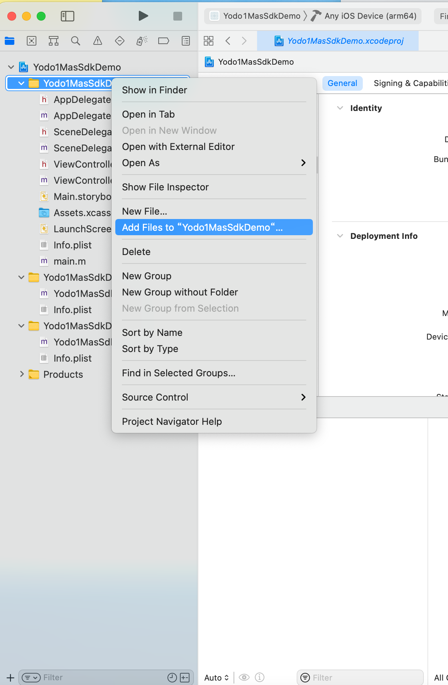
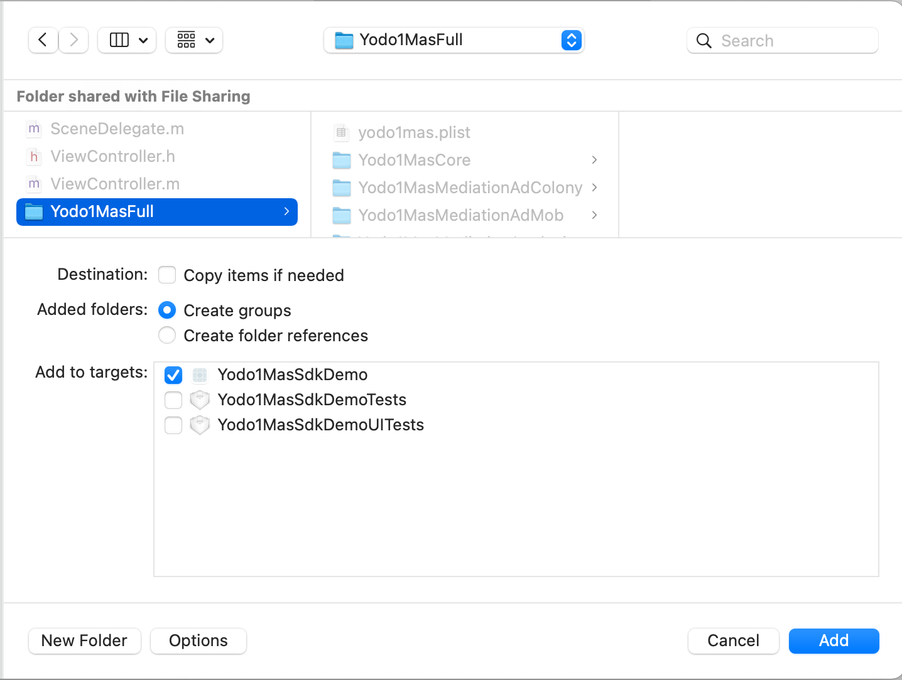
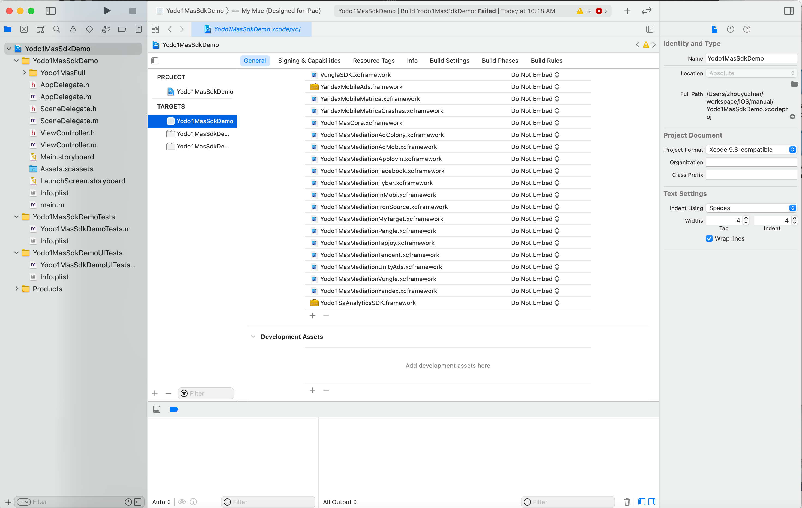
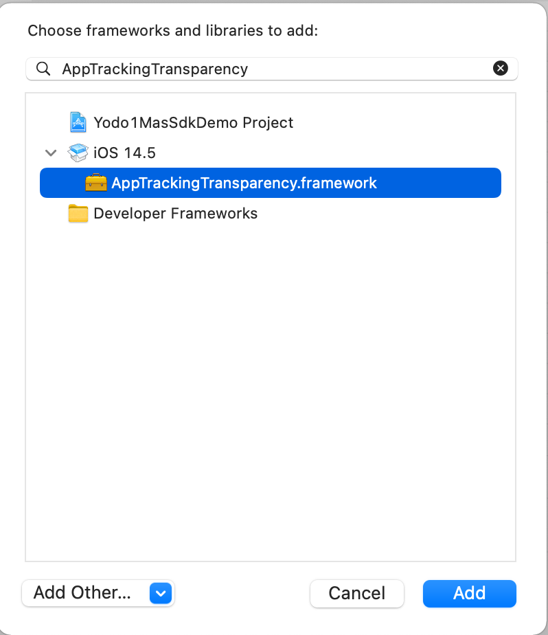
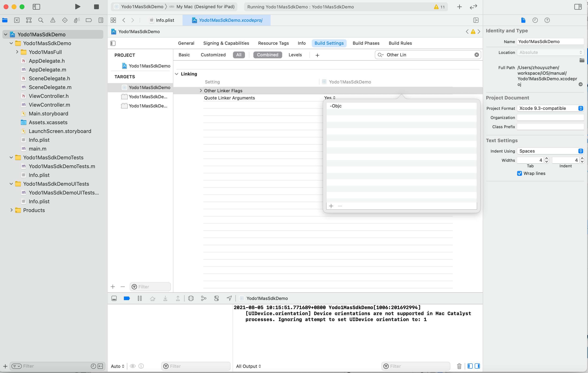
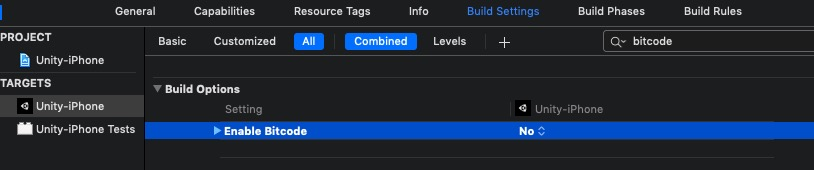

# iOS Integration

## Prerequisites

* iOS 15 requires `Xcode 13+`. Please make sure you are using the latest version of Xcode.
* MAS supports iOS 10.0 and above
* The easiest way is to use `CocoaPods`(Please use version `1.10.0` and above), If you are just starting out with 'CocoaPods', please refer to its [official documentation](https://guides.cocoapods.org/using/using-cocoapods) to study how to create and use it `Podfile`

## The Integration Steps
### 1. Add iOS SDK to your project

#### 1.1 CocoaPods
* Create the `Podfile` file

	Create the `Podfile` file in the project root directory
	
	```ruby
	touch Podfile
	```

* Import the iOS SDK into the project
	Please open the project's `Podfile` file and add the following code to the target of the application:
	
	```ruby
	# use_frameworks! # If you use Facebook to share or log in, please add
	source 'https://github.com/CocoaPods/Specs.git'  # recommend: source 'https://cdn.cocoapods.org/'
	source 'https://github.com/Yodo1Games/MAS-Spec.git'
	source 'https://github.com/Yodo1Games/Yodo1Spec.git'
	
	pod 'Yodo1MasFull', '4.4.0'
	```
	
	Execute the following command in `Terminal` :
	
	```ruby
	pod install --repo-update
	```
	
	Make sure to always open the Xcode workspace instead of the project file when building your project:
	```
	open App.xcworkspace
	```
	
#### 1.2 Manual Download

Follow these steps to add the SDK to your project:

* [Download iOS SDK Version 4.4.0](https://mas-artifacts.yodo1.com/4.4.0/iOS/Release/Yodo1MasFull-Manual-4.4.0.zip)</br>
	After you download the SDK; Unzip and copy the downloaded SDK into the project
	
	 

* Add System Resource Library

	
	

	Please follow the above method to add all the following:
	
	- Accelerate
	- AdSupport
	- AppTrackingTransparency
	- AudioToolbox
	- AVKit
	- MapKit
	- WebKit
	- Security
	- CoreMedia
	- AVFoundation
	- CoreTelephony
	- CoreLocation
	- SystemConfiguration
	- MobileCoreServices
	- JavaScriptCore
	- MessageUI
	- CoreImage
	- ImageIO
	- CoreText
	- CoreMotion
	- CoreServices
	- SafariServices
	- StoreKit
	- CFNetwork
	- Social
	- WatchConnectivity
	- QuartzCore
	- EventKit
	- CoreVideo
	- MediaPlayer
	- LocalAuthentication
	- VideoToolbox
	- c++
	- c++abi
	- sqlite3
	- sqlite3.0
	- xml2
	- xml2.2
	- bz2
	- resolv
	- iconv
	- z

* Add Linker Flags

	

	Please follow the above method to add all the following:
	
	- `-ObjC`
	- `-l"bz2"`
	- `-l"c++"`
	- `-l"c++abi"`
	- `-l"iconv"`
	- `-l"resolv"`
	- `-l"sqlite3"`
	- `-l"sqlite3.0"`
	- `-l"xml2"`
	- `-l"xml2.2"`
	- `-l"z"`

### 2. Xcode project configuration
#### 2.1 AppLovin SDK Key
* Using the Xcode project navigator, select `Info.plist`.
* Click the add button (+) next to any key in the property list editor and create a new property key.
* Enter the key name - `AppLovinSdkKey`.
* Choose a string value type.
* Enter `xcGD2fy-GdmiZQapx_kUSy5SMKyLoXBk8RyB5u9MVv34KetGdbl4XrXvAUFy0Qg9scKyVTI0NM4i_yzdXih4XE` in the value field.

	```xml
	<key>AppLovinSdkKey</key>
	<string>xcGD2fy-GdmiZQapx_kUSy5SMKyLoXBk8RyB5u9MVv34KetGdbl4XrXvAUFy0Qg9scKyVTI0NM4i_yzdXih4XE</string>
	```

#### 2.2 Add AdMob App ID
* Add `GADApplicationIdentifier` with `String` type to your project's `info.plist` file.
* You may edit the `info.plist` file and add `GADApplicationIdentifier` to it by using the `Open As Source Code` option.

	``` xml
	<key>GADApplicationIdentifier</key> 
	<string>Your MAS AdMob App ID</string>
	```

#### 2.3 iOS9 `App Transport Security (ATS)` Settings

Apple has added in controls for ATS in iOS9. To ensure uninterrupted ad delivery across all Mediation Networks, it’s important to make these changes to your `info.plist`.

* Add a dictionary and name it `NSAppTransportSecurity`.
* Inside this dictionary, add a Boolean named `NSAllowsArbitraryLoads` and set it to YES.

You may edit the `info.plist` file using the `Open As Source Code` and add the code below to the file. Such as:

``` xml
<key>NSAppTransportSecurity</key> 
<dict> 
    <key>NSAllowsArbitraryLoads</key> 
    <true/> 
</dict>
```

#### 2.4 iOS14 `AppTrackingTransparency(ATT)` Settings

**User tracking instructions**

iOS 14 requires publishers to obtain permission to track user devices across applications. Follow these steps to complete the process.

* Using the Xcode project navigator, select `Info.plist`.
* Click the add button (+) next to any key in the property list editor and create a new property key.
* Enter the key name - `NSUserTrackingUsageDescription`.
* Choose a string value type.
* Enter the app tracking transparency message in the value field.
* Personalized ads are delivered using this identifier. For example:

	```xml
	<key>NSUserTrackingUsageDescription</key>
	<string>This identifier will be used to deliver personalized ads to you.</string>
	```

For more information about `NSUserTrackingUsageDescription`, check Apple's developer [documentation](https://developer.apple.com/documentation/bundleresources/information_property_list/nsusertrackingusagedescription). 

For multi-language localizations, check Apple's developer [documentation](https://developer.apple.com/documentation/xcode/localization/adding_support_for_languages_and_regions).

**Advertising Network ID**

Games for users running iOS 14 or later need to include the network ID of each advertising platform in the attribute list file (`Info.plist`):

* Under the Xcode project navigator, select `Info.plist`.
* Click the add button (+) next to any key in the property list editor and create a new property key.
* Enter the key name - `SKAdNetworkItems`.
* For value type, choose `Array`.
* Use the key and each advertising platform network ID string to add the dictionary to the array.

For more information about editing the property list, check Xcode's [documentation](https://help.apple.com/xcode/mac/current/#/dev3f399a2a6%C2%A0).

The following shows the array of dictionaries you need to access the SDK.

```
<dict>
    <key>SKAdNetworkIdentifier</key>
    <string>275upjj5gd.skadnetwork</string>
</dict>
<dict>
    <key>SKAdNetworkIdentifier</key>
    <string>294l99pt4k.skadnetwork</string>
</dict>
<dict>
    <key>SKAdNetworkIdentifier</key>
    <string>2fnua5tdw4.skadnetwork</string>
</dict>
<dict>
    <key>SKAdNetworkIdentifier</key>
    <string>2u9pt9hc89.skadnetwork</string>
</dict>
<dict>
    <key>SKAdNetworkIdentifier</key>
    <string>3rd42ekr43.skadnetwork</string>
</dict>
<dict>
    <key>SKAdNetworkIdentifier</key>
    <string>4468km3ulz.skadnetwork</string>
</dict>
<dict>
    <key>SKAdNetworkIdentifier</key>
    <string>44jx6755aq.skadnetwork</string>
</dict>
<dict>
    <key>SKAdNetworkIdentifier</key>
    <string>44n7hlldy6.skadnetwork</string>
</dict>
<dict>
    <key>SKAdNetworkIdentifier</key>
    <string>4fzdc2evr5.skadnetwork</string>
</dict>
<dict>
    <key>SKAdNetworkIdentifier</key>
    <string>4pfyvq9l8r.skadnetwork</string>
</dict>
<dict>
    <key>SKAdNetworkIdentifier</key>
    <string>523jb4fst2.skadnetwork</string>
</dict>
<dict>
    <key>SKAdNetworkIdentifier</key>
    <string>5l3tpt7t6e.skadnetwork</string>
</dict>
<dict>
    <key>SKAdNetworkIdentifier</key>
    <string>5lm9lj6jb7.skadnetwork</string>
</dict>
<dict>
    <key>SKAdNetworkIdentifier</key>
    <string>6964rsfnh4.skadnetwork</string>
</dict>
<dict>
    <key>SKAdNetworkIdentifier</key>
    <string>6g9af3uyq4.skadnetwork</string>
</dict>
<dict>
    <key>SKAdNetworkIdentifier</key>
    <string>74b6s63p6l.skadnetwork</string>
</dict>
<dict>
    <key>SKAdNetworkIdentifier</key>
    <string>7rz58n8ntl.skadnetwork</string>
</dict>
<dict>
    <key>SKAdNetworkIdentifier</key>
    <string>7ug5zh24hu.skadnetwork</string>
</dict>
<dict>
    <key>SKAdNetworkIdentifier</key>
    <string>84993kbrcf.skadnetwork</string>
</dict>
<dict>
    <key>SKAdNetworkIdentifier</key>
    <string>8s468mfl3y.skadnetwork</string>
</dict>
<dict>
    <key>SKAdNetworkIdentifier</key>
    <string>9nlqeag3gk.skadnetwork</string>
</dict>
<dict>
    <key>SKAdNetworkIdentifier</key>
    <string>9rd848q2bz.skadnetwork</string>
</dict>
<dict>
    <key>SKAdNetworkIdentifier</key>
    <string>9t245vhmpl.skadnetwork</string>
</dict>
<dict>
    <key>SKAdNetworkIdentifier</key>
    <string>a7xqa6mtl2.skadnetwork</string>
</dict>
<dict>
    <key>SKAdNetworkIdentifier</key>
    <string>c6k4g5qg8m.skadnetwork</string>
</dict>
<dict>
    <key>SKAdNetworkIdentifier</key>
    <string>cg4yq2srnc.skadnetwork</string>
</dict>
<dict>
    <key>SKAdNetworkIdentifier</key>
    <string>cj5566h2ga.skadnetwork</string>
</dict>
<dict>
    <key>SKAdNetworkIdentifier</key>
    <string>e5fvkxwrpn.skadnetwork</string>
</dict>
<dict>
    <key>SKAdNetworkIdentifier</key>
    <string>ejvt5qm6ak.skadnetwork</string>
</dict>
<dict>
    <key>SKAdNetworkIdentifier</key>
    <string>g28c52eehv.skadnetwork</string>
</dict>
<dict>
    <key>SKAdNetworkIdentifier</key>
    <string>g2y4y55b64.skadnetwork</string>
</dict>
<dict>
    <key>SKAdNetworkIdentifier</key>
    <string>gta9lk7p23.skadnetwork</string>
</dict>
<dict>
    <key>SKAdNetworkIdentifier</key>
    <string>hs6bdukanm.skadnetwork</string>
</dict>
<dict>
    <key>SKAdNetworkIdentifier</key>
    <string>kbd757ywx3.skadnetwork</string>
</dict>
<dict>
    <key>SKAdNetworkIdentifier</key>
    <string>kbmxgpxpgc.skadnetwork</string>
</dict>
<dict>
    <key>SKAdNetworkIdentifier</key>
    <string>klf5c3l5u5.skadnetwork</string>
</dict>
<dict>
    <key>SKAdNetworkIdentifier</key>
    <string>m8dbw4sv7c.skadnetwork</string>
</dict>
<dict>
    <key>SKAdNetworkIdentifier</key>
    <string>mlmmfzh3r3.skadnetwork</string>
</dict>
<dict>
    <key>SKAdNetworkIdentifier</key>
    <string>mtkv5xtk9e.skadnetwork</string>
</dict>
<dict>
    <key>SKAdNetworkIdentifier</key>
    <string>n6fk4nfna4.skadnetwork</string>
</dict>
<dict>
    <key>SKAdNetworkIdentifier</key>
    <string>n9x2a789qt.skadnetwork</string>
</dict>
<dict>
    <key>SKAdNetworkIdentifier</key>
    <string>ppxm28t8ap.skadnetwork</string>
</dict>
<dict>
    <key>SKAdNetworkIdentifier</key>
    <string>prcb7njmu6.skadnetwork</string>
</dict>
<dict>
    <key>SKAdNetworkIdentifier</key>
    <string>pwa73g5rt2.skadnetwork</string>
</dict>
<dict>
    <key>SKAdNetworkIdentifier</key>
    <string>pwdxu55a5a.skadnetwork</string>
</dict>
<dict>
    <key>SKAdNetworkIdentifier</key>
    <string>qqp299437r.skadnetwork</string>
</dict>
<dict>
    <key>SKAdNetworkIdentifier</key>
    <string>r45fhb6rf7.skadnetwork</string>
</dict>
<dict>
    <key>SKAdNetworkIdentifier</key>
    <string>rx5hdcabgc.skadnetwork</string>
</dict>
<dict>
    <key>SKAdNetworkIdentifier</key>
    <string>t38b2kh725.skadnetwork</string>
</dict>
<dict>
    <key>SKAdNetworkIdentifier</key>
    <string>tl55sbb4fm.skadnetwork</string>
</dict>
<dict>
    <key>SKAdNetworkIdentifier</key>
    <string>u679fj5vs4.skadnetwork</string>
</dict>
<dict>
    <key>SKAdNetworkIdentifier</key>
    <string>uw77j35x4d.skadnetwork</string>
</dict>
<dict>
    <key>SKAdNetworkIdentifier</key>
    <string>v72qych5uu.skadnetwork</string>
</dict>
<dict>
    <key>SKAdNetworkIdentifier</key>
    <string>wg4vff78zm.skadnetwork</string>
</dict>
<dict>
    <key>SKAdNetworkIdentifier</key>
    <string>wzmmz9fp6w.skadnetwork</string>
</dict>
<dict>
    <key>SKAdNetworkIdentifier</key>
    <string>yclnxrl5pm.skadnetwork</string>
</dict>
<dict>
    <key>SKAdNetworkIdentifier</key>
    <string>ydx93a7ass.skadnetwork</string>
</dict>
<dict>
    <key>SKAdNetworkIdentifier</key>
    <string>3qcr597p9d.skadnetwork</string>
</dict>
<dict>
    <key>SKAdNetworkIdentifier</key>
    <string>3qy4746246.skadnetwork</string>
</dict>
<dict>
    <key>SKAdNetworkIdentifier</key>
    <string>3sh42y64q3.skadnetwork</string>
</dict>
<dict>
    <key>SKAdNetworkIdentifier</key>
    <string>424m5254lk.skadnetwork</string>
</dict>
<dict>
    <key>SKAdNetworkIdentifier</key>
    <string>4dzt52r2t5.skadnetwork</string>
</dict>
<dict>
    <key>SKAdNetworkIdentifier</key>
    <string>578prtvx9j.skadnetwork</string>
</dict>
<dict>
    <key>SKAdNetworkIdentifier</key>
    <string>5a6flpkh64.skadnetwork</string>
</dict>
<dict>
    <key>SKAdNetworkIdentifier</key>
    <string>8c4e2ghe7u.skadnetwork</string>
</dict>
<dict>
    <key>SKAdNetworkIdentifier</key>
    <string>av6w8kgt66.skadnetwork</string>
</dict>
<dict>
    <key>SKAdNetworkIdentifier</key>
    <string>cstr6suwn9.skadnetwork</string>
</dict>
<dict>
    <key>SKAdNetworkIdentifier</key>
    <string>f38h382jlk.skadnetwork</string>
</dict>
<dict>
    <key>SKAdNetworkIdentifier</key>
    <string>p78axxw29g.skadnetwork</string>
</dict>
<dict>
    <key>SKAdNetworkIdentifier</key>
    <string>s39g8k73mm.skadnetwork</string>
</dict>
<dict>
    <key>SKAdNetworkIdentifier</key>
    <string>v4nxqhlyqp.skadnetwork</string>
</dict>
<dict>
    <key>SKAdNetworkIdentifier</key>
    <string>zq492l623r.skadnetwork</string>
</dict>
<dict>
    <key>SKAdNetworkIdentifier</key>
    <string>24t9a8vw3c.skadnetwork</string>
</dict>
<dict>
    <key>SKAdNetworkIdentifier</key>
    <string>32z4fx6l9h.skadnetwork</string>
</dict>
<dict>
    <key>SKAdNetworkIdentifier</key>
    <string>54nzkqm89y.skadnetwork</string>
</dict>
<dict>
    <key>SKAdNetworkIdentifier</key>
    <string>6xzpu9s2p8.skadnetwork</string>
</dict>
<dict>
    <key>SKAdNetworkIdentifier</key>
    <string>79pbpufp6p.skadnetwork</string>
</dict>
<dict>
    <key>SKAdNetworkIdentifier</key>
    <string>9b89h5y424.skadnetwork</string>
</dict>
<dict>
    <key>SKAdNetworkIdentifier</key>
    <string>c3frkrj4fj.skadnetwork</string>
</dict>
<dict>
    <key>SKAdNetworkIdentifier</key>
    <string>feyaarzu9v.skadnetwork</string>
</dict>
<dict>
    <key>SKAdNetworkIdentifier</key>
    <string>ggvn48r87g.skadnetwork</string>
</dict>
<dict>
    <key>SKAdNetworkIdentifier</key>
    <string>glqzh8vgby.skadnetwork</string>
</dict>
<dict>
    <key>SKAdNetworkIdentifier</key>
    <string>k674qkevps.skadnetwork</string>
</dict>
<dict>
    <key>SKAdNetworkIdentifier</key>
    <string>ludvb6z3bs.skadnetwork</string>
</dict>
<dict>
    <key>SKAdNetworkIdentifier</key>
    <string>rvh3l7un93.skadnetwork</string>
</dict>
<dict>
    <key>SKAdNetworkIdentifier</key>
    <string>x8jxxk4ff5.skadnetwork</string>
</dict>
<dict>
    <key>SKAdNetworkIdentifier</key>
    <string>xy9t38ct57.skadnetwork</string>
</dict>
<dict>
    <key>SKAdNetworkIdentifier</key>
    <string>zmvfpc5aq8.skadnetwork</string>
</dict>
<dict>
    <key>SKAdNetworkIdentifier</key>
    <string>n38lu8286q.skadnetwork</string>
</dict>
<dict>
    <key>SKAdNetworkIdentifier</key>
    <string>v9wttpbfk9.skadnetwork</string>
</dict>
<dict>
    <key>SKAdNetworkIdentifier</key>
    <string>22mmun2rn5.skadnetwork</string>
</dict>
<dict>
    <key>SKAdNetworkIdentifier</key>
    <string>252b5q8x7y.skadnetwork</string>
</dict>
<dict>
    <key>SKAdNetworkIdentifier</key>
    <string>9g2aggbj52.skadnetwork</string>
</dict>
<dict>
    <key>SKAdNetworkIdentifier</key>
    <string>dzg6xy7pwj.skadnetwork</string>
</dict>
<dict>
    <key>SKAdNetworkIdentifier</key>
    <string>f73kdq92p3.skadnetwork</string>
</dict>
<dict>
    <key>SKAdNetworkIdentifier</key>
    <string>hdw39hrw9y.skadnetwork</string>
</dict>
<dict>
    <key>SKAdNetworkIdentifier</key>
    <string>x8uqf25wch.skadnetwork</string>
</dict>
<dict>
    <key>SKAdNetworkIdentifier</key>
    <string>y45688jllp.skadnetwork</string>
</dict>
<dict>
    <key>SKAdNetworkIdentifier</key>
    <string>97r2b46745.skadnetwork</string>
</dict>
<dict>
    <key>SKAdNetworkIdentifier</key>
    <string>b9bk5wbcq9.skadnetwork</string>
</dict>
<dict>
    <key>SKAdNetworkIdentifier</key>
    <string>mls7yz5dvl.skadnetwork</string>
</dict>
<dict>
    <key>SKAdNetworkIdentifier</key>
    <string>w9q455wk68.skadnetwork</string>
</dict>
<dict>
    <key>SKAdNetworkIdentifier</key>
    <string>su67r6k2v3.skadnetwork</string>
</dict>
<dict>
    <key>SKAdNetworkIdentifier</key>
    <string>737z793b9f.skadnetwork</string>
</dict>
<dict>
    <key>SKAdNetworkIdentifier</key>
    <string>r26jy69rpl.skadnetwork</string>
</dict>
<dict>
    <key>SKAdNetworkIdentifier</key>
    <string>238da6jt44.skadnetwork</string>
</dict>
<dict>
    <key>SKAdNetworkIdentifier</key>
    <string>488r3q3dtq.skadnetwork</string>
</dict>
<dict>
    <key>SKAdNetworkIdentifier</key>
    <string>52fl2v3hgk.skadnetwork</string>
</dict>
<dict>
    <key>SKAdNetworkIdentifier</key>
    <string>5tjdwbrq8w.skadnetwork</string>
</dict>
<dict>
    <key>SKAdNetworkIdentifier</key>
    <string>9yg77x724h.skadnetwork</string>
</dict>
<dict>
    <key>SKAdNetworkIdentifier</key>
    <string>ecpz2srf59.skadnetwork</string>
</dict>
<dict>
    <key>SKAdNetworkIdentifier</key>
    <string>gvmwg8q7h5.skadnetwork</string>
</dict>
<dict>
    <key>SKAdNetworkIdentifier</key>
    <string>lr83yxwka7.skadnetwork</string>
</dict>
<dict>
    <key>SKAdNetworkIdentifier</key>
    <string>n66cz3y3bx.skadnetwork</string>
</dict>
<dict>
    <key>SKAdNetworkIdentifier</key>
    <string>nzq8sh4pbs.skadnetwork</string>
</dict>
<dict>
    <key>SKAdNetworkIdentifier</key>
    <string>pu4na253f3.skadnetwork</string>
</dict>
<dict>
    <key>SKAdNetworkIdentifier</key>
    <string>v79kvwwj4g.skadnetwork</string>
</dict>
<dict>
    <key>SKAdNetworkIdentifier</key>
    <string>yrqqpx2mcb.skadnetwork</string>
</dict>
<dict>
    <key>SKAdNetworkIdentifier</key>
    <string>z4gj7hsk7h.skadnetwork</string>
</dict>
<dict>
    <key>SKAdNetworkIdentifier</key>
    <string>f7s53z58qe.skadnetwork</string>
</dict>
<dict>
    <key>SKAdNetworkIdentifier</key>
    <string>mp6xlyr22a.skadnetwork</string>
</dict>
<dict>
    <key>SKAdNetworkIdentifier</key>
    <string>x44k69ngh6.skadnetwork</string>
</dict>
<dict>
    <key>SKAdNetworkIdentifier</key>
    <string>7953jerfzd.skadnetwork</string>
</dict>
```

<!--#### 2.4 Disable `BitCode`
Ensure that all mediation networks work properly by disabling bitcode.


-->


### 3. Comply With Necessary Legal Framework
Please comply with all legal frameworks that apply to your game and its users. You can find references to the major legal frameworks and details about how to comply with them while using MAS through these links:

* [GDPR](privacy-gdpr.md)
* [COPPA](privacy-coppa.md)
* [CCPA](privacy-ccpa.md)

Or, you can enable the built-in privacy compliance dialog in the SDK to collect user information:


1.Enable (Please call before initialization)

```obj-c
Yodo1MasAdBuildConfig *config = [Yodo1MasAdBuildConfig instance];
config.enableUserPrivacyDialog = YES; // default value is NO
[[Yodo1Mas sharedInstance] setAdBuildConfig:config];
```

2.Custom user agreement

```obj-c
Yodo1MasAdBuildConfig *config = [Yodo1MasAdBuildConfig instance];
config.enableUserPrivacyDialog = YES;
config.userAgreementUrl = @"Your user agreement url";
[[Yodo1Mas sharedInstance] setAdBuildConfig:config];
```

3.Custom privacy policy
 
```obj-c
Yodo1MasAdBuildConfig *config = [Yodo1MasAdBuildConfig instance];
config.enableUserPrivacyDialog = YES;
config.privacyPolicyUrl = @"Your privacy policy url";
[[Yodo1Mas sharedInstance] setAdBuildConfig:config];
```

<font color=red>IMPORTANT!</font> Failure to comply with these frameworks can lead to **Apple App Store and/or Google Play Store rejecting** your game, as well as a negative impact of your game's monetization.

### 4. Initialize the SDK
#### 4.1 Import header file `Yodo1Mas.h`
``` obj-c
#import <Yodo1MasCore/Yodo1Mas.h>
```

#### 4.2 Add the snippet below by using your AppDelegate's `didFinishLaunchingWithOptions` method:

``` obj-c
[[Yodo1Mas sharedInstance] initWithAppId:@"Your AppId" successful:^{
    
} fail:^(NSError * _Nonnull error) {
    
}];
```

## Banner Integration
### 1. Set up the banner ad delegate method
``` obj-c
[Yodo1Mas sharedInstance].bannerAdDelegate = self;

#pragma mark - Yodo1MasAdDelegate
- (void)onAdOpened:(Yodo1MasAdEvent *)event {
    
}

- (void)onAdClosed:(Yodo1MasAdEvent *)event {
    
}

- (void)onAdvertError:(Yodo1MasAdEvent *)event error:(Yodo1MasError *)error {
    
}
```

### 2. Show banner ad

The method using the default parameters, align: `Yodo1MasAdBannerAlignBottom | Yodo1MasAdBannerAlignHorizontalCenter` and offset(X: 0,Y: 0)

```obj-c
[[Yodo1Mas sharedInstance] showBannerAd];
```

The method using the default offset(X: 0, Y: 0), you need to customize the banner alignment.

```obj-c
Yodo1MasAdBannerAlign align = Yodo1MasAdBannerAlignTop | Yodo1MasAdBannerAlignHorizontalCenter;
[[Yodo1Mas sharedInstance] showBannerAdWithAlign:align];
```

The method need to customize the banner alignment and offset.

```obj-c
Yodo1MasAdBannerAlign align = Yodo1MasAdBannerAlignTop | Yodo1MasAdBannerAlignHorizontalCenter;
// point.x > 0, the banner will move to the right. point.x < 0, the banner will move to the left, point.y > 0, the banner will move to the bottom. point.y < 0, the banner will move to the top
CGPoint point = CGPointMake(10.0f, 10.0f); 
[[Yodo1Mas sharedInstance] showBannerAdWithAlign:align offset:point];
```

### 3. Dismiss banner ad

```obj-c
[[Yodo1Mas sharedInstance] dismissBannerAd];

BOOL destroy = NO; // if destroy == YES, the ads displayed in the next call to showBanner are different. if destroy == NO, the ads displayed in the next call to showBanner are same
[[Yodo1Mas sharedInstance] dismissBannerAdWithDestroy:destroy];
```

### 4. Create a Banner Placement

```obj-c
[[Yodo1Mas sharedInstance] showBannerAd:@"MY_BANNER_PLACEMENT"]
```

## Banner(V2) Integration

### 1. Init Yodo1MasBannerAdView

For `Objective-C` 

```objective-c
Yodo1MasBannerAdView *bannerAdView = [[Yodo1MasBannerAdView alloc] init];
[bannerAdView setAdSize:Yodo1MasBannerAdSizeBanner];
// TODO: Add bannerAdView to your view hierarchy.
```

For `Swift`

```swift
let bannerAdView = Yodo1MasBannerAdView()
bannerAdView.setAdSize(.banner)
// TODO: Add bannerAdView to your view hierarchy.
```

#### Banner sizes
|  Size in dp   | Description  | Availability | AdSize constant |
|  :-----------  | :-----------  | :--------------- | :--------------- |
| 320x50  | Banner | Phones and Tablets | Banner |
| 320x100  | Large Banner | Phones and Tablets |  LargeBanner |
| 300x250  | IAB Medium Rectangle | Phones and Tablets |  IABMediumRectangle |
| Full screen width x Adaptive height | Adaptive banner | Phones and Tablets |  AdaptiveBanner |
| Screen width x 32/50/90  | Smart banner | Phones and Tablets | SmartBanner |

### 2. Load an ad

Once the `Yodo1MasBannerAdView` is in place, the next step is to load an ad. That's done with the `loadAd()` method in the `Yodo1MasBannerAdView` class.

Here's an example that shows how to load an ad in the `viewDidLoad` method of an `UIViewController`:

For `Objective-C` 

```objective-c

#import <UIKit/UIKit.h>
#import "Yodo1Mas.h"
#import "Yodo1MasBannerAdView.h"
  
@interface MainController ()
  
@property (nonatomic, strong) Yodo1MasBannerAdView *bannerAdView;

@end

@implementation BannerController
  
- (void)viewDidLoad {
  [super viewDidLoad];
  [[Yodo1Mas sharedInstance] initWithAppKey:@"YourAppKey" successful:^{

  } fail:^(NSError * _Nonnull error) {

  }];
  
  _bannerAdView = [[Yodo1MasBannerAdView alloc] init];
  [_bannerAdView setAdSize:Yodo1MasBannerAdSizeBanner];
  [_bannerAdView loadAd];
	CGSize size = _bannerAdView.intrinsicContentSize;
  _bannerAdView.frame = CGRectMake((self.view.bounds.size.width - size.width) / 2, self.view.bounds.size.height - size.height, size.width, size.height);
  [self.view addSubview:_bannerAdView];
}
@end
```

For `Swift`

```swift
import UIKit
import Yodo1MasCore

class MainController : UIViewController {

	var bannerAdView: Yodo1MasBannerAdView!

	override func viewDidLoad() {
		super.viewDidLoad()
    Yodo1Mas.sharedInstance().initWithAppKey("YourAppKey") {
            
    } fail: { error in

    }
    bannerAdView = Yodo1MasBannerAdView()
    bannerAdView.setAdSize(.banner)
    bannerAdView.loadAd()
    let size = bannerAdView.intrinsicContentSize
    bannerAdView.frame = CGRect(x: (self.view.bounds.width - size.width) / 2, y: self.view.bounds.height - size.height, width: size.width, height: size.height)
    self.view.addSubview(bannerAdView)
   }
}
```

That's it! Your app is now ready to display banner ads.

### 3. Ad events

To further customize the behavior of your ad, you can hook onto a number of events in the ad's lifecycle: loading, opening, closing, and so on. You can listen for these events through the `Yodo1MasBannerAdViewDelegate`.

For `Objective-C` 

```objective-c
#import <UIKit/UIKit.h>
#import "Yodo1Mas.h"
#import "Yodo1MasBannerAdView.h"
  
@interface MainController ()<Yodo1MasBannerAdViewDelegate>
  
@property (nonatomic, strong) Yodo1MasBannerAdView *bannerAdView;

@end

@implementation BannerController
  
- (void)viewDidLoad {
  [super viewDidLoad];
  [[Yodo1Mas sharedInstance] initWithAppKey:@"YourAppKey" successful:^{

  } fail:^(NSError * _Nonnull error) {

  }];
  
  _bannerAdView = [[Yodo1MasBannerAdView alloc] init];
  _bannerAdView.adDelegate = self;
  [_bannerAdView setAdSize:Yodo1MasBannerAdSizeBanner];
  [_bannerAdView loadAd];
	CGSize size = _bannerAdView.intrinsicContentSize;
  _bannerAdView.frame = CGRectMake((self.view.bounds.size.width - size.width) / 2, self.view.bounds.size.height - size.height, size.width, size.height);
  [self.view addSubview:_bannerAdView];
}


#pragma mark - Yodo1MasBannerAdViewDelegate
- (void)onBannerAdLoaded:(Yodo1MasBannerAdView *)banner {
    
}

- (void)onBannerAdFailedToLoad:(Yodo1MasBannerAdView *)banner withError:(Yodo1MasError *)error {
    
}

- (void)onBannerAdOpened:(Yodo1MasBannerAdView *)banner {

}

- (void)onBannerAdFailedToOpen:(Yodo1MasBannerAdView *)banner withError:(Yodo1MasError *)error {
    
}

- (void)onBannerAdClosed:(Yodo1MasBannerAdView *)banner {

}

@end
```

For `Swift`

```swift
import UIKit
import Yodo1MasCore

class MainController: UIViewController {
    var bannerAdView: Yodo1MasBannerAdView!

    override func viewDidLoad() {
        super.viewDidLoad()
        
        Yodo1Mas.sharedInstance().initWithAppKey("YourAppKey") {
            
        } fail: { error in
            
        }
        
        bannerAdView = Yodo1MasBannerAdView()
        bannerAdView.setAdSize(.banner)
        bannerAdView.adDelegate = self
        bannerAdView.loadAd()
        let size = bannerAdView.intrinsicContentSize
        bannerAdView.frame = CGRect(x: (self.view.bounds.width - size.width) / 2, y: self.view.bounds.height - size.height, width: size.width, height: size.height)
        self.view.addSubview(bannerAdView)
    }
}

extension MainController: Yodo1MasBannerAdViewDelegate {
    // MARK: Yodo1MasBannerAdViewDelegate
    func onBannerAdLoaded(_ banner: Yodo1MasBannerAdView) {
        
    }
    
    func onBannerAdFailed(toLoad banner: Yodo1MasBannerAdView, withError error: Yodo1MasError) {
        
    }
    
    func onBannerAdOpened(_ banner: Yodo1MasBannerAdView) {
        
    }
    
    func onBannerAdFailed(toOpen banner: Yodo1MasBannerAdView, withError error: Yodo1MasError) {
        
    }
    
    func onBannerAdClosed(_ banner: Yodo1MasBannerAdView) {
        
    }
    
}
```

## Interstitial Integration
### 1. Set the interstitial ad delegate method
``` obj-c
[Yodo1Mas sharedInstance].interstitialAdDelegate = self; 

#pragma mark - Interstitial Delegate
- (void)onAdOpened:(Yodo1MasAdEvent *)event {
    
}

- (void)onAdClosed:(Yodo1MasAdEvent *)event {
    
}

- (void)onAdError:(Yodo1MasAdEvent *)event error:(Yodo1MasError *)error {
    
}       
```

### 2. Check the loading status of interstitials
``` obj-c
BOOL isLoaded = [[Yodo1Mas sharedInstance] isInterstitialAdLoaded];
```

### 3. Show interstitial ad
```obj-c
[[Yodo1Mas sharedInstance] showInterstitialAd];
```

### 4. Create a Interstitial Placement
```obj-c
[[Yodo1Mas sharedInstance] showInterstitialAd:@"MY_INTERSTITIAL_PLACEMENT"]
```

## Rewarded Video Integration
### 1. Set up rewarded video ad delegate methods
``` obj-c
[Yodo1Mas sharedInstance].rewardAdDelegate = self;

#pragma mark - Yodo1MasAdDelegate
- (void)onAdOpened:(Yodo1MasAdEvent *)event {
    
}

- (void)onAdClosed:(Yodo1MasAdEvent *)event {
    
}

- (void)onAdvertError:(Yodo1MasAdEvent *)event error:(Yodo1MasError *)error {
    
}

#pragma mark - Ad Rewarded
- (void)onAdRewardEarned:(Yodo1MasAdEvent *)event {
    
}
```

### 2. Check the loading status of rewarded video ads
``` obj-c
BOOL isLoaded = [[Yodo1Mas sharedInstance] isRewardAdLoaded];
```

### 3. Show rewarded video ads
```obj-c
[[Yodo1Mas sharedInstance] showRewardAd]
```

### 4. Create a rewarded Placement
```obj-c
[[Yodo1Mas sharedInstance] showRewardAd:@"MY_REWARDED_PLACEMENT"]
```