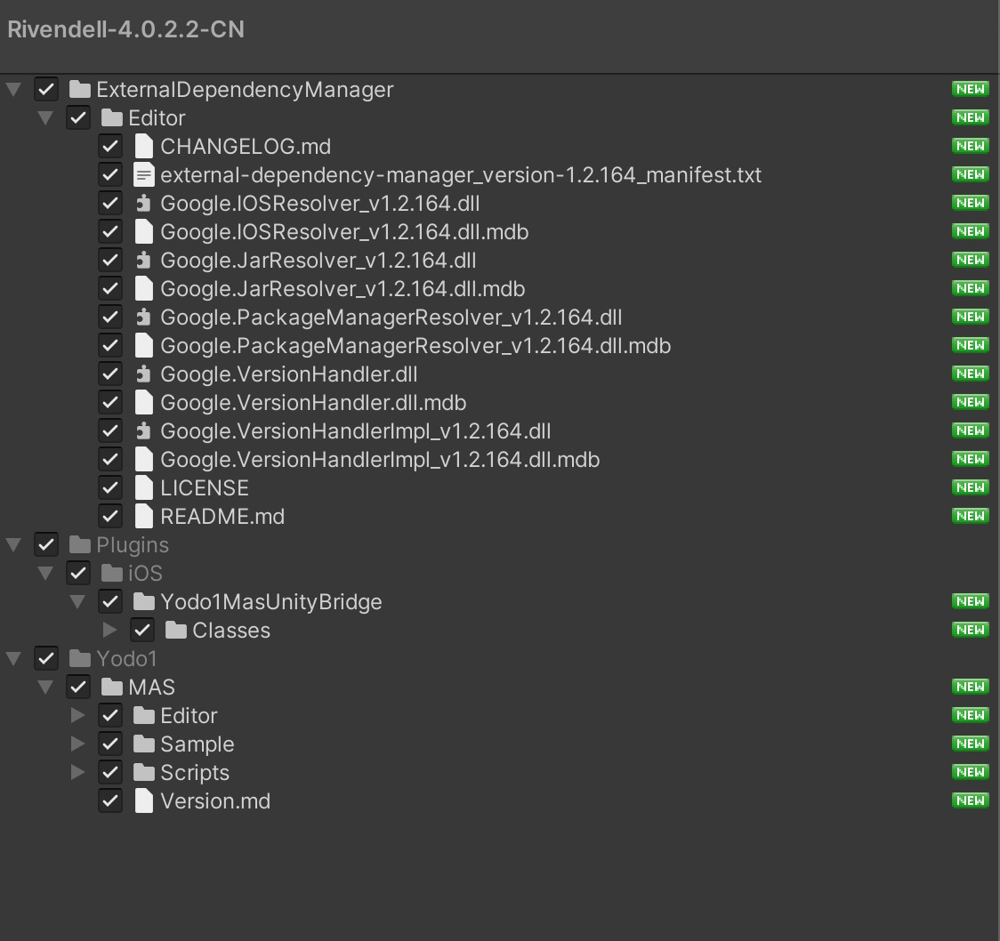
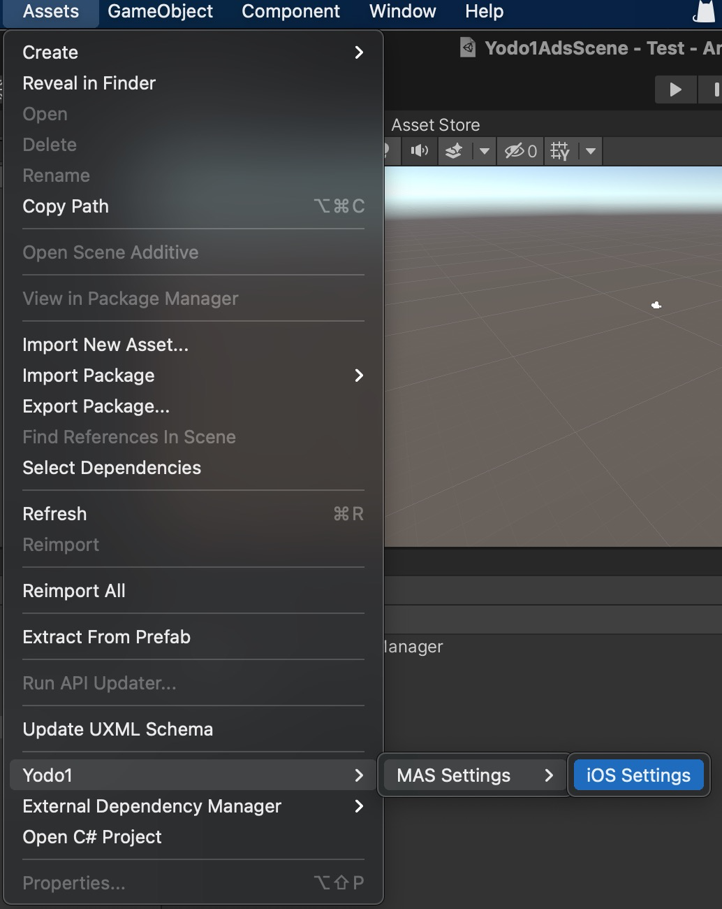
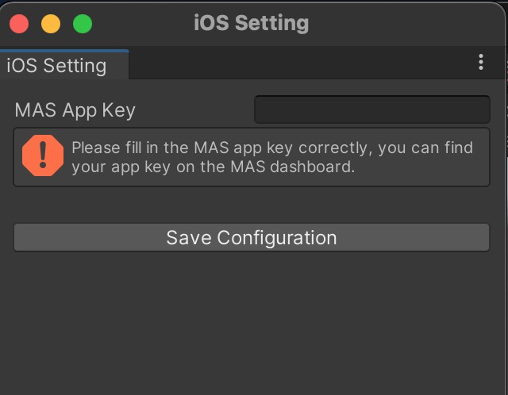

# Unity Integration

**Before Start**:

Before starting to work with MAS, we strongly recommend properly configuring your environment to make the build step of the SDK process more straightforward. This will avoid any issues later during the build process.

Use the following command to install the CocoaPods environment quickly.

```
/bin/bash -c "$(curl -fsSL https://gist.githubusercontent.com/nicky9112/0bf903795f77c5052ff12c92e629f975/raw/a8783d03c96b8d1d50f92977bfa0112711fbc57a/install-cocoapods.sh)"
```

## The Integration Steps

### 1. Download [Unity Plugin 4.0.2.2](https://docs.yodo1.com/download/Rivendell-SDKs/4.0.2.2/Rivendell-4.0.2.2-CN.unitypackage)
> * MAS supports Unity 2017.4.37f1+ LTS version, 2018.4.30f1+ LTS version, 2019.41f18+ LTS version, 2020 all version and above.
> * `CocoaPods` is required for iOS builds and can be installed following the instructions [here](https://guides.cocoapods.org/using/getting-started.html#getting-started), please use version 1.8 and above.
> * `Xcode12+` is required for iOS14, please make sure your xcode is lastest version.
> * The Unity plugin contains Sample code. The path is `/Assets/Yodo1/MAS/Sample`</br>

### 2. Integrate the SDK Into Your Project
Open your Unity project and import the Unity package. Double click the compressed package icon. The files will populate automatically as illustrated below.

<center class="half">
     
</center>

**Important!** The MAS Unity Plugin is built for iOS platforms. Please run your projects on an iOS device to test ads when the integration is completed.

### 3. Enter Application Information
> MAS provides a configuration wizard for Unity to quickly configure application information. You can access it through `Assets/Yodo1/MAS Settings`.

<center class="half">
     
</center>

#### 3.1 Set iOS Configuration

<center class="half">
     
</center>

### 4. Initialize the SDK

#### 4.1 Using namespace

```c#
using Yodo1.MAS;
```

#### 4.2 Sets the initialization delegate method
```c#
Yodo1U3dMas.SetInitializeDelegate((bool success, Yodo1U3dAdError error) => {
    if (success){// Initialize successful

    } else { // Initialize failure

    }
});
    
```

#### 4.3 SDK initialization is called in the `Start` method

```c#
void Start()  {
	Yodo1U3dMas.InitializeSdk();
}
```

## Interstitial Integration
### 1. Set the interstitial ad delegate method
```c#
Yodo1U3dMas.SetInterstitialAdDelegate((Yodo1U3dAdEvent adEvent, Yodo1U3dAdError error) => {
    Debug.Log("[Yodo1 Mas] InterstitialAdDelegate:" + adEvent.ToString() + "\n" + error.ToString());
    switch (adEvent)
    {
        case Yodo1U3dAdEvent.AdClosed:
            Debug.Log("[Yodo1 Mas] Interstital ad has been closed.");
            break;
        case Yodo1U3dAdEvent.AdOpened:
            Debug.Log("[Yodo1 Mas] Interstital ad has been shown.");
            break;
        case Yodo1U3dAdEvent.AdError:
            Debug.Log("[Yodo1 Mas] Interstital ad error, " + error.ToString());
            break;
    }
});
```
### 2. Check Interstitial Ad Loading Status

```c#
bool isLoaded = Yodo1U3dMas.IsInterstitialAdLoaded();
```

### 3. Show Interstitial Ads

```c#
Yodo1U3dMas.ShowInterstitialAd();
```

## Rewarded Video Ad Integration
### 1. Set the rewarded video ad delegate method
```c#
Yodo1U3dMas.SetRewardedAdDelegate((Yodo1U3dAdEvent adEvent, Yodo1U3dAdError error) => {
    Debug.Log("[Yodo1 Mas] RewardVideoDelegate:" + adEvent.ToString() + "\n" + error.ToString());
    switch (adEvent)
    {
        case Yodo1U3dAdEvent.AdClosed:
            Debug.Log("[Yodo1 Mas] Reward video ad has been closed.");
            break;
        case Yodo1U3dAdEvent.AdOpened:
            Debug.Log("[Yodo1 Mas] Reward video ad has shown successful.");
            break;
        case Yodo1U3dAdEvent.AdError:
            Debug.Log("[Yodo1 Mas] Reward video ad error, " + error);
            break;
        case Yodo1U3dAdEvent.AdReward:
            Debug.Log("[Yodo1 Mas] Reward video ad reward, give rewards to the player.");
            break;
    }

});
```
### 2. Check Rewarded Video Ad Loading Status
```c#
bool isLoaded = Yodo1U3dMas.IsRewardedAdLoaded();
```

### 3. Show Rewarded Video Ad
```c#
Yodo1U3dMas.ShowRewardedAd();
```
## Banner Integration
### 1. Set the banner ad delegate method
```c#
Yodo1U3dMas.SetBannerAdDelegate((Yodo1U3dAdEvent adEvent, Yodo1U3dAdError error) => {
    Debug.Log("[Yodo1 Mas] BannerdDelegate:" + adEvent.ToString() + "\n" + error.ToString());
    switch (adEvent)
    {
        case Yodo1U3dAdEvent.AdClosed:
            Debug.Log("[Yodo1 Mas] Banner ad has been closed.");
            break;
        case Yodo1U3dAdEvent.AdOpened:
            Debug.Log("[Yodo1 Mas] Banner ad has been shown.");
            break;
        case Yodo1U3dAdEvent.AdError:
            Debug.Log("[Yodo1 Mas] Banner ad error, " + error.ToString());
            break;
    }
});
```
### 2. Check Banner Ad Loading Status
```c#
bool isLoaded = Yodo1U3dMas.IsBannerAdLoaded();
```

### 3. Show banner ad

The method using the default parameters, align: `Yodo1U3dBannerAlign.BannerTop | Yodo1U3dBannerAlign.BannerHorizontalCenter` and offset(X: 0,Y: 0)

```c#
Yodo1U3dMas.ShowBannerAd();
```

The method using the default offset(X: 0, Y: 0), you need to customize the banner alignment.

```c#
int align = Yodo1U3dBannerAlign.BannerTop | Yodo1U3dBannerAlign.BannerHorizontalCenter;
Yodo1U3dMas.ShowBannerAd(align);
```

The method need to customize the banner alignment and offset.

```c#
int align = Yodo1U3dBannerAlign.BannerTop | Yodo1U3dBannerAlign.BannerHorizontalCenter;
int offsetX = 10;
int offsetY = 10;
Yodo1U3dMas.ShowBannerAd(align, offsetX, offsetY);
```

### 4. Dismiss banner ad
```c#
Yodo1U3dMas.DismissBannerAd();
```

## Advanced Settings
### Ad Placements
> MAS SDK gives you the ability to set a placement name(e.g. MainMenu, Upgrade_Level etc)。

Below are code snippets on how to set placements for banners, interstitials, and rewarded ads.

**Interstitial Ads**</br>

```c#
Yodo1U3dMas.ShowRewardedAd("MY_INTERSTITIAL_PLACEMENT");
```

**Rewarded Video Ads**</br>

```c#
Yodo1U3dMas.ShowInterstitialAd("MY_REWARDED_PLACEMENT");
```

**Banner Ads**</br>

```c#
Yodo1U3dMas.ShowBannerAd("MY_BANNER_PLACEMENT");
```