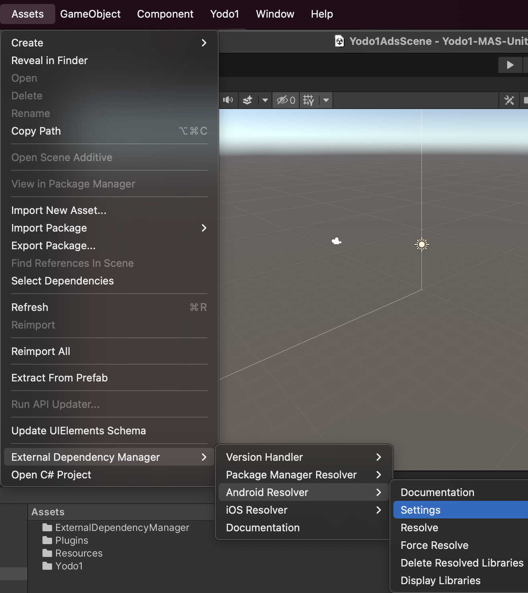
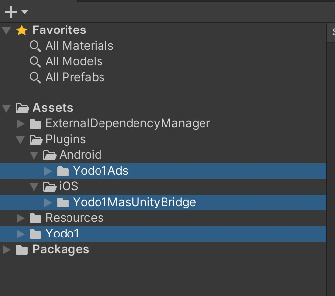

# Unity Integration

**Before Start**:

Please confirm whether the SDK version you are currently using is v3：

If it is v3 version, please read [upgrade document](upgrade-guide-unity.md)

If you have not integrated, please read the following documents

## The Integration Steps

### 1. Download [Unity Plugin 4.0.5](https://docs.yodo1.com/download/Rivendell-SDKs/4.0.5/Rivendell-4.0.5-Full.unitypackage) Or Google Families Policy Edition [Unity Plugin 4.0.5](https://docs.yodo1.com/download/Rivendell-SDKs/4.0.5/Rivendell-4.0.5-Family.unitypackage)
> * MAS supports Unity 2017.4.37f1+ LTS version, 2018.4.30f1+ LTS version, 2019.41f18+ LTS version, 2020 all version and above.
> * [Jetifier](https://developer.android.com/jetpack/androidx/releases/jetifier) is required for Android builds and can be enabled by selecting ***Assets > External Dependency Manager > Android Resolver > Settings > Use Jetifier***
> * `CocoaPods` is required for iOS builds and can be installed following the instructions [here](https://guides.cocoapods.org/using/getting-started.html#getting-started), please use version 1.8 and above.
> * `Xcode12+` is required for iOS14, please make sure your xcode is lastest version.
> * The Unity plugin contains Sample code. The path is `/Assets/Yodo1/MAS/Sample`</br>

Please upgrade to Firebase 7.0.0 and above if you are using Firebase, lower Firebase will not be probably compatible with AdMob since we are using the most updated Admob. According to Admob, Firebase needs to be updated to match the Admob version. And this update will also improve your general SDK integration process for long-term.

**Google Families Policy Edition**

* For games that comply with the Google family policy
* Ad networks that comply with the Google Families Policy are supported only
* More information about the Google Family Policy can be found [here](https://support.google.com/googleplay/android-developer/answer/9283445)

### 2. Integrate the SDK Into Your Project
Open your Unity project and import the Unity package. Double click the compressed package icon. The files will populate automatically as illustrated below.

<center class="half">
     
</center>

**Important!** The MAS Unity Plugin is built for Android & iOS platforms. Please run your projects on an Android or iOS device to test ads when the integration is completed.

### 3. Enter Application Information
> MAS provides a configuration wizard for Unity to quickly configure application information. You can access it through `Assets/Yodo1/MAS Settings`.

<center class="half">
     
</center>

#### 3.1 Set Android Configuration

<center class="half">
     
</center>

**Important!** Invalid AdMob AppID will cause a crash, please make sure to fetch the AdMob App ID from MAS dashboard

#### 3.2 Set iOS Configuration

<center class="half">
     
</center>

**Important!** Invalid AdMob AppID will cause a crash, please make sure to fetch the AdMob App ID from MAS dashboard

### 4. Support AndroidX
#### 4.1 Look for and click on "Settings" under "Assets".

<center class="half">
     
</center>

#### 4.2 Select `Use Jetifier`.

<center class="half">
     
</center>

### 5. Comply With Necessary Legal Frameworks
Please comply with all legal frameworks that apply to your game and its users. You can find information on compliance through these links:

* [GDPR](privacy-gdpr.md)
* [COPPA](privacy-coppa.md)
* [CCPA](privacy-ccpa.md)

<font color=red>IMPORTANT!</font> Failure to comply with these frameworks can lead the Apple App Store and/or Google Play Store rejecting your game, as well as a negative impact of your game's monetization.

### 6. Initialize the SDK

#### 6.1 Using namespace

```c#
using Yodo1.MAS;
```

#### 6.2 Sets the initialization delegate method
```c#
Yodo1U3dMas.SetInitializeDelegate((bool success, Yodo1U3dAdError error) => {
    if (success){// Initialize successful

    } else { // Initialize failure

    }
});
    
```

#### 6.3 SDK initialization is called in the `Start` method

```c#
void Start()  {
	Yodo1U3dMas.InitializeSdk();
}
```

### 7. Proguard
> If you don't need to use Proguard to obfuscate the code, please ignore this item.


If you need to use Proguard to obfuscate the code, make sure you don't obfuscate the SDK code. 

1) Please open the custom Proguard file as illustrated below 


2) Add the following code to your ProGuard file such as `Proguard-user.txt` in the path 
`/Assets/Plugins/Android/`

```
-ignorewarnings
-keeppackagenames com.yodo1.**
-keep class com.yodo1.** { *; }
-keep class com.yodo1.mas.** { *; }
-keep class com.yodo1.mas.ads.** {*;}
-keep class com.yodo1.mas.error.** { *; }
-keep class com.yodo1.mas.event.** { *; }
-keep public class * extends com.yodo1.mas.mediation.Yodo1MasAdapterBase

-keep class com.google.ads.** { *; }

-keepclassmembers class com.ironsource.sdk.controller.IronSourceWebView$JSInterface {
public *;
}
-keepclassmembers class * implements android.os.Parcelable {
public static final android.os.Parcelable$Creator *;
}
-keep public class com.google.android.gms.ads.** {
public *;
}
-keep class com.ironsource.adapters.** {
*;
}
-dontwarn com.ironsource.mediationsdk.**
-dontwarn com.ironsource.adapters.**
-dontwarn com.moat.**
-keep class com.moat.** { public protected private *; }

-keepattributes SourceFile,LineNumberTable
-keepattributes JavascriptInterface
-keep class android.webkit.JavascriptInterface {
*;
}
-keep class com.unity3d.ads.** {
*;
}
-keep class com.unity3d.services.** {
*;
}
-dontwarn com.google.ar.core.**
-dontwarn com.unity3d.services.**
-dontwarn com.ironsource.adapters.unityads.**
-keepattributes Signature,InnerClasses,Exceptions,Annotation
-keep public class com.applovin.sdk.AppLovinSdk{
*;
}
-keep public class com.applovin.sdk.AppLovin* {
public protected *;
}
-keep public class com.applovin.nativeAds.AppLovin* {
public protected *;
}
-keep public class com.applovin.adview.* {
public protected *;
}
-keep public class com.applovin.mediation.* {
public protected *;
}
-keep public class com.applovin.mediation.ads.* {
public protected *;
}
-keep public class com.applovin.impl.*.AppLovin {
public protected *;
}
-keep public class com.applovin.impl.**.*Impl {
public protected *;
}
-keepclassmembers class com.applovin.sdk.AppLovinSdkSettings {
private java.util.Map localSettings;
}
-keep class com.applovin.mediation.adapters.** {
*;
}
-keep class com.applovin.mediation.adapter.**{
*;
}
-keep class com.chartboost.** {
*;
}
-dontwarn com.facebook.ads.internal.**
-keeppackagenames com.facebook.*
-keep public class com.facebook.ads.** {public protected *;}
-keep class com.tapjoy.** { *;}
-keep class com.moat.** { *;}
-keepattributes JavascriptInterface
-keepattributes *Annotation*
-keep class * extends java.util.ListResourceBundle {
protected Object[][] getContents();
}
-keep public class com.google.android.gms.common.internal.safeparcel.SafeParcelable {
public static final *** NULL;
}
-keepnames @com.google.android.gms.common.annotation.KeepName class * -keepclassmembernames class * {
@com.google.android.gms.common.annotation.KeepName *;
}
-keepnames class * implements android.os.Parcelable {
public static final ** CREATOR;
}
-keep class com.google.android.gms.ads.identifier.** { *;}
-dontwarn com.tapjoy.**

-keep class com.vungle.warren.** { *;}
-dontwarn com.vungle.warren.error.VungleError$ErrorCode
-keep class com.moat.** { *;}
-dontwarn com.moat.**
-dontwarn org.codehaus.mojo.animal_sniffer.IgnoreJRERequirement
-dontwarn okio.**
-dontwarn retrofit2.Platform$Java8
-keepattributes Signature
-keepattributes *Annotation*
-dontwarn sun.misc.**
-keep class com.google.gson.examples.android.model.** { *;}
-keep class * implements com.google.gson.TypeAdapterFactory
-keep class * implements com.google.gson.JsonSerializer
-keep class * implements com.google.gson.JsonDeserializer
-keep class com.google.android.gms.internal.** { *;}
-dontwarn com.google.android.gms.ads.identifier.**

-keepattributes SourceFile,LineNumberTable

-keep class com.my.target.** {*;}

-keep class com.yandex.mobile.ads.** {*;}
-dontwarn com.yandex.mobile.ads.**

-keepattributes *Annotation*

-keep public class com.bytedance.sdk.openadsdk.*{ public *;}

-dontwarn com.tencent.bugly.**
-keep public class com.tencent.bugly.**{*;}

-dontwarn com.sensorsdata.analytics.android.**
-keep class com.sensorsdata.analytics.android.** {
*;
}

-keep class com.yodo1.sensor.** {
*;
}

-keep class **.R$* {
<fields>;
}
-keep public class * extends android.content.ContentProvider
-keepnames class * extends android.view.View

-keep class * extends android.app.Fragment {
public void setUserVisibleHint(boolean);
public void onHiddenChanged(boolean);
public void onResume();
public void onPause();
}
-keep class android.support.v4.app.Fragment {
public void setUserVisibleHint(boolean);
public void onHiddenChanged(boolean);
public void onResume();
public void onPause();
}
-keep class * extends android.support.v4.app.Fragment {
public void setUserVisibleHint(boolean);
public void onHiddenChanged(boolean);
public void onResume();
public void onPause();
}

-dontwarn org.json.**
-keep class org.json.**{*;}

-keep public class com.bytedance.sdk.openadsdk.*{
public *;
}
-keepattributes SourceFile,LineNumberTable
-keep class com.inmobi.** {
*;
}
-keep public class com.google.android.gms.**
-dontwarn com.google.android.gms.**
-dontwarn com.squareup.picasso.**
-keep class com.google.android.gms.ads.identifier.AdvertisingIdClient{
public *;
}
-keep class com.google.android.gms.ads.identifier.AdvertisingIdClient$Info{
public *;
}
# skip the Picasso library classes
-keep class com.squareup.picasso.** {*;}
-dontwarn com.squareup.okhttp.**
# skip Moat classes
-keep class com.moat.** {*;}
-dontwarn com.moat.**
# skip IAB classes
-keep class com.iab.** {*;}
-dontwarn com.iab.**

-keep class com.umeng.** {*;}

-keep class com.uc.** {*;}

-keepclassmembers class * {
public <init> (org.json.JSONObject);
}
-keepclassmembers enum * {
public static **[] values();
public static ** valueOf(java.lang.String);
}
-keep class com.zui.** {*;}
-keep class com.miui.** {*;}
-keep class com.heytap.** {*;}
-keep class a.** {*;}
-keep class com.vivo.** {*;}

-keep class com.uc.crashsdk.** { *; }
-keep interface com.uc.crashsdk.** { *; } 
```

### 8. AdMob Android Manifest Merging Errors
The AdMob SDK use the `<queries>` element in their bundled Android Manifest files. If you are on an incompatible version of the Android Gradle plugin, you will encounter the following build errors, respectively:

```xml
com.android.builder.internal.aapt.v2.Aapt2Exception: Android resource linking failed
error: unexpected element <queries> found in <manifest>.
```

You will need to upgrade to one of the following versions of the Android Gradle plugin that supports it:

| **Current Android Gradle Plugin Version** | **Supported Android Gradle Plugin Version** |
|  :-------------------------------------:  | :-----------------------------------------: |
|    4.1.*                                  |            Already Supported                |
|    4.0.*                                  |            4.0.1                            |
|    3.6.*                                  |            3.6.4                            |
|    3.5.*                                  |            3.5.4                            |
|    3.4.*                                  |            3.4.3                            |
|    3.3.*                                  |            3.3.3                            |

To update the Gradle Plugin version to a compatible one, please enable the custom base Gradle template by selecting **Edit > Project Settings > Android tab > Publisher Settings > Custom Base Gradle Template**.

The template will be located at `Assets/Plugins/Android/mainTemplate.gradle` for Unity 2019.2 or below and `Assets/Plugins/Android/baseProjectTemplate.gradle` for Unity 2019.3 or above. Then update the below line with the appropriate version:

```java
classpath com.android.tools.build:gradle:x.x.x
```

If you are on Unity 2017.4 or below, please ensure that you are on at least 2017.4.40 which uses a compatible version of the Gradle Plugin by default.

Detailed steps for different versions of Unity can be found [here](android-manifest-merging-errors-queries.md).

### 9. Upgrading Firebase

If you are using Firebase, please upgrade to Firebase 7.0.0 or above. Lower versions will not be compatible with AdMob, as MAS uses the most updated version of Admob. Admob requires and a version of Firebase that matches the Admob version. 

Note: This update will also improve your general SDK integration process for long-term

If Firebase 7.0.0 is not upgraded and there is a conflict when building android, the conflict as below:


```java
Duplicate calss com.google.android.gms.internal.measurement.zzjp found in modules classes.jar
(com.google.android.gms:play-services-measurement-base:17.5.0) and classes.jar
(com.google.android.gms:play-services-measurement-impl:17.2.0)
```

You can handle the conflict in the following solution

* Open the `mainTemplate.gradle` file in the `Assets/Plugins/Android` directory
* Change specified content, {MAS\_SDK\_VERSION} is the SDK version of MAS, e.g. 4.0.0.3</br>
	Before
	
	``` groovy
	implementation 'com.yodo1.mas:google:{MAS_SDK_VERSION}'
	```

	After
	
	``` groovy
	implementation('com.yodo1.mas:google:{MAS_SDK_VERSION}') {
	    exclude group: 'com.google.android.gms'
	}
	```
	

### 10. FBCoreKit Conflicts

If you are using a Facebook related SDK and have FBCoreKit conflict, you can resolve the conflict by following these steps

* Enter `Assets/Yodo1/MAS/Editor/Dependencies` directory and open the `Yodo1MasiOSDependencies.xml` file
* Remove or comment `<iosPod name="FBSDKCoreKit" version="~> 6.5.2" bitcode="false" minTargetSdk="9.0" />`

### 11. How can you check if MAS is in your apk?

1) If MAS is present, your Unity project will have the following structure:


2) Check Unity integration mode

2.1)If you're using gradle then you will find reference `'com.yodo1.mas:standard:versioncode'` or `'com.yodo1.mas:google:versioncode'` in the file at the end of .gradle in the `Assets/Plugins/Android` folder


2.2）If you're using Android Resolver you will find the file `com.yodo1.mas:standard:version.aar` or `com.yodo1.mas:google:version.aar` in the `Assets/Plugins/Android` folder


3) If MAS is present, your APK will have the package com.yodo1.advert in one of the .dex files as the following structure:
> Drag apk file to AndroidStudio, or you can follow this guid [Analyze your build with APK Analyzer](https://developer.android.com/studio/build/apk-analyzer)


4) The MAS initialization log will be in the console:


## Interstitial Integration
### 1. Set the interstitial ad delegate method
```c#
Yodo1U3dMas.SetInterstitialAdDelegate((Yodo1U3dAdEvent adEvent, Yodo1U3dAdError error) => {
    Debug.Log("[Yodo1 Mas] InterstitialAdDelegate:" + adEvent.ToString() + "\n" + error.ToString());
    switch (adEvent)
    {
        case Yodo1U3dAdEvent.AdClosed:
            Debug.Log("[Yodo1 Mas] Interstital ad has been closed.");
            break;
        case Yodo1U3dAdEvent.AdOpened:
            Debug.Log("[Yodo1 Mas] Interstital ad has been shown.");
            break;
        case Yodo1U3dAdEvent.AdError:
            Debug.Log("[Yodo1 Mas] Interstital ad error, " + error.ToString());
            break;
    }
});
```
### 2. Check Interstitial Ad Loading Status

```c#
bool isLoaded = Yodo1U3dMas.IsInterstitialAdLoaded();
```

### 3. Show Interstitial Ads

```c#
Yodo1U3dMas.ShowInterstitialAd();
```

## Rewarded Video Ad Integration
### 1. Set the rewarded video ad delegate method
```c#
Yodo1U3dMas.SetRewardedAdDelegate((Yodo1U3dAdEvent adEvent, Yodo1U3dAdError error) => {
    Debug.Log("[Yodo1 Mas] RewardVideoDelegate:" + adEvent.ToString() + "\n" + error.ToString());
    switch (adEvent)
    {
        case Yodo1U3dAdEvent.AdClosed:
            Debug.Log("[Yodo1 Mas] Reward video ad has been closed.");
            break;
        case Yodo1U3dAdEvent.AdOpened:
            Debug.Log("[Yodo1 Mas] Reward video ad has shown successful.");
            break;
        case Yodo1U3dAdEvent.AdError:
            Debug.Log("[Yodo1 Mas] Reward video ad error, " + error);
            break;
        case Yodo1U3dAdEvent.AdReward:
            Debug.Log("[Yodo1 Mas] Reward video ad reward, give rewards to the player.");
            break;
    }

});
```
### 2. Check Rewarded Video Ad Loading Status
```c#
bool isLoaded = Yodo1U3dMas.IsRewardedAdLoaded();
```

### 3. Show Rewarded Video Ad
```c#
Yodo1U3dMas.ShowRewardedAd();
```
## Banner Integration
### 1. Set the banner ad delegate method
```c#
Yodo1U3dMas.SetBannerAdDelegate((Yodo1U3dAdEvent adEvent, Yodo1U3dAdError error) => {
    Debug.Log("[Yodo1 Mas] BannerdDelegate:" + adEvent.ToString() + "\n" + error.ToString());
    switch (adEvent)
    {
        case Yodo1U3dAdEvent.AdClosed:
            Debug.Log("[Yodo1 Mas] Banner ad has been closed.");
            break;
        case Yodo1U3dAdEvent.AdOpened:
            Debug.Log("[Yodo1 Mas] Banner ad has been shown.");
            break;
        case Yodo1U3dAdEvent.AdError:
            Debug.Log("[Yodo1 Mas] Banner ad error, " + error.ToString());
            break;
    }
});
```
### 2. Check Banner Ad Loading Status
```c#
bool isLoaded = Yodo1U3dMas.IsBannerAdLoaded();
```

### 3. Show banner ad

The method using the default parameters, align: `Yodo1U3dBannerAlign.BannerTop | Yodo1U3dBannerAlign.BannerHorizontalCenter` and offset(X: 0,Y: 0)

```c#
Yodo1U3dMas.ShowBannerAd();
```

The method using the default offset(X: 0, Y: 0), you need to customize the banner alignment.

```c#
int align = Yodo1U3dBannerAlign.BannerTop | Yodo1U3dBannerAlign.BannerHorizontalCenter;
Yodo1U3dMas.ShowBannerAd(align);
```

The method need to customize the banner alignment and offset.

```c#
int align = Yodo1U3dBannerAlign.BannerTop | Yodo1U3dBannerAlign.BannerHorizontalCenter;
int offsetX = 10;
int offsetY = 10;
Yodo1U3dMas.ShowBannerAd(align, offsetX, offsetY);
```

### 4. Dismiss banner ad
```c#
Yodo1U3dMas.DismissBannerAd();
```

## Advanced Settings
### Ad Placements
> MAS SDK gives you the ability to set a placement name(e.g. MainMenu, Upgrade_Level etc)。

Below are code snippets on how to set placements for banners, interstitials, and rewarded ads.

**Interstitial Ads**</br>

```c#
Yodo1U3dMas.ShowRewardedAd("MY_INTERSTITIAL_PLACEMENT");
```

**Rewarded Video Ads**</br>

```c#
Yodo1U3dMas.ShowInterstitialAd("MY_REWARDED_PLACEMENT");
```

**Banner Ads**</br>

```c#
Yodo1U3dMas.ShowBannerAd("MY_BANNER_PLACEMENT");
```