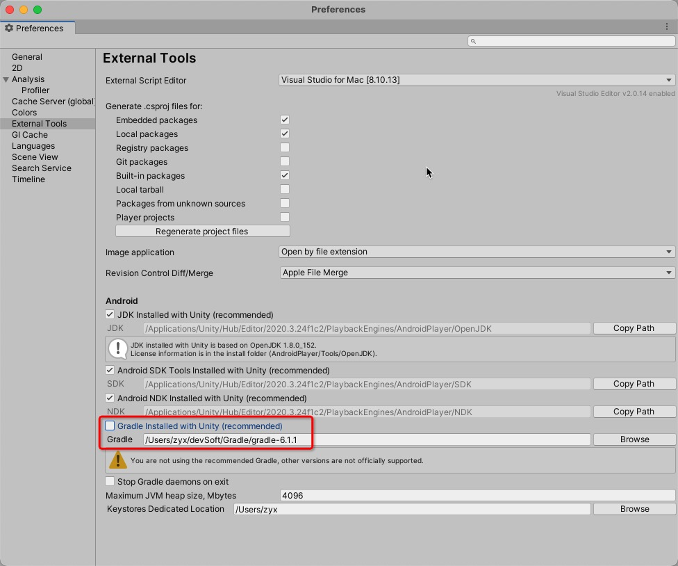

# Unity Integration

## Prerequisites
* MAS supports Unity LTS versions from 2018 and above
* To deploy to Android, you need to target API 21+
* To deploy to iOS, you need to use Xcode 13+
* To build on iOS, you need to use Cocoapods 1.10.0+
* Please make sure to check the Sample `/Assets/Yodo1/MAS/Sample` to aid your integration</br>

## The Integration Steps

### 1. Download the Correct Unity Plugin

MAS provides 3 versions of the Unity plugin, and you need to select one depending on your game:

* If your game is a part of Google Play’s “Designed for Families” program, you will need to use the Family SDK in order to comply with the program’s requirements.
* If your game is not part of the “Designed for Families Program”, please use the Standard SDK.
* If your game prefers to use the 4 top ad networks to keep the SDK lightweight without making significant compromises on Monetization, please use the Lite SDK.

[Designed For Families](https://mas-artifacts.yodo1.com/4.8.2/Unity/Release/Rivendell-4.8.2-Family.unitypackage)

[Standard MAS Plugin](https://mas-artifacts.yodo1.com/4.8.2/Unity/Release/Rivendell-4.8.2-Full.unitypackage)

[Lightweight MAS Plugin](https://mas-artifacts.yodo1.com/4.8.2/Unity/Release/Rivendell-4.8.2-Lite.unitypackage)

### Note:
If you are use unity **2018**,please check on the Custom Gradle Template through the following steps:

File -> Build Setting -> Player Settings -> Publishing Settings -> Build as below
<center class="half">
     
</center>


### 2. Integrate the SDK Into Your Project
Open your Unity project and import the Unity package. Double click the compressed package icon. The files will populate automatically as illustrated below.

<center class="half">
     
</center>

**Important!** The MAS Unity Plugin is built for Android & iOS platforms. Please run your projects on an Android or iOS device to test ads when the integration is completed.

### 3. Enter Application Information
> MAS provides a configuration wizard for Unity to quickly configure application information. You can access it through `Assets/Yodo1/MAS Settings`.

<center class="half">
     
</center>

You will need to take the app key (generated in the game submission process) and add it into the configuration fields. You will also need to use the Admob ID generated by the MAS Dashboard.

#### 3.1 Set Android Configuration

<center class="half">
     
</center>

**Important!** Invalid AdMob AppID will cause a crash, please make sure to fetch the AdMob App ID from MAS dashboard

#### 3.2 Set iOS Configuration

<center class="half">
     
</center>

**Important!** Invalid AdMob AppID will cause a crash, please make sure to fetch the AdMob App ID from MAS dashboard

### 4. Support AndroidX
#### 4.1 Look for and click on "Settings" under "Assets".

<center class="half">
     
</center>

#### 4.2 Select `Use Jetifier`.

<center class="half">
     
</center>

#### 4.3 Force Resolve

Do the force resolve as below
<center class="half">
     
</center>

If force resolve succeeded, you will see the result as the following screenshot
<center class="half">
     
</center>

### 5. Support Android 12

Unity 2020.3.15 and above / 2021.1.16 and above can ignore the following settings. Lower versions require the following settings


- Modify the gradle version used by Unity to 6.1.1 or above, you can get the gradle versions from [here](https://services.gradle.org/distributions/)

<center class="half">
     
</center>

### 6. Comply With Necessary Legal Frameworks
Please comply with all legal frameworks that apply to your game and its users. You can find information on compliance through these links:

* [GDPR](privacy-gdpr.md)
* [COPPA](privacy-coppa.md)
* [CCPA](privacy-ccpa.md)

If you’re using MAS 4.3.0+, you can enable the built-in privacy compliance dialog in the SDK to collect user information:


1.Enable (Please call before initialization)

```c#
    Yodo1AdBuildConfig config = new Yodo1AdBuildConfig()
        .enableUserPrivacyDialog(true); // default value is false
    Yodo1U3dMas.SetAdBuildConfig(config);
```

2.Custom user agreement

```c#
    Yodo1AdBuildConfig config = new Yodo1AdBuildConfig()
        .enableUserPrivacyDialog(true)
        .userAgreementUrl("Your user agreement url");
    Yodo1U3dMas.SetAdBuildConfig(config);
```

3.Custom privacy policy
 
```c#
    Yodo1AdBuildConfig config = new Yodo1AdBuildConfig()
        .enableUserPrivacyDialog(true)
        .privacyPolicyUrl("Your privacy policy url");
    Yodo1U3dMas.SetAdBuildConfig(config);
```
4.Custom The age verification pop up (optional)

```c#
Yodo1MasUserPrivacyConfig userPrivacyConfig = new Yodo1MasUserPrivacyConfig()
    .titleBackgroundColor(Color.green)
    .titleTextColor(Color.blue)
    .contentBackgroundColor(Color.black)
    .contentTextColor(Color.white)
    .buttonBackgroundColor(Color.red)
    .buttonTextColor(Color.green);

Yodo1AdBuildConfig config = new Yodo1AdBuildConfig()
    .enableUserPrivacyDialog(true)
    .userPrivacyConfig(userPrivacyConfig);

Yodo1U3dMas.SetAdBuildConfig(config);
```

<font color=red>IMPORTANT!</font> Failure to comply with these frameworks can lead the Apple App Store and/or Google Play Store rejecting your game, as well as a negative impact of your game's monetization.

5.Get user age and ATT status (optional)

```c#
int age = Yodo1U3dMas.GetUserAge();

int attStatus = Yodo1U3dMas.GetAttrackingStatus();
switch(attStatus) {
    case Yodo1U3dAttrackingStatus.NotDetermined: break;
    case Yodo1U3dAttrackingStatus.Restricted: break;
    case Yodo1U3dAttrackingStatus.Denied: break;
    case Yodo1U3dAttrackingStatus.Authorized: break;
    case Yodo1U3dAttrackingStatus.SystemLow: break;
}
```

<font color=red>IMPORTANT!</font> `GetUserAge()` and `GetAttrackingStatus()` must be called after the SDK is initialized. `GetAttrackingStatus()` only works on iOS platform

### 7. Initialize the SDK

#### 7.1 Using namespace

```c#
using Yodo1.MAS;
```

#### 7.2 Sets the initialization delegate method
```c#
Yodo1U3dMasCallback.OnSdkInitializedEvent += (success, error) =>{
    if (success)
    {
    }
};
    
```

#### 7.3 SDK initialization is called in the `Start` method

```c#
void Start()  {
	Yodo1U3dMas.InitializeMasSdk();
}
```

### 8. Proguard
> If you don't need to use Proguard to obfuscate the code, please ignore this item.


If you need to use Proguard to obfuscate the code, make sure you don't obfuscate the SDK code. 

1) Please open the custom Proguard file as illustrated below 


2) Add the following code to your ProGuard file such as `Proguard-user.txt` in the path 
`/Assets/Plugins/Android/`

```
-ignorewarnings
-keeppackagenames com.yodo1.**
-keep class com.yodo1.** { *; }
-keep class com.yodo1.mas.** { *; }
-keep class com.yodo1.mas.ads.** {*;}
-keep class com.yodo1.mas.error.** { *; }
-keep class com.yodo1.mas.event.** { *; }
-keep class com.yodo1.mas.banner.** { *; }
-keep public class * extends com.yodo1.mas.mediation.Yodo1MasAdapterBase

-keep class com.google.ads.** { *; }

-keepclassmembers class com.ironsource.sdk.controller.IronSourceWebView$JSInterface {
public *;
}
-keepclassmembers class * implements android.os.Parcelable {
public static final android.os.Parcelable$Creator *;
}
-keep public class com.google.android.gms.ads.** {
public *;
}
-keep class com.ironsource.adapters.** {
*;
}
-dontwarn com.ironsource.mediationsdk.**
-dontwarn com.ironsource.adapters.**
-dontwarn com.moat.**
-keep class com.moat.** { public protected private *; }

-keepattributes SourceFile,LineNumberTable
-keepattributes JavascriptInterface
-keep class android.webkit.JavascriptInterface {
*;
}
-keep class com.unity3d.ads.** {
*;
}
-keep class com.unity3d.services.** {
*;
}
-dontwarn com.google.ar.core.**
-dontwarn com.unity3d.services.**
-dontwarn com.ironsource.adapters.unityads.**
-keepattributes Signature,InnerClasses,Exceptions,Annotation
-keep public class com.applovin.sdk.AppLovinSdk{
*;
}
-keep public class com.applovin.sdk.AppLovin* {
public protected *;
}
-keep public class com.applovin.nativeAds.AppLovin* {
public protected *;
}
-keep public class com.applovin.adview.* {
public protected *;
}
-keep public class com.applovin.mediation.* {
public protected *;
}
-keep public class com.applovin.mediation.ads.* {
public protected *;
}
-keep public class com.applovin.impl.*.AppLovin {
public protected *;
}
-keep public class com.applovin.impl.**.*Impl {
public protected *;
}
-keepclassmembers class com.applovin.sdk.AppLovinSdkSettings {
private java.util.Map localSettings;
}
-keep class com.applovin.mediation.adapters.** {
*;
}
-keep class com.applovin.mediation.adapter.**{
*;
}
-keep class com.chartboost.** {
*;
}
-dontwarn com.facebook.ads.internal.**
-keeppackagenames com.facebook.*
-keep public class com.facebook.ads.** {public protected *;}
-keep class com.tapjoy.** { *;}
-keep class com.moat.** { *;}
-keepattributes JavascriptInterface
-keepattributes *Annotation*
-keep class * extends java.util.ListResourceBundle {
protected Object[][] getContents();
}
-keep public class com.google.android.gms.common.internal.safeparcel.SafeParcelable {
public static final *** NULL;
}
-keepnames @com.google.android.gms.common.annotation.KeepName class * -keepclassmembernames class * {
@com.google.android.gms.common.annotation.KeepName *;
}
-keepnames class * implements android.os.Parcelable {
public static final ** CREATOR;
}
-keep class com.google.android.gms.ads.identifier.** { *;}
-dontwarn com.tapjoy.**

-keep class com.vungle.warren.** { *;}
-dontwarn com.vungle.warren.error.VungleError$ErrorCode
-keep class com.moat.** { *;}
-dontwarn com.moat.**
-dontwarn org.codehaus.mojo.animal_sniffer.IgnoreJRERequirement
-dontwarn okio.**
-dontwarn retrofit2.Platform$Java8
-keepattributes Signature
-keepattributes *Annotation*
-dontwarn sun.misc.**
-keep class com.google.gson.examples.android.model.** { *;}
-keep class * implements com.google.gson.TypeAdapterFactory
-keep class * implements com.google.gson.JsonSerializer
-keep class * implements com.google.gson.JsonDeserializer
-keep class com.google.android.gms.internal.** { *;}
-dontwarn com.google.android.gms.ads.identifier.**

-keepattributes SourceFile,LineNumberTable

-keep class com.my.target.** {*;}

-keep class com.yandex.mobile.ads.** {*;}
-dontwarn com.yandex.mobile.ads.**

-keepattributes *Annotation*

-keep public class com.bytedance.sdk.openadsdk.*{ public *;}

-dontwarn com.tencent.bugly.**
-keep public class com.tencent.bugly.**{*;}

-dontwarn com.sensorsdata.analytics.android.**
-keep class com.sensorsdata.analytics.android.** {
*;
}

-keep class com.yodo1.sensor.** {
*;
}

-keep class **.R$* {
<fields>;
}
-keep public class * extends android.content.ContentProvider
-keepnames class * extends android.view.View

-keep class * extends android.app.Fragment {
public void setUserVisibleHint(boolean);
public void onHiddenChanged(boolean);
public void onResume();
public void onPause();
}
-keep class android.support.v4.app.Fragment {
public void setUserVisibleHint(boolean);
public void onHiddenChanged(boolean);
public void onResume();
public void onPause();
}
-keep class * extends android.support.v4.app.Fragment {
public void setUserVisibleHint(boolean);
public void onHiddenChanged(boolean);
public void onResume();
public void onPause();
}

-dontwarn org.json.**
-keep class org.json.**{*;}

-keep public class com.bytedance.sdk.openadsdk.*{
public *;
}
-keepattributes SourceFile,LineNumberTable
-keep class com.inmobi.** {
*;
}
-keep public class com.google.android.gms.**
-dontwarn com.google.android.gms.**
-dontwarn com.squareup.picasso.**
-keep class com.google.android.gms.ads.identifier.AdvertisingIdClient{
public *;
}
-keep class com.google.android.gms.ads.identifier.AdvertisingIdClient$Info{
public *;
}
# skip the Picasso library classes
-keep class com.squareup.picasso.** {*;}
-dontwarn com.squareup.okhttp.**
# skip Moat classes
-keep class com.moat.** {*;}
-dontwarn com.moat.**
# skip IAB classes
-keep class com.iab.** {*;}
-dontwarn com.iab.**

-keep class com.umeng.** {*;}

-keep class com.uc.** {*;}

-keepclassmembers class * {
public <init> (org.json.JSONObject);
}
-keepclassmembers enum * {
public static **[] values();
public static ** valueOf(java.lang.String);
}
-keep class com.zui.** {*;}
-keep class com.miui.** {*;}
-keep class com.heytap.** {*;}
-keep class a.** {*;}
-keep class com.vivo.** {*;}

-keep class com.uc.crashsdk.** { *; }
-keep interface com.uc.crashsdk.** { *; } 

-keep class com.alibaba.sdk.android.**{*;}
-keep class com.ut.**{*;}
-keep class com.ta.**{*;}
```

## Banner Integration
### 1. Set the banner ad delegate method
```c#
private void InitializeBannerAds()
{
	// Add Events
    Yodo1U3dMasCallback.Banner.OnAdOpenedEvent += OnBannerAdOpenedEvent;
    Yodo1U3dMasCallback.Banner.OnAdClosedEvent += OnBannerAdClosedEvent;
    Yodo1U3dMasCallback.Banner.OnAdErrorEvent += OnBannerAdErrorEvent;

    Yodo1U3dMas.ShowBannerAd();
}

private void OnBannerAdErrorEvent(Yodo1U3dAdError adError)
{
    Debug.Log("[Yodo1 Mas] Banner ad error - " + adError.ToString());
}

private void OnBannerAdOpenedEvent()
{
    Debug.Log("[Yodo1 Mas] Banner ad opened");
}

private void OnBannerAdClosedEvent()
{
    Debug.Log("[Yodo1 Mas] Banner ad closed");
}
```

### 2. Show banner ad

The method using the default parameters, align: `Yodo1U3dBannerAlign.BannerBottom | Yodo1U3dBannerAlign.BannerHorizontalCenter` and offset(X: 0,Y: 0)

```c#
Yodo1U3dMas.ShowBannerAd();
```

### 3. Set Banner Position

You can choose the banner position (bottom or top) by creating an in variable in the following way:

```c#
//for banner on bottom
int align = Yodo1U3dBannerAlign.BannerBottom; 
//for banner on top
int align = Yodo1U3dBannerAlign.BannerTop; 

Yodo1U3dMas.ShowBannerAd(align);
```

### 4. Set Banner Offset

You can customize the banner offset for avoid notch or camera holes for example using the next code:

```c#
int align = Yodo1U3dBannerAlign.BannerTop | Yodo1U3dBannerAlign.BannerHorizontalCenter;
int offsetX = 10; // offsetX > 0, the banner will move to the right. offsetX < 0, the banner will move to the left. if align = Yodo1Mas.BannerLeft, offsetX < 0 is invalid (Only Android)
int offsetY = 10; // offsetY > 0, the banner will move to the bottom. offsetY < 0, the banner will move to the top. if align = Yodo1Mas.BannerTop, offsetY < 0 is invalid(Only Android)
Yodo1U3dMas.ShowBannerAd(align, offsetX, offsetY);
```

### 5. Dismiss banner ad
```c#
Yodo1U3dMas.DismissBannerAd();

bool destroy = false; // if destroy == true, the ads displayed in the next call to showBanner are different. if destroy == false, the ads displayed in the next call to showBanner are same
Yodo1U3dMas.DismissBannerAd(destroy);
```

### 6. Create a Banner Placement
Simply add the placement name as a string after the positioning and offset.

```c#
Yodo1U3dMas.ShowBannerAd("Placement_Name");
```

## Banner(V2) Integration

### 1. Create a Yodo1U3dBannerAdView

The first step toward displaying a banner is to create a **Yodo1U3dBannerAdView** object in a C# script attached to a GameObject.

```c#
using System;
using UnityEngine;
using Yodo1.MAS;
...
public class BannerSampleV2 : MonoBehaviour
{
    private Yodo1U3dBannerAdView bannerAdView;
    ...
    public void Start()
    {
        // Initialize the MAS SDK.
        Yodo1U3dMasCallback.OnSdkInitializedEvent += (success, error) =>{ };
        Yodo1U3dMas.InitializeMasSdk();
		
        this.RequestBanner();
    }

    private void RequestBanner()
    {
        // Create a 320x50 banner at top of the screen
        bannerAdView = new Yodo1U3dBannerAdView(Yodo1U3dBannerAdSize.Banner, Yodo1U3dBannerAdPosition.BannerTop | Yodo1U3dBannerAdPosition.BannerHorizontalCenter);
    }
}
```

The constructor for a `Yodo1U3dBannerAdView` has the following parameters:

* `Yodo1U3dBannerAdSize` - The MAS ad size you'd like to use.
* `Yodo1U3dBannerAdPosition` - The position where the banner ad should be placed. The `Yodo1U3dBannerAdPosition` enum lists the valid ad position values.

### 2. (Optional) Custom ad position
For greater control over where a `Yodo1U3dBannerAdView` is placed on screen than what's offered by `Yodo1U3dBannerAdPosition` values, use the `Yodo1U3dBannerAdView` constructor that has x- and y-coordinates as parameters:

```c#
// Create a 320x50 banner ad at coordinate (0,50) on screen.
bannerAdView = new Yodo1U3dBannerAdView(Yodo1U3dBannerAdSize.Banner, 0, 50);
```

The top-left corner of the `Yodo1U3dBannerAdView` will be positioned at the x and y values passed to the constructor, where the origin is the top-left of the screen.

### 3. Load an ad

Once the BannerView is instantiated, the next step is to load an ad. That's done with the loadAd() method in the BannerView class.

Here's an example that shows how to load an ad:

```c#
...
    private void RequestBanner()
    {
        // Create a 320x50 banner at top of the screen
        bannerAdView = new Yodo1U3dBannerAdView(Yodo1U3dBannerAdSize.Banner, Yodo1U3dBannerAdPosition.BannerTop | Yodo1U3dBannerAdPosition.BannerHorizontalCenter);

        // Load banner ads, the banner ad will be displayed automatically after loaded
        bannerAdView.LoadAd();
    }
...
```

That's it! Your app is now ready to display banner ads from MAS.

### 4. Ad events

To further customize the behavior of your ad, you can hook into a number of events in the ad's lifecycle: loading, opening, closing, and so on.

```c#
...
using System;
using UnityEngine;
using Yodo1.MAS;
...
public class BannerSampleV2 : MonoBehaviour
{
    private Yodo1U3dBannerAdView bannerAdView;

    public void Start()
    {
        // Initialize the MAS SDK.
        Yodo1U3dMasCallback.OnSdkInitializedEvent += (success, error) =>{ };
        Yodo1U3dMas.InitializeMasSdk();
		
        this.RequestBanner();
    }

    private void RequestBanner()
    {
		  // Clean up banner before reusing
        if (bannerAdView != null)
        {
            bannerAdView.Destroy();
        }

    	 // Create a 320x50 banner at top of the screen
        bannerAdView = new Yodo1U3dBannerAdView(Yodo1U3dBannerAdSize.Banner, Yodo1U3dBannerAdPosition.BannerTop | Yodo1U3dBannerAdPosition.BannerHorizontalCenter);

		 // Ad Events
        bannerAdView.OnAdLoadedEvent += OnBannerAdLoadedEvent;
        bannerAdView.OnAdFailedToLoadEvent += OnBannerAdFailedToLoadEvent;
        bannerAdView.OnAdOpenedEvent += OnBannerAdOpenedEvent;
        bannerAdView.OnAdFailedToOpenEvent += OnBannerAdFailedToOpenEvent;
        bannerAdView.OnAdClosedEvent += OnBannerAdClosedEvent;

        // Load banner ads, the banner ad will be displayed automatically after loaded
        bannerAdView.LoadAd();
    }

    private void OnBannerAdLoadedEvent(Yodo1U3dBannerAdView adView)
    {
        // Banner ad is ready to be shown.
        Debug.Log("[Yodo1 Mas] OnBannerAdLoadedEvent event received");
    }

    private void OnBannerAdFailedToLoadEvent(Yodo1U3dBannerAdView adView, Yodo1U3dAdError adError)
    {
        Debug.Log("[Yodo1 Mas] OnBannerAdFailedToLoadEvent event received with error: " + adError.ToString());
    }

    private void OnBannerAdOpenedEvent(Yodo1U3dBannerAdView adView)
    {
        Debug.Log("[Yodo1 Mas] OnBannerAdOpenedEvent event received");
    }

    private void OnBannerAdFailedToOpenEvent(Yodo1U3dBannerAdView adView, Yodo1U3dAdError adError)
    {
        Debug.Log("[Yodo1 Mas] OnBannerAdFailedToOpenEvent event received with error: " + adError.ToString());
    }

    private void OnBannerAdClosedEvent(Yodo1U3dBannerAdView adView)
    {
        Debug.Log("[Yodo1 Mas] OnBannerAdClosedEvent event received");
    }
}
```

### 5. Clean up banner ads

When you are finished with a BannerView, make sure to call the Destroy() method before dropping your reference to it:

```c#
bannerAdView.Destroy();
bannerAdView = null;
```

### 6. Create a Banner Placement

Simply add the placement name as a string in the parentheses.

```c#
bannerAdView.SetAdPlacement("Placement_Name")
```

## Interstitial Integration
### 1. Set the interstitial ad delegate method
```c#
private void InitializeInterstitialAds()
{
	// Add Events
    Yodo1U3dMasCallback.Interstitial.OnAdLoadedEvent += OnInterstitialAdLoadedEvent;
    Yodo1U3dMasCallback.Interstitial.OnAdLoadFailedEvent += OnInterstitialAdLoadFailedEvent;
    Yodo1U3dMasCallback.Interstitial.OnAdOpenedEvent += OnInterstitialAdOpenedEvent;
    Yodo1U3dMasCallback.Interstitial.OnAdOpenFailedEvent += OnInterstitialAdOpenFailedEvent;
    Yodo1U3dMasCallback.Interstitial.OnAdClosedEvent += OnInterstitialAdClosedEvent;
}

private void OnInterstitialAdLoadedEvent() 
{
    Debug.Log("[Yodo1 Mas] Interstitial ad loaded");
}

private void OnInterstitialAdLoadFailedEvent(Yodo1U3dAdError adError) 
{
    Debug.Log("[Yodo1 Mas] Interstitial ad load error - " + adError.ToString());
}

private void OnInterstitialAdOpenedEvent()
{
    Debug.Log("[Yodo1 Mas] Interstitial ad opened");
}

private void OnInterstitialAdOpenFailedEvent(Yodo1U3dAdError adError) 
{
    Debug.Log("[Yodo1 Mas] Interstitial ad open error - " + adError.ToString());
}

private void OnInterstitialAdClosedEvent()
{
    Debug.Log("[Yodo1 Mas] Interstitial ad closed");
}
```

### 2. Check Interstitial Ad Loading Status

```c#
bool isLoaded = Yodo1U3dMas.IsInterstitialAdLoaded();
```

### 3. Show Interstitial Ads

```c#
Yodo1U3dMas.ShowInterstitialAd();
```

### 4. Create a Interstitial Placement

Simply add the placement name as a string in the parentheses.

```c#
Yodo1U3dMas.ShowInterstitialAd("Placement_Name");
```

## Interstitial(V2) Integration

### 1. Create a Yodo1U3dInterstitialAd

The first step toward displaying a Interstitial is to create a **Yodo1U3dInterstitialAd** object in a C# script attached to a GameObject.

```c#
using System;
using UnityEngine;
using Yodo1.MAS;
...
public class InterstitialSampleV2 : MonoBehaviour
{
    private Yodo1U3dInterstitialAd interstitialAd;
    ...
    public void Start()
    {
        // Initialize the MAS SDK.
        Yodo1U3dMasCallback.OnSdkInitializedEvent += (success, error) =>{ };
        Yodo1U3dMas.InitializeMasSdk();
		
        this.RequestInterstitial();
    }

    private void RequestInterstitial()
    {
        interstitialAd = Yodo1U3dInterstitialAd.GetInstance();
        interstitialAd.autoDelayIfLoadFail = true; // If LoadAd method is called in AdLoadFailed callback, there are chances of this function getting called continuously which might lead to ANRs or other errors. So we recommend that you retry with exponentially higher delays, up to a maximum delay. You can use the below boolean variable to turn on ad load retrying exponentially with higher delays from 2 seconds to 32 seconds. By default, this variable will be false. If this variable is enabled, then the AdFailedToLoad callback will be triggered with the above mentioned delays. 
    }
}
```

### 2. Load an ad

Once the Yodo1U3dInterstitialAd is instantiated, the next step is to load an ad. That's done with the loadAd() method in the Yodo1U3dInterstitialAd class.

Here's an example that shows how to load an ad:

```c#
...
    private void RequestInterstitial()
    {
        interstitialAd = Yodo1U3dInterstitialAd.GetInstance();
        interstitialAd.autoDelayIfLoadFail = true; // If LoadAd method is called in AdLoadFailed callback, there are chances of this function getting called continuously which might lead to ANRs or other errors. So we recommend that you retry with exponentially higher delays, up to a maximum delay. You can use the below boolean variable to turn on ad load retrying exponentially with higher delays from 2 seconds to 32 seconds. By default, this variable will be false. If this variable is enabled, then the AdFailedToLoad callback will be triggered with the above mentioned delays. 
        interstitialAd.LoadAd();
    }
...
```

That's it! Your app is now ready to display interstitial ads from MAS.

### 3. Ad events

To further customize the behavior of your ad, you can hook into a number of events in the ad's lifecycle: loading, opening, closing, and so on.

```c#
...
using System;
using UnityEngine;
using Yodo1.MAS;
...
public class InterstitialSampleV2 : MonoBehaviour
{
    private Yodo1U3dInterstitialAd interstitialAd;

    public void Start()
    {
        // Initialize the MAS SDK.
        Yodo1U3dMasCallback.OnSdkInitializedEvent += (success, error) =>{ };
        Yodo1U3dMas.InitializeMasSdk();
		
        this.RequestInterstitial();
    }

    private void RequestInterstitial()
    {
        interstitialAd = Yodo1U3dInterstitialAd.GetInstance();
        interstitialAd.autoDelayIfLoadFail = true; // If LoadAd method is called in AdLoadFailed callback, there are chances of this function getting called continuously which might lead to ANRs or other errors. So we recommend that you retry with exponentially higher delays, up to a maximum delay. You can use the below boolean variable to turn on ad load retrying exponentially with higher delays from 2 seconds to 32 seconds. By default, this variable will be false. If this variable is enabled, then the AdFailedToLoad callback will be triggered with the above mentioned delays. 

		 // Ad Events
        interstitialAd.OnAdLoadedEvent += OnInterstitialAdLoadedEvent;
        interstitialAd.OnAdLoadFailedEvent += OnInterstitialAdLoadFailedEvent;
        interstitialAd.OnAdOpenedEvent += OnInterstitialAdOpenedEvent;
        interstitialAd.OnAdOpenFailedEvent += OnInterstitialAdOpenFailedEvent;
        interstitialAd.OnAdClosedEvent += OnInterstitialAdClosedEvent;
        interstitialAd.LoadAd();
    }

    private void OnInterstitialAdLoadedEvent(Yodo1U3dInterstitialAd ad)
    {
        ad.ShowAd();
        Debug.Log("[Yodo1 Mas] OnInterstitialAdLoadedEvent event received");
    }

    private void OnInterstitialAdLoadFailedEvent(Yodo1U3dInterstitialAd ad, Yodo1U3dAdError adError)
    {
        Debug.Log("[Yodo1 Mas] OnInterstitialAdLoadFailedEvent event received with error: " + adError.ToString());
    }

    private void OnInterstitialAdOpenedEvent(Yodo1U3dInterstitialAd ad)
    {
        Debug.Log("[Yodo1 Mas] OnInterstitialAdOpenedEvent event received");
    }

    private void OnInterstitialAdOpenFailedEvent(Yodo1U3dInterstitialAd ad, Yodo1U3dAdError adError)
    {
        Debug.Log("[Yodo1 Mas] OnInterstitialAdOpenFailedEvent event received with error: " + adError.ToString());
    }

    private void OnInterstitialAdClosedEvent(Yodo1U3dInterstitialAd ad)
    {
        Debug.Log("[Yodo1 Mas] OnInterstitialAdClosedEvent event received");
    }
}
```

### 4. Create a Interstitial Placement

Simply add the placement name as a string in the parentheses.

```c#
interstitialAd.SetAdPlacement("Placement_Name")
```

## Rewarded Video Ad Integration
### 1. Set the rewarded video ad delegate method
```c#


private void InitializeRewardedAds()
{
	// Add Events
    Yodo1U3dMasCallback.Rewarded.OnAdLoadedEvent += OnRewardedAdLoadedEvent;
    Yodo1U3dMasCallback.Rewarded.OnAdLoadFailedEvent += OnRewardedAdLoadFailedEvent;
    Yodo1U3dMasCallback.Rewarded.OnAdOpenedEvent += OnRewardedAdOpenedEvent;
    Yodo1U3dMasCallback.Rewarded.OnAdOpenFailedEvent += OnRewardedAdOpenFailedEvent;
    Yodo1U3dMasCallback.Rewarded.OnAdClosedEvent += OnRewardedAdClosedEvent;
    Yodo1U3dMasCallback.Rewarded.OnAdReceivedRewardEvent += OnAdReceivedRewardEvent;
}

private void OnRewardedAdLoadedEvent() 
{
    Debug.Log("[Yodo1 Mas] Rewarded ad loaded");
}

private void OnRewardedAdLoadFailedEvent(Yodo1U3dAdError adError) 
{
    Debug.Log("[Yodo1 Mas] Rewarded ad load error - " + adError.ToString());
}

private void OnRewardedAdOpenedEvent()
{
    Debug.Log("[Yodo1 Mas] Rewarded ad opened");
}

private void OnRewardedAdOpenFailedEvent(Yodo1U3dAdError adError) 
{
    Debug.Log("[Yodo1 Mas] Rewarded ad open error - " + adError.ToString());
}

private void OnRewardedAdClosedEvent()
{
    Debug.Log("[Yodo1 Mas] Rewarded ad closed");
}

private void OnAdReceivedRewardEvent()
{
    Debug.Log("[Yodo1 Mas] Rewarded ad received reward");
}
```

### 2. Check Rewarded Video Ad Loading Status
```c#
bool isLoaded = Yodo1U3dMas.IsRewardedAdLoaded();
```

### 3. Show Rewarded Video Ad
```c#
Yodo1U3dMas.ShowRewardedAd();
```

### 4. Create a Rewarded Video Placement

Simply add the placement name as a string into the parentheses.

```c#
Yodo1U3dMas.ShowRewardedAd("Placement_Name");
```

## Rewarded(V2) Integration

### 1. Create a Yodo1U3dRewardedAd

The first step toward displaying a Interstitial is to create a **Yodo1U3dRewardedAd** object in a C# script attached to a GameObject.

```c#
using System;
using UnityEngine;
using Yodo1.MAS;
...
public class RewardSampleV2 : MonoBehaviour
{
    private Yodo1U3dRewardAd rewardAd;
    ...
    public void Start()
    {
        // Initialize the MAS SDK.
        Yodo1U3dMasCallback.OnSdkInitializedEvent += (success, error) =>{ };
        Yodo1U3dMas.InitializeMasSdk();
		
        this.RequestReward();
    }

    private void RequestReward()
    {
        rewardAd = Yodo1U3dRewardAd.GetInstance();
        rewardAd.autoDelayIfLoadFail = true; // If LoadAd method is called in AdLoadFailed callback, there are chances of this function getting called continuously which might lead to ANRs or other errors. So we recommend that you retry with exponentially higher delays, up to a maximum delay. You can use the below boolean variable to turn on ad load retrying exponentially with higher delays from 2 seconds to 32 seconds. By default, this variable will be false. If this variable is enabled, then the AdFailedToLoad callback will be triggered with the above mentioned delays. 
    }
}
```

### 2. Load an ad

Once the `Yodo1U3dRewardAd` is instantiated, the next step is to load an ad. That's done with the loadAd() method in the `Yodo1U3dRewardAd` class.

Here's an example that shows how to load an ad:

```c#
...
    private void RequestReward()
    {
        rewardAd = Yodo1U3dRewardAd.GetInstance();
        rewardAd.autoDelayIfLoadFail = true; // If LoadAd method is called in AdLoadFailed callback, there are chances of this function getting called continuously which might lead to ANRs or other errors. So we recommend that you retry with exponentially higher delays, up to a maximum delay. You can use the below boolean variable to turn on ad load retrying exponentially with higher delays from 2 seconds to 32 seconds. By default, this variable will be false. If this variable is enabled, then the AdFailedToLoad callback will be triggered with the above mentioned delays. 
        rewardAd.LoadAd();
    }
...
```

That's it! Your app is now ready to display reward ads from MAS.

### 3. Ad events

To further customize the behavior of your ad, you can hook into a number of events in the ad's lifecycle: loading, opening, closing, and so on.

```c#
...
using System;
using UnityEngine;
using Yodo1.MAS;
...
public class RewardSampleV2 : MonoBehaviour
{
    private Yodo1U3dRewardAd rewardAd;

    public void Start()
    {
        // Initialize the MAS SDK.
        Yodo1U3dMasCallback.OnSdkInitializedEvent += (success, error) =>{ };
        Yodo1U3dMas.InitializeMasSdk();
		
        this.RequestReward();
    }

    private void RequestReward()
    {
        rewardAd = Yodo1U3dRewardAd.GetInstance();
        rewardAd.autoDelayIfLoadFail = true; // If LoadAd method is called in AdLoadFailed callback, there are chances of this function getting called continuously which might lead to ANRs or other errors. So we recommend that you retry with exponentially higher delays, up to a maximum delay. You can use the below boolean variable to turn on ad load retrying exponentially with higher delays from 2 seconds to 32 seconds. By default, this variable will be false. If this variable is enabled, then the AdFailedToLoad callback will be triggered with the above mentioned delays. 

		 // Ad Events
        rewardAd.OnAdLoadedEvent += OnRewardAdLoadedEvent;
        rewardAd.OnAdLoadFailedEvent += OnRewardAdLoadFailedEvent;
        rewardAd.OnAdOpenedEvent += OnRewardAdOpenedEvent;
        rewardAd.OnAdOpenFailedEvent += OnRewardAdOpenFailedEvent;
        rewardAd.OnAdClosedEvent += OnRewardAdClosedEvent;
        rewardAd.OnAdEarnedEvent += OnRewardAdEarnedEvent;
        rewardAd.LoadAd();
    }

    private void OnRewardAdLoadedEvent(Yodo1U3dRewardAd ad)
    {
        Debug.Log("[Yodo1 Mas] OnRewardAdLoadedEvent event received");
        ad.ShowAd();
    }

    private void OnRewardAdLoadFailedEvent(Yodo1U3dRewardAd ad, Yodo1U3dAdError adError)
    {
        Debug.Log("[Yodo1 Mas] OnRewardAdLoadFailedEvent event received with error: " + adError.ToString());
    }

    private void OnRewardAdOpenedEvent(Yodo1U3dRewardAd ad)
    {
        Debug.Log("[Yodo1 Mas] OnRewardAdOpenedEvent event received");
    }

    private void OnRewardAdOpenFailedEvent(Yodo1U3dRewardAd ad, Yodo1U3dAdError adError)
    {
        Debug.Log("[Yodo1 Mas] OnRewardAdOpenFailedEvent event received with error: " + adError.ToString());
    }

    private void OnRewardAdClosedEvent(Yodo1U3dRewardAd ad)
    {
        Debug.Log("[Yodo1 Mas] OnRewardAdClosedEvent event received");
    }

    private void OnRewardAdEarnedEvent(Yodo1U3dRewardAd ad) 
    {
         Debug.Log("[Yodo1 Mas] OnRewardAdEarnedEvent event received");
    }
}
```

### 4. Create a Reward Placement

Simply add the placement name as a string in the parentheses.

```c#
rewardAd.SetAdPlacement("Placement_Name")
```

## Rewarded Interstitial Integration

### 1. Create a Yodo1U3dRewardedInterstitialAd

The first step toward displaying a Rewarded Interstitial is to create a **Yodo1U3dRewardedInterstitialAd** object in a C# script attached to a GameObject.

```c#
using System;
using UnityEngine;
using Yodo1.MAS;
...
public class RewardedInterstitialSampleV2 : MonoBehaviour
{
    private Yodo1U3dRewardedInterstitialAd rewardedInterstitialAd;
    ...
    public void Start()
    {
        // Initialize the MAS SDK.
        Yodo1U3dMasCallback.OnSdkInitializedEvent += (success, error) =>{ };
        Yodo1U3dMas.InitializeMasSdk();
		
        this.RequestRewardedInterstitial();
    }

    private void RequestRewardedInterstitial()
    {
        rewardedInterstitialAd = Yodo1U3dRewardedInterstitialAd.GetInstance();
        rewardedInterstitialAd.autoDelayIfLoadFail = true; // If LoadAd method is called in AdLoadFailed callback, there are chances of this function getting called continuously which might lead to ANRs or other errors. So we recommend that you retry with exponentially higher delays, up to a maximum delay. You can use the below boolean variable to turn on ad load retrying exponentially with higher delays from 2 seconds to 32 seconds. By default, this variable will be false. If this variable is enabled, then the AdFailedToLoad callback will be triggered with the above mentioned delays. 
    }
}
```

### 2. Load an ad

Once the `Yodo1U3dRewardedInterstitialAd` is instantiated, the next step is to load an ad. That's done with the loadAd() method in the `Yodo1U3dRewardedInterstitialAd` class.

Here's an example that shows how to load an ad:

```c#
...
    private void RequestRewardedInterstitial()
    {
        rewardedInterstitialAd = Yodo1U3dRewardedInterstitialAd.GetInstance();
        rewardedInterstitialAd.autoDelayIfLoadFail = true; // If LoadAd method is called in AdLoadFailed callback, there are chances of this function getting called continuously which might lead to ANRs or other errors. So we recommend that you retry with exponentially higher delays, up to a maximum delay. You can use the below boolean variable to turn on ad load retrying exponentially with higher delays from 2 seconds to 32 seconds. By default, this variable will be false. If this variable is enabled, then the AdFailedToLoad callback will be triggered with the above mentioned delays. 
        rewardedInterstitialAd.LoadAd();
    }
...
```

That's it! Your app is now ready to display rewarded interstitial ads from MAS.

### 3. Ad events

To further customize the behavior of your ad, you can hook into a number of events in the ad's lifecycle: loading, opening, closing, and so on.

```c#
...
using System;
using UnityEngine;
using Yodo1.MAS;
...
public class RewardedInterstitialSampleV2 : MonoBehaviour
{
    private Yodo1U3dRewardedInterstitialAd rewardedInterstitialAd;

    public void Start()
    {
        // Initialize the MAS SDK.
        Yodo1U3dMasCallback.OnSdkInitializedEvent += (success, error) =>{ };
        Yodo1U3dMas.InitializeMasSdk();
		
        this.RequestRewardedInterstitial();
    }

    private void RequestRewardedInterstitial()
    {
        rewardedInterstitialAd = Yodo1U3dRewardedInterstitialAd.GetInstance();
        rewardedInterstitialAd.autoDelayIfLoadFail = true; // If LoadAd method is called in AdLoadFailed callback, there are chances of this function getting called continuously which might lead to ANRs or other errors. So we recommend that you retry with exponentially higher delays, up to a maximum delay. You can use the below boolean variable to turn on ad load retrying exponentially with higher delays from 2 seconds to 32 seconds. By default, this variable will be false. If this variable is enabled, then the AdFailedToLoad callback will be triggered with the above mentioned delays. 

		 // Ad Events
        rewardedInterstitialAd.OnAdLoadedEvent += OnRewardedInterstitialAdLoadedEvent;
        rewardedInterstitialAd.OnAdLoadFailedEvent += OnRewardedInterstitialAdLoadFailedEvent;
        rewardedInterstitialAd.OnAdOpenedEvent += OnRewardedInterstitialAdOpenedEvent;
        rewardedInterstitialAd.OnAdOpenFailedEvent += OnRewardedInterstitialAdOpenFailedEvent;
        rewardedInterstitialAd.OnAdClosedEvent += OnRewardedInterstitialAdClosedEvent;
        rewardedInterstitialAd.OnAdEarnedEvent += OnRewardedInterstitialAdEarnedEvent;
        rewardedInterstitialAd.LoadAd();
    }

    private void OnRewardedInterstitialAdLoadedEvent(Yodo1U3dRewardedInterstitialAd ad)
    {
        Debug.Log("[Yodo1 Mas] OnRewardedInterstitialAdLoadedEvent event received");
        ad.ShowAd();
    }

    private void OnRewardedInterstitialAdLoadFailedEvent(Yodo1U3dRewardedInterstitialAd ad, Yodo1U3dAdError adError)
    {
        Debug.Log("[Yodo1 Mas] OnRewardedInterstitialAdLoadFailedEvent event received with error: " + adError.ToString());
    }

    private void OnRewardedInterstitialAdOpenedEvent(Yodo1U3dRewardedInterstitialAd ad)
    {
        Debug.Log("[Yodo1 Mas] OnRewardedInterstitialAdOpenedEvent event received");
    }

    private void OnRewardedInterstitialAdOpenFailedEvent(Yodo1U3dRewardedInterstitialAd ad, Yodo1U3dAdError adError)
    {
        Debug.Log("[Yodo1 Mas] OnRewardedInterstitialAdOpenFailedEvent event received with error: " + adError.ToString());
    }

    private void OnRewardedInterstitialAdClosedEvent(Yodo1U3dRewardedInterstitialAd ad)
    {
        Debug.Log("[Yodo1 Mas] OnRewardedInterstitialAdClosedEvent event received");
    }

    private void OnRewardedInterstitialAdEarnedEvent(Yodo1U3dRewardedInterstitialAd ad) 
    {
         Debug.Log("[Yodo1 Mas] OnRewardedInterstitialAdEarnedEvent event received");
    }
}
```

### 4. Create a Rewarded Interstitial Placement

Simply add the placement name as a string in the parentheses.

```c#
rewardedInterstitialAd.SetAdPlacement("Placement_Name")
```


## App Open Integration

### 1. Create a Yodo1U3dAppOpenAd

The first step toward displaying a Rewarded Interstitial is to create a **Yodo1U3dAppOpenAd** object in a C# script attached to a GameObject.

```c#
using System;
using UnityEngine;
using Yodo1.MAS;
...
public class AppOpenSampleV2 : MonoBehaviour
{
    private Yodo1U3dAppOpenAd appOpenAd;
    ...
    public void Start()
    {
        // Initialize the MAS SDK.
        Yodo1U3dMasCallback.OnSdkInitializedEvent += (success, error) =>{ };
        Yodo1U3dMas.InitializeMasSdk();
		
        this.RequestAppOpen();
    }

    private void RequestAppOpen()
    {
        appOpenAd = Yodo1U3dAppOpenAd.GetInstance();
        appOpenAd.autoDelayIfLoadFail = true; // If LoadAd method is called in AdLoadFailed callback, there are chances of this function getting called continuously which might lead to ANRs or other errors. So we recommend that you retry with exponentially higher delays, up to a maximum delay. You can use the below boolean variable to turn on ad load retrying exponentially with higher delays from 2 seconds to 32 seconds. By default, this variable will be false. If this variable is enabled, then the AdFailedToLoad callback will be triggered with the above mentioned delays. 
    }
}
```

### 2. Load an ad

Once the `Yodo1U3dAppOpenAd` is instantiated, the next step is to load an ad. That's done with the loadAd() method in the `Yodo1U3dAppOpenAd` class.

Here's an example that shows how to load an ad:

```c#
...
    private void RequestAppOpen()
    {
        appOpenAd = Yodo1U3dAppOpenAd.GetInstance();
        appOpenAd.autoDelayIfLoadFail = true; // If LoadAd method is called in AdLoadFailed callback, there are chances of this function getting called continuously which might lead to ANRs or other errors. So we recommend that you retry with exponentially higher delays, up to a maximum delay. You can use the below boolean variable to turn on ad load retrying exponentially with higher delays from 2 seconds to 32 seconds. By default, this variable will be false. If this variable is enabled, then the AdFailedToLoad callback will be triggered with the above mentioned delays. 
        appOpenAd.LoadAd();
    }
...
```

That's it! Your app is now ready to display app open ads from MAS.

### 3. Ad events

To further customize the behavior of your ad, you can hook into a number of events in the ad's lifecycle: loading, opening, closing, and so on.

```c#
...
using System;
using UnityEngine;
using Yodo1.MAS;
...
public class AppOpenSampleV2 : MonoBehaviour
{
    private Yodo1U3dAppOpenAd appOpenAd;

    public void Start()
    {
        // Initialize the MAS SDK.
        Yodo1U3dMasCallback.OnSdkInitializedEvent += (success, error) =>{ };
        Yodo1U3dMas.InitializeMasSdk();
		
        this.RequestAppOpen();
    }

    private void RequestAppOpen()
    {
        appOpenAd = Yodo1U3dAppOpenAd.GetInstance();
        appOpenAd.autoDelayIfLoadFail = true; // If LoadAd method is called in AdLoadFailed callback, there are chances of this function getting called continuously which might lead to ANRs or other errors. So we recommend that you retry with exponentially higher delays, up to a maximum delay. You can use the below boolean variable to turn on ad load retrying exponentially with higher delays from 2 seconds to 32 seconds. By default, this variable will be false. If this variable is enabled, then the AdFailedToLoad callback will be triggered with the above mentioned delays. 

		 // Ad Events
        appOpenAd.OnAdLoadedEvent += OnAppOpenAdLoadedEvent;
        appOpenAd.OnAdLoadFailedEvent += OnAppOpenAdLoadFailedEvent;
        appOpenAd.OnAdOpenedEvent += OnAppOpenAdOpenedEvent;
        appOpenAd.OnAdOpenFailedEvent += OnAppOpenAdOpenFailedEvent;
        appOpenAd.OnAdClosedEvent += OnAppOpenAdClosedEvent;
        appOpenAd.OnAdEarnedEvent += OnAppOpenAdEarnedEvent;
        appOpenAd.LoadAd();
    }

    private void OnAppOpenAdLoadedEvent(Yodo1U3dAppOpenAd ad)
    {
        Debug.Log("[Yodo1 Mas] OnAppOpenAdLoadedEvent event received");
        ad.ShowAd();
    }

    private void OnAppOpenAdLoadFailedEvent(Yodo1U3dAppOpenAd ad, Yodo1U3dAdError adError)
    {
        Debug.Log("[Yodo1 Mas] OnAppOpenAdLoadFailedEvent event received with error: " + adError.ToString());
    }

    private void OnAppOpenAdOpenedEvent(Yodo1U3dAppOpenAd ad)
    {
        Debug.Log("[Yodo1 Mas] OnAppOpenAdOpenedEvent event received");
    }

    private void OnAppOpenAdOpenFailedEvent(Yodo1U3dAppOpenAd ad, Yodo1U3dAdError adError)
    {
        Debug.Log("[Yodo1 Mas] OnAppOpenAdOpenFailedEvent event received with error: " + adError.ToString());
    }

    private void OnAppOpenAdClosedEvent(Yodo1U3dAppOpenAd ad)
    {
        Debug.Log("[Yodo1 Mas] OnAppOpenAdClosedEvent event received");
    }
}
```

### 4. Create a App Open Placement

Simply add the placement name as a string in the parentheses.

```c#
appOpenAd.SetAdPlacement("Placement_Name")
```

### 5. Cold Starts and Loading Screens
```c#
using System;
using UnityEngine;
using Yodo1.MAS;
...
public class AppOpenSampleV2 : MonoBehaviour
{
    private Yodo1U3dAppOpenAd appOpenAd;
    ...
    public void Start()
    {
        // Initialize the MAS SDK.
        Yodo1U3dMasCallback.OnSdkInitializedEvent += (success, error) =>{ };
        Yodo1U3dMas.InitializeMasSdk();
		
        this.RequestAppOpen();
    }

    private void RequestAppOpen()
    {
        appOpenAd = Yodo1U3dAppOpenAd.GetInstance();
        appOpenAd.autoDelayIfLoadFail = true; // If LoadAd method is called in AdLoadFailed callback, there are chances of this function getting called continuously which might lead to ANRs or other errors. So we recommend that you retry with exponentially higher delays, up to a maximum delay. You can use the below boolean variable to turn on ad load retrying exponentially with higher delays from 2 seconds to 32 seconds. By default, this variable will be false. If this variable is enabled, then the AdFailedToLoad callback will be triggered with the above mentioned delays. 
        
        appOpenAd.OnAdLoadedEvent += OnAppOpenAdLoadedEvent;
        appOpenAd.OnAdLoadFailedEvent += OnAppOpenAdLoadFailedEvent;
        appOpenAd.OnAdOpenedEvent += OnAppOpenAdOpenedEvent;
        appOpenAd.OnAdOpenFailedEvent += OnAppOpenAdOpenFailedEvent;
        appOpenAd.OnAdClosedEvent += OnAppOpenAdClosedEvent;
        appOpenAd.OnAdEarnedEvent += OnAppOpenAdEarnedEvent;
        appOpenAd.LoadAd();
    }

    private void OnApplicationFocus(bool focus)
    {
        if (focus)
        {
            appOpenAd.ShowAd();
        }
    }

    private void OnAppOpenAdLoadedEvent(Yodo1U3dAppOpenAd ad)
    {
        Debug.Log("[Yodo1 Mas] OnAppOpenAdLoadedEvent event received");
    }

    private void OnAppOpenAdLoadFailedEvent(Yodo1U3dAppOpenAd ad, Yodo1U3dAdError adError)
    {
        Debug.Log("[Yodo1 Mas] OnAppOpenAdLoadFailedEvent event received with error: " + adError.ToString());
        ad.LoadAd();
    }

    private void OnAppOpenAdOpenedEvent(Yodo1U3dAppOpenAd ad)
    {
        Debug.Log("[Yodo1 Mas] OnAppOpenAdOpenedEvent event received");
    }

    private void OnAppOpenAdOpenFailedEvent(Yodo1U3dAppOpenAd ad, Yodo1U3dAdError adError)
    {
        Debug.Log("[Yodo1 Mas] OnAppOpenAdOpenFailedEvent event received with error: " + adError.ToString());
        ad.LoadAd();
    }

    private void OnAppOpenAdClosedEvent(Yodo1U3dAppOpenAd ad)
    {
        Debug.Log("[Yodo1 Mas] OnAppOpenAdClosedEvent event received");
        ad.LoadAd();
    }
}
```

## Native Ads Integration

### 1. Create a Yodo1U3dNativeAdView

The first step toward displaying a native is to create a **Yodo1U3dNativeAdView** object in a C# script attached to a GameObject.

```c#
using System;
using UnityEngine;
using Yodo1.MAS;
...
public class NativeSampleV2 : MonoBehaviour
{
    private Yodo1U3dNativeAdView nativeAdView;
    ...
    public void Start()
    {
        // Initialize the MAS SDK.
        Yodo1U3dMasCallback.OnSdkInitializedEvent += (success, error) =>{ };
        Yodo1U3dMas.InitializeMasSdk();
		
        this.RequestNative();
    }

    private void RequestNative()
    {
        // Create a 375x200 native at bottom of the screen
        nativeAdView = new Yodo1U3dNativeAdView(Yodo1U3dNativeAdPosition.NativeHorizontalCenter | Yodo1U3dNativeAdPosition.NativeBottom, 0, 0, 375, 200);

    }
}
```
The constructor for a `Yodo1U3dNativeAdView` has the following parameter:

* `Yodo1U3dNativeAdPosition` - The position where the native ad should be placed. The `Yodo1U3dNativeAdPosition` enum lists the valid ad position values.

### 2. (Optional) Custom ad position
For greater control over where a `Yodo1U3dNativeAdView` is placed on screen than what's offered by `Yodo1U3dNativeAdPosition` values, use the `Yodo1U3dNativeAdView` constructor that has x- and y-coordinates as parameters:

```c#
// Create a 375x200 native ad at coordinate (0,50) on screen.
nativeAdView = new Yodo1U3dNativeAdView(0, 50, 375, 200);
```

The top-left corner of the `Yodo1U3NativeAdView` will be positioned at the x and y values passed to the constructor, where the origin is the top-left of the screen.


### 3. Load an ad

Once the NativeView is instantiated, the next step is to load an ad. That's done with the loadAd() method in the NativeView class.

Here's an example that shows how to load an ad:

```c#
...
    private void RequestNative()
    {
        // Create a 375x200 native at bottom of the screen
        nativeAdView = new Yodo1U3dNativeAdView(Yodo1U3dNativeAdPosition.NativeHorizontalCenter | Yodo1U3dNativeAdPosition.NativeBottom, 0, 0, 375, 200);

        // Load native ads, the native ad will be displayed automatically after loaded
        nativeAdView.LoadAd();
    }
...
```

That's it! Your app is now ready to display native ads from MAS.

### 4. Ad events

To further customize the behavior of your ad, you can hook into a number of events in the ad's lifecycle: loading, opening, closing, and so on.

```c#
...
using System;
using UnityEngine;
using Yodo1.MAS;
...
public class NativeSampleV2 : MonoBehaviour
{
    private Yodo1U3dNativeAdView nativeAdView;

    public void Start()
    {
        // Initialize the MAS SDK.
        Yodo1U3dMasCallback.OnSdkInitializedEvent += (success, error) =>{ };
        Yodo1U3dMas.InitializeMasSdk();
		
        this.RequestNative();
    }

    private void RequestNative()
    {
		  // Clean up native before reusing
        if (nativeAdView != null)
        {
            nativeAdView.Destroy();
        }

    	 // Create a 375x200 native at top of the screen
        nativeAdView = new Yodo1U3dNativeAdView(0, 0 , 375, 200);

		 // Ad Events
        nativeAdView.OnAdLoadedEvent += OnNativeAdLoadedEvent;
        nativeAdView.OnAdFailedToLoadEvent += OnNativeAdFailedToLoadEvent;

        // Load native ads, the native ad will be displayed automatically after loaded
        nativeAdView.LoadAd();
    }

    private void OnNativeAdLoadedEvent(Yodo1U3dNativeAdView adView)
    {
        // Native ad is ready to be shown.
        Debug.Log("[Yodo1 Mas] OnNativeAdLoadedEvent event received");
    }

    private void OnNativeAdFailedToLoadEvent(Yodo1U3dNativeAdView adView, Yodo1U3dAdError adError)
    {
        Debug.Log("[Yodo1 Mas] OnNativeAdFailedToLoadEvent event received with error: " + adError.ToString());
    }
}
```

### 5. Clean up native ads

When you are finished with a NativeView, make sure to call the Destroy() method before dropping your reference to it:

```c#
nativeAdView.Destroy();
nativeAdView = null;
```

### 6. Create a Native Placement

Simply add the placement name as a string in the parentheses.

```c#
nativeAdView.SetAdPlacement("Placement_Name")
```
