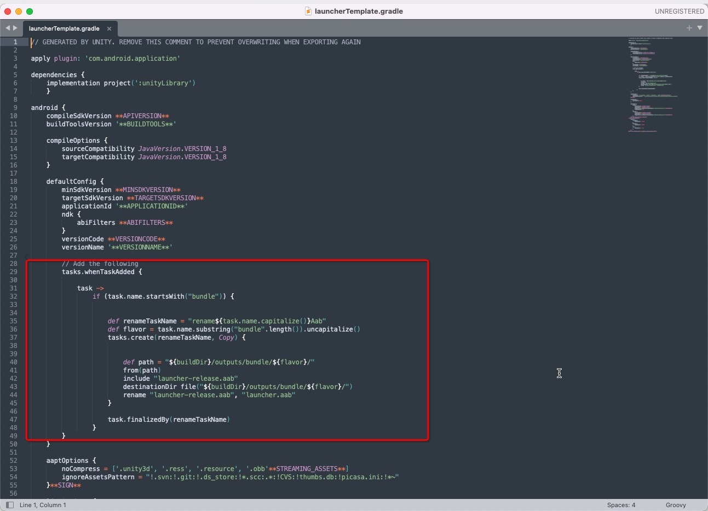

# Known Issues Unity

#### 1. Error compiling aab file
Error information: `FileNotFoundException: Temp/gradleOut/launcher/build/utputs/budle/release/laucher.aab does not exist
`
<center class="half">
     
</center>

The solution is : At launcherTemplate Of defaultConfig The following code has been added 

```
tasks.whenTaskAdded {

    task ->
        if (task.name.startsWith("bundle")) {


            def renameTaskName = "rename${task.name.capitalize()}Aab"
            def flavor = task.name.substring("bundle".length()).uncapitalize()
            tasks.create(renameTaskName, Copy) {


                def path = "${buildDir}/outputs/bundle/${flavor}/"
                from(path)
                include "launcher-release.aab"
                destinationDir file("${buildDir}/outputs/bundle/${flavor}/")
                rename "launcher-release.aab", "launcher.aab"
            }

            task.finalizedBy(renameTaskName)
        }
}
```

<center class="half">
     
</center>