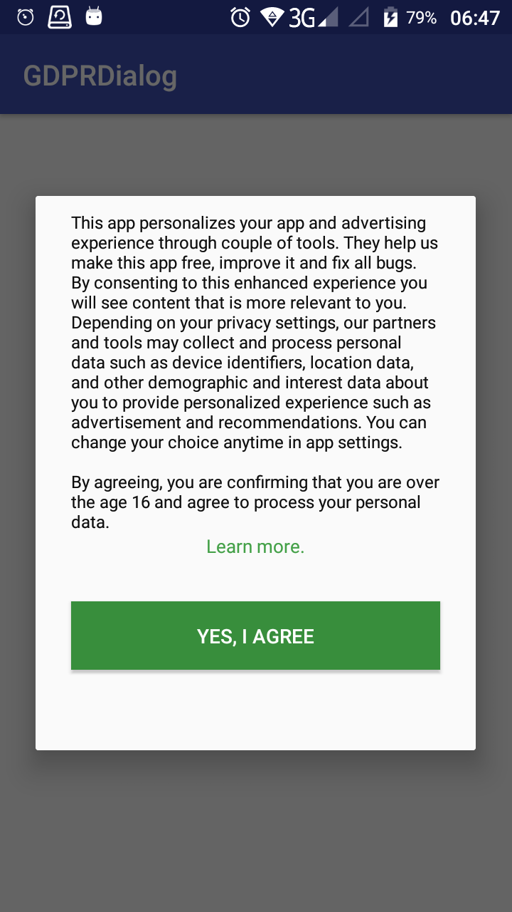

# GDPR
> IMPORTANT! Please add the relevant code below before initializing the MAS SDK.

## 1. What Is GDPR?
The General Data Protection Regulation (GDPR) is a regulation in EU law on data protection and privacy for all individual citizens of the European Union (EU) and the European Economic Area (EEA). For details, check this [article](https://www.zdnet.com/article/gdpr-an-executive-guide-to-what-you-need-to-know/). 

The most important thing to know is in order to be compliant with GDPR, you need to give users in the EU the choice to opt out of data collection for your game, and players under 16 must also opt out of data collection, as they are below the age of consent.

## 2. EEA/GDPR Settings in MAS SDK
If you have EU users, follow the steps below to comply with GDPR.

**1) Determine whether a user is in the EU region**

**2) Create a pop up window that verifies that the user is over 16 and consents to sharing their data.**

<center class="half">
</center>



IMPORTANT! The message depicted above is unnecessarily long. We suggest a shorter version that reads as follows:

“We collect player data and distribute it to third parties to personalize the game experience. This personalization leads to a more engaging, and exciting, game play experience. If you are under the age of 16, or do not consent to having your data shared, you may opt out.“

Please make sure to add two options, one for consenting and one for not consenting.

**3) Get Authorization Result**

If a user indicates consent, use the following methods per engine:

**Unity**

```c#
Yodo1U3dMas.SetGDPR(true);
```

**Android**

```java
Yodo1Mas.getInstance().setGDPR(true);
```

**iOS**

```obj-c
[Yodo1Mas sharedInstance].isGDPRUserConsent = Yes;
```

**If the user doesn't consent, use the following methods per engine.**

**Unity**

```c#
Yodo1U3dMas.SetGDPR(false)
```

**Android**

```java
Yodo1Mas.getInstance().setGDPR(false);
```

**iOS**

```obj-c
[Yodo1Mas sharedInstance].isGDPRUserConsent = NO;
```
