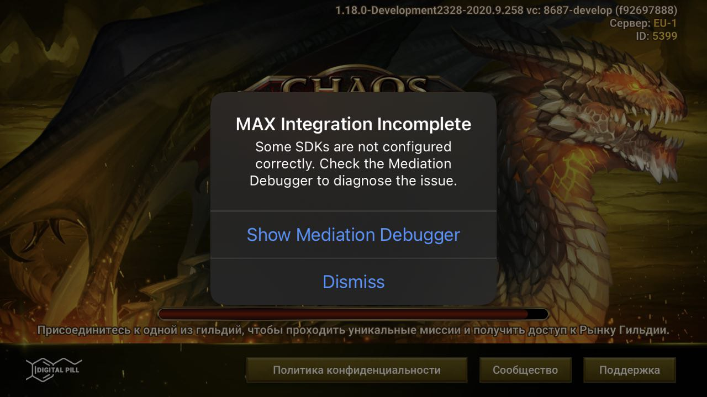

# iOS Questions

## What is the primary cause of errors during compilation?

The cause is most likely a dependency conflict. MAS includes several third party libraries, and you will need to remove duplicates of these libraries elsewhere in your code base. 

## How can pubs address “MAX Integration Incomplete” issue when they upload their app to App store?



This pop-up window is from applovin, which will stop appearing by deleting `NSAllowsArbitraryLoadsInWebContent` from Info.plist. 

## Will integrate with MAS be rejected by Apple because of UIWebView?

No, the MAS SDK does not use UIWebView. To see where UIWebView is used, click [here](https://levelup.gitconnected.com/how-to-find-and-remove-uiwebview-uses-in-your-ios-app-d9395f7baacc).

## How to view the debuglog?
From version 4.8.7 the debug log will be hidden by default. If you want to view the debug log, please add the following elements to the info.plist file

```
<dict>
    <key>EnableDebugLogging</key>
    <true/>
</dict>
```