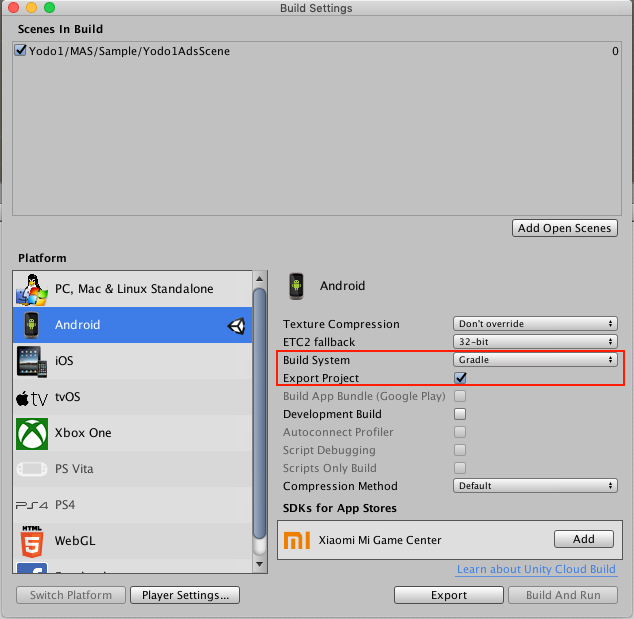

# Unity Questions 

## How to export Android Project from unity?

Exporting a Project is only available when you have selected Gradle as your Build System.

To export the Project:

1. From the Build System drop-down menu, select Gradle.
2. Check the Export Project checkbox. When Export Project is checked, the Build button is relabeled Export and the Build And Run button is disabled.
3. Click the Export button and select a destination folder for the project.

You can also find ways to export Android project from different unity versions from [here](https://docs.unity3d.com/2020.1/Documentation/Manual/android-BuildProcess.html)

> Select the unity version in the top left corner of the page, and find the content `exporting the project` on the right page

