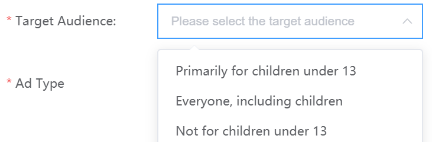
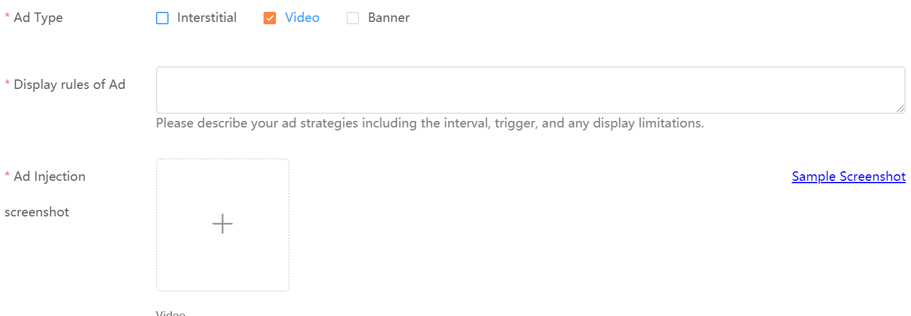
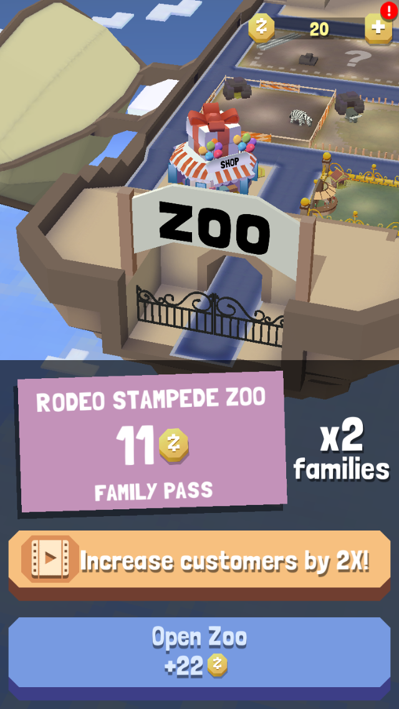
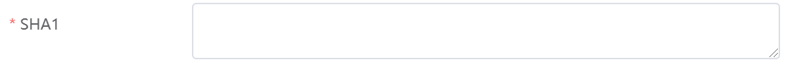

# Additional Steps For Live Games

Video Guide
https://www.loom.com/share/8ca2de905e384c9d83f7ad6095866d29

## Why are There Additional Steps for Live Games?

Though some information is auto-populated because of the app store link, there is other information needed that only exists for live games. These steps are simple, but they have important implications for your ad revenue. See below.

### Step 1: Specifying the Target Audience

In choosing the target audience for your game, you are indicating who the majority of your players are meant to be.

Please carefully select the correct audience. Certain ad networks used in MAS are inappropriate for children under 13, and knowing that your audience is "Primarily for Children under 13" will guarantee the best ad network configuration for MAS.

Also, please note that if your game serves either a general audience or children under 13, you will need to comply with various privacy regulations in different regions. Information on how to do this can be found here.

### Step 2: Providing Details About Your Ad Injection Points

During submission, you'll be asked to provide information about the ads in your game. 

For "Display rules of ads", please provide basic information about how ads work in your game.

For example:
1. How often does a user see a banner, an interstitial ad, or the option to watch a rewarded video? 
2. What causes an ad to show? Sometimes players see an interstitial ad after losing.
3. Are there any limitations to the way ads are displayed? One case of this might height and width limitations for banners.

For "Ad injection screenshot", please search your game for examples of ads being displayed in the game. As you can see in the previous screenshot, "Video" is selected. Here is an example of a screenshot that could be submitted for rewarded video:

     

### Step 3: Adding Your SHA1 (Chinese Android SDK Only)

Your SHA1 is a cryptographic hash that is used as an identifying marker for your games. Certain Ad Networks require your SHA1 to serve ads.

Not sure how to get your SHA1? Here are guides for [Unity](https://www.youtube.com/watch?v=o-I-Eq2fQRg) and [Android](https://medium.com/pen-bold-kiln-press/sha-1-android-studio-ec02fb893e72).

