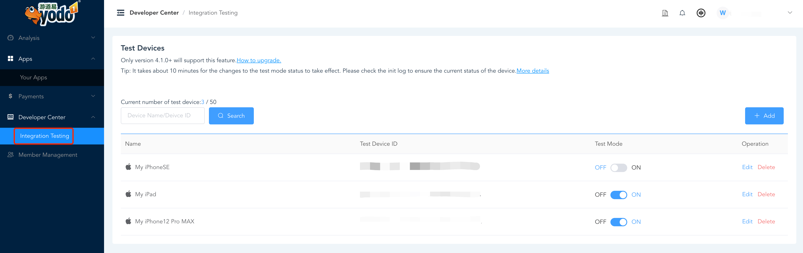
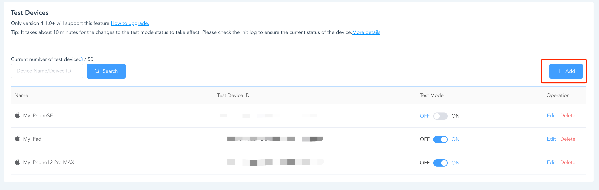
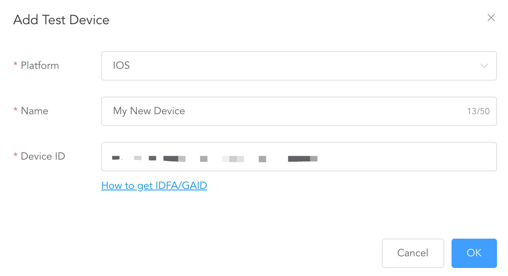
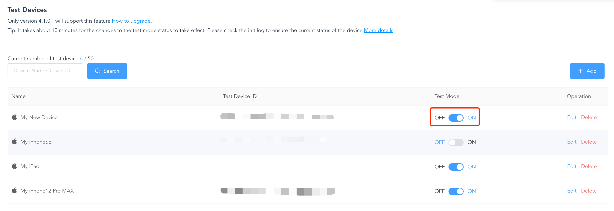

You can set specific devices that will receive test ad content to evaluate and check integration. All your apps can use the test device and you can operate switch to control the display of test ads at any time.

## Test Devices
To use this feature, follow these steps:

### 1.Go to 'Developer Center' and select 'Integration Testing'

### 2.Click '+Add' button to add a new device

### 3.Enter Name and Device ID(IDFA for iOS or GAID for Android)

If you are not sure how to fill in IDFA/GAID please refer [here](test-idfa&gaid.md).

### 4.Once you've successfully added a test device, you will see it on the under list and the Test Mode will set to ON status by default.

## Test Mode
Test mode is a kind of status management for test devices.When the test mode is ON state witch means the test device can receive test ads.you can toggle the state any time.

Once you toggle the state it will take some time(about 10 mins),then you need rebot your app to accept the new state.

About the Test Ads you can read [this](test-idfa&gaid.md). 

### Relationship about Test ads/Test mode/Store status
✅ Test ads will show
❌ Test ads will not show

| **Store Status** | **Test Mode ON** | **Test Mode OFF** |
| --- | --- | --- |
| live | ✅ | ❌ |
| non-live | ✅ | ✅ |

You can also check the logs from the init method to confirm whether the device is a test device(
**Test Device**) and whether receive test ads(**Test Ad**). For details please read [this](test-init-log-helper.md).
