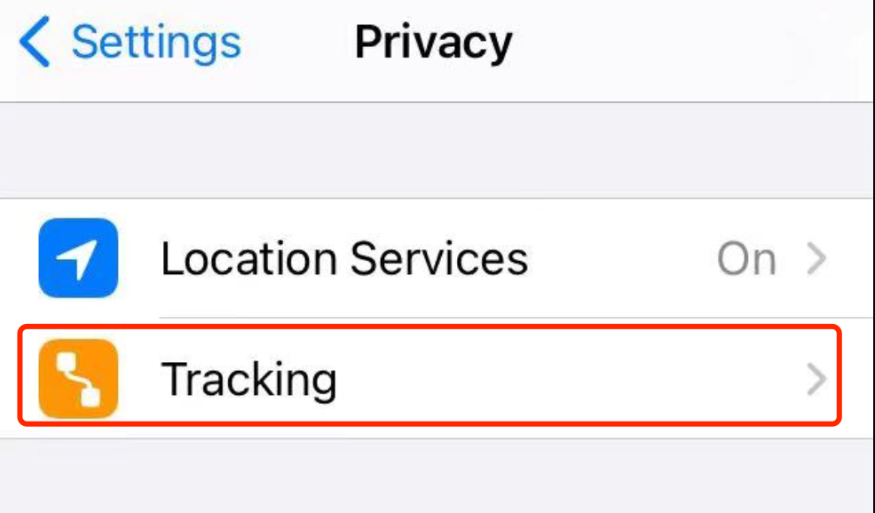

## IDFA for iOS device
Currently, Apple does not surface the IDFA by default on iOS devices.Here are some ways to help you get IDFA.
First you need to confirm the 'Tracking' feature is ON.

### MAS Init Log Helper
The MAS SDK provides an easy way to verify that you’ve successfully integrated.then you can find IDFA through the output. please read [this](test-init-log-helper.md).

### Programmatically
please read [this](https://developer.apple.com/documentation/adsupport/asidentifiermanager).

### IDFA issues on iPhone 12
We noticed that on some iPhone 12 devices the tracking feature is not able to be turned on, resulting in the acquired IDFA will be **000000-0000-0000-0000-000000000000** This is an iOS system bug.
You can still turn it on with the following settings, but this is more dangerous and it is recommended that you back up your device first.

1.Settings

2.Reset

Once reset completed you can turns the 'Tracking' ON.

## GAID for Android devices

### MAS Init Log Helper
please read [this](test-init-log-helper.md).

### Android Device Setting
On Android devices, you can find your GAID in your device settings. Navigate to Settings, click Google, and then Ads

### Programmatically
please read [this](https://developer.android.com/training/articles/ad-id).
