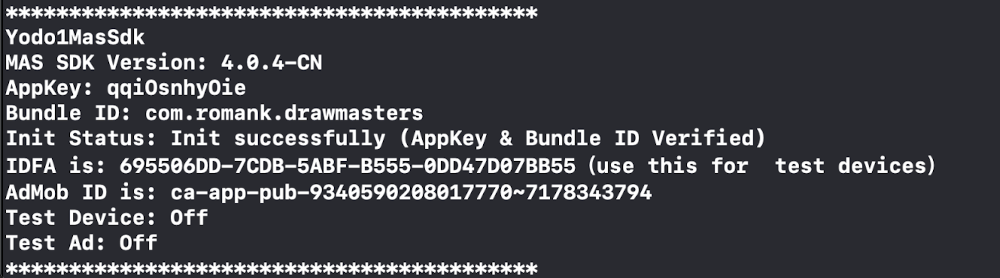

The MAS SDK provides an easy way to verify that you’ve successfully integrated.You only need to pay attention to one thing: the log printing of the initialization method.

💡**Before you start**
The Init Log Helper can only be used with Unity Plugin 4.1.0+.

## Init method and log
When you call the following method and then notice the output.
```csharp
Yodo1U3dMas.InitializeSdk();
```
Output items
| **Item** | **Description** | **Example** |
| --- | --- | --- |
| **MAS SDK Version** | For iOS, there is no special version.
Special version for Android eg: GooglePolicy | iOS: 4.1.0 |
| **AppKey** | If not filled, then display **None (please fill correct AppKey)** | yourappkey |
| **Bundle ID** | Your bundle id | com.companyname.appname |
| **Admob ID** | Your Admob id.
If not filled, then display **None (please fill correct Admob ID)** | ca-app-pub-xxx~xxx |
| **Init Status** | The **AppKey** **Bundle ID** and **Admob ID** will be verified to be correct and match.(
Init successfully/Init failed) | Init successfully (AppKey & Bundle ID & Admob ID Verified) |
| **IDFA is** | Only **iOS** devices print this message.
Only when you allow ATT will it print correctly, if it does not get success it will show **None**. | xxxx-xxx-xx (use this for test devices) |
| **GAID is** | Only **Android** devices print this message | xxxx-xxx-xx (use this for test devices) |
| **Test Device** | Whether the current device is a test device.(On/Off/None)

When **Init Status failed** then print **None**. | On |
| **Test Ad** | Whether the displayed ad is a test ad.(On/Off/None)

When **Init Status failed** then print **None** | On |

Output example:



The init log helper reviews everything you need.You should care about the results that are displayed, where the **Init Status** you should **pay special attention**, if the display **Init failed** please check the ErrorCode.
