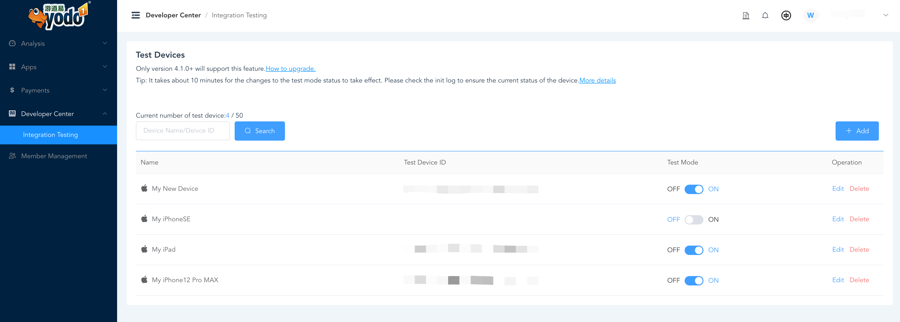

We strongly recommend testing your latest app version on a test device before submitting the final version to the app store.


Here are some tips.
## Use The Init Log Helper
> 💡**Before you start**
> The Init Log Helper can only be used with 4.1.0+.

When your integration is complete, check the log print of the call to the init method. The log format is as follows.
```shell
MAS SDK Version: Android-4.2.0
AppKey: xxxx
Bundle ID: com.yourbundle.id
Admob ID: ca-app-pub-xxx~xxx
Init Status: Init successfully (AppKey & Bundle ID & Admob ID Verified)
GAID is: xxxx-xxx-xxx-xxx
Test Device: On
Test Ad: On
```
For the meaning of each of these items you can read [this](test-init-log-helper.md). 


The most important thing is to check the **Init Status** item.If it prints Init failed, then you should pay attention to the [ErrorCode](error-code.md) printed. 

## Use Test ads to review ads feature
MAS Test Ads for apps facilitates the ad implementation and ad content testing process for developers.

For live app you can test the ads feature by adding test devices.For details, please see [here](test-devices&mode.md). 
> When you add an **non-live app** to your MAS account, it will remain in test ads until you set them to live.

