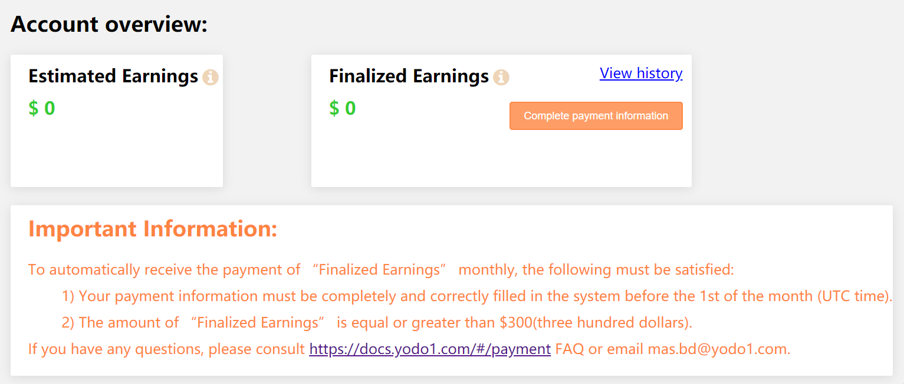

# Receiving Your Payment

## 1. When do I receive my payment?

We issue payment on the 10th of each month, and it takes an average of 2-3 days for you to receive payment, with the longest wait time being 7 days. HOWEVER, there are some conditions that apply to the first payment.

## 2. What conditions apply?

For you to receive your first payment:

1) Payment information must be completely and correctly filled in the system before the 1st of the month.
2) The amount of “Finalized Earnings” is equal or greater than $300 (three hundred US dollars).

## 3. What is the difference between Estimated Earnings and Finalized Earnings?

Estimated Earnings refers to the revenue "Earned but not yet been audited or received", meaning the ad networks have not paid Yodo1 the money to be disbursed to your game.

Finalized earnings refers to revenue "Earned, audited and received.", meaning Yodo1 will pay you this final amount of money. 
