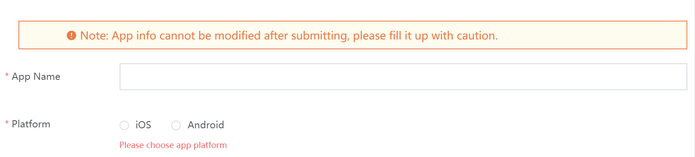
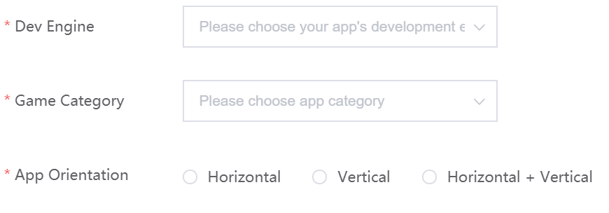
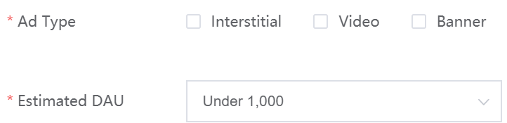
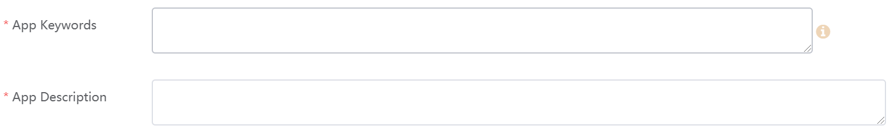

# Main Steps for Submission

Video Guide

https://www.loom.com/share/b318878d2fd447ceb4147c4f54ba6857

## 1. Basic Information

***Note***: These fields will be auto-completed for live games.

Enter the name of your App as it will appear on the Apple App Store or Google Play Store.

**IMPORTANT!** As noted in the picture below, **you can not modify information after submitting**. Please make sure you enter the correct game name.

## 2. Game Set Up Information

Please submit the development engine you are using for your app, the game category, and the app orientation.  

If you do not see your development engine you are using, please choose other.

Please think carefully about the game category and your app orientation. These will impact the monetization strategy MAS uses.

## 3. Advertising Information

Indicate what type of ads your game uses and your estimated DAU. This will prepare our team in advance to help optimize your monetization strategy.

## 4. Search Parameters Information

***Note***: Live games will not need to enter the App Description information.

Enter the app keywords relevant to the game, and the App Description you expect to submit to Google Play or the App Store.

