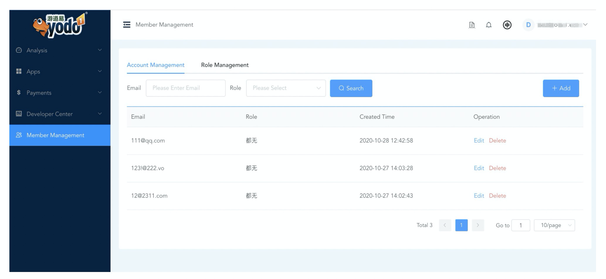
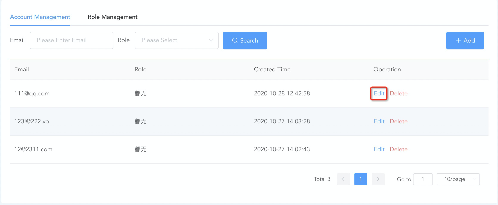
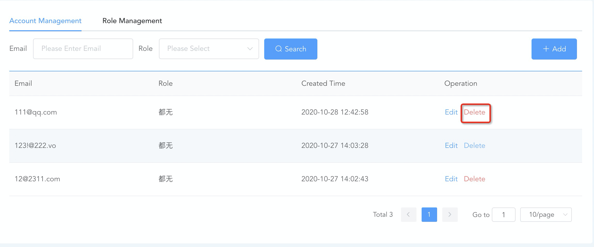
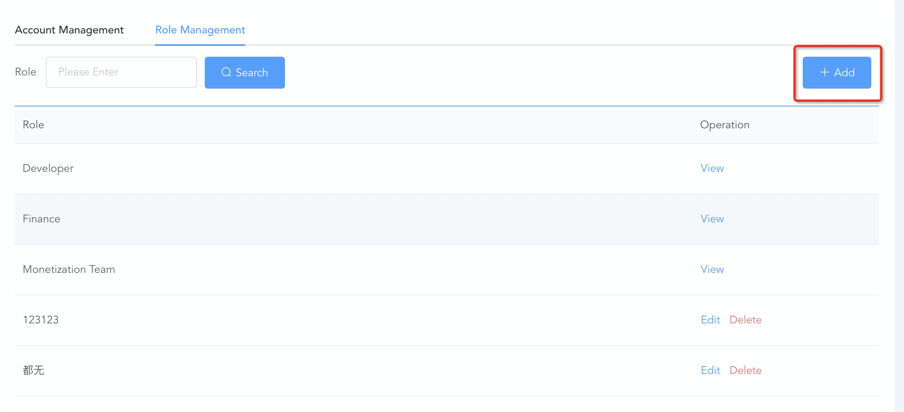
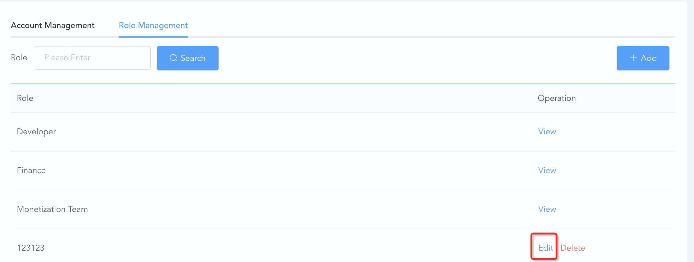
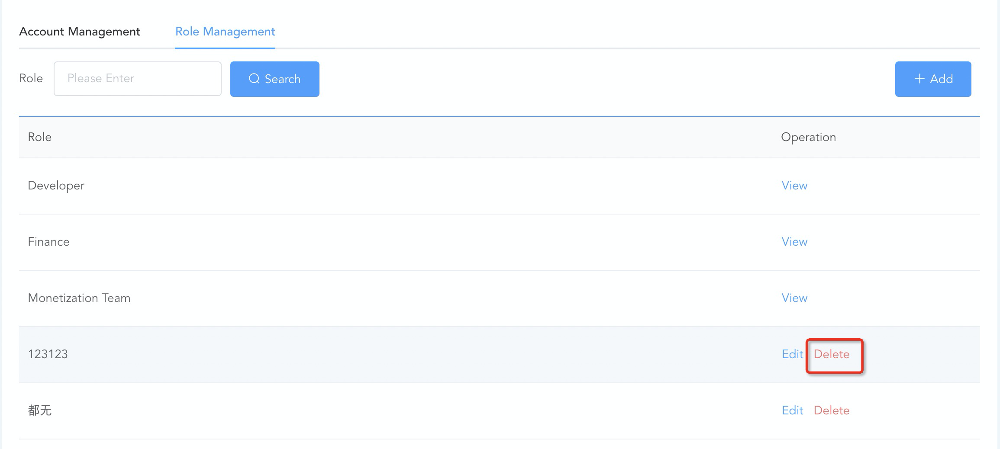

# Member Management

MAS lets you give other members the ability to view and edit your applications
Set it up by following these steps.

## 1. Getting Started

Use the left navigation and select "**Member Management**"

## 2. Add a New Member

Click the "**+Add**" button on the Account Management tab to enter the new page. Provide the following information and click the "OK" button.

* **Enter the sub-account login email.** Note that the added sub-account mailbox cannot be a mailbox registered in MAS.
* **Role settings.** The system offers  three roles by default. Users can add new roles according to business needs.
  * **Admin:** Can perform all page operations on authorized applications;
  * **Finance:** Can authorize the sub-account to edit and view the overview, payment information, and payment history pages under the financial module;
  * **Standard:** Can allow the sub-account to view the account dashboard, Revenue Report, user behavior, and other report rights.
  
**Specify the scope of applications.** All applications are on the left, and authorized applications are on the right. Use the list of all applications to select the one you wish to authorize Click ">" to complete.

## 3. Edit a Member's Permissions
Select an account you want to edit, and click the "Edit" button. The subsequent steps are the same as the ones you need to follow when adding an account.

## 4. Delete a Member

When an account is no longer needed, you can delete it. 
Select the account you want to edit delete, and click the "Delete" button.

## 5. Add a role
When the default role permission configuration does not meet your needs, you can create a new role and assign desired permissions.

Click the **"+ Add"** button under the role management tab to enter a new page. Enter the role name, select the permissions to be assigned (the selected permissions will be highlighted), and click the **"OK"** button.

## 6. Edit a Role's Permission
You may modify permission settings of a role after it is created. The steps to follow are the same as those involved in creating a role.

## 7. Delete a Role
When a role is no longer needed, you can delete it.

* Select the account you want to delete and click the delete button. 
Note: You can't delete a role if it has active users

