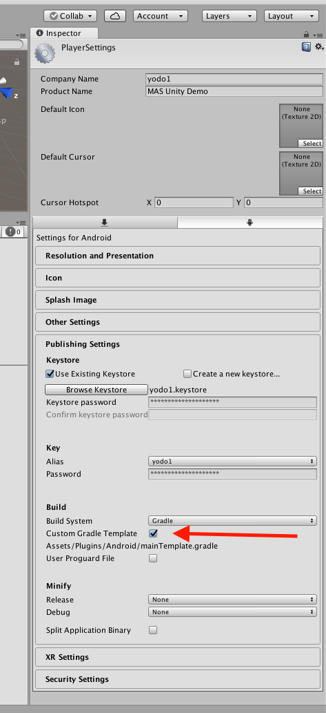

# AdMob Android Manifest Merging Errors

## Unity 2020
默认支持无需特殊设置

## Unity 2019

`File -> Build Setting -> Player Settings -> Publishing Settings -> Build`

如图勾选箭头所指选项，然后打开
`Assets/Plugins/Android/` 下的 `baseProjectTemplate.gradle` 文件，修改里面的 `gradle android` 插件版本 如：3.4.3

然后 `Assets -> External Dependency Manager -> Android Resolver -> Force Resolve`,

再然后修改 Unity 使用的 Gradle 版本，使其与上面修改的 插件版本匹配，如图

## Unity 2018

`File -> Build Setting -> Player Settings -> Publishing Settings -> Build`

如图勾选箭头所指选项，然后打开

`Assets/Plugins/Android/` 下的 `mainTemplate.gradle` 文件，修改里面的 `gradle android` 插件版本 如：3.4.3

然后 `Assets -> External Dependency Manager -> Android Resolver -> Force Resolve`,

再然后修改 Unity 使用的 Gradle 版本，使其与上面修改的 插件版本匹配，如图

## Unity 2017

`File -> Build Setting -> Player Settings -> Publishing Settings -> Build`

如图勾选箭头所指选项，然后打开

`Assets/Plugins/Android/` 下的 `mainTemplate.gradle` 文件，修改里面的 `gradle android` 插件版本 如：3.4.3，

并添加

1.multiDexEnabled true

2.compileOptions {

    sourceCompatibility JavaVersion.VERSION_1_8

    targetCompatibility JavaVersion.VERSION_1_8

}

然后 `Assets -> External Dependency Manager -> Android Resolver -> Force Resolve`
