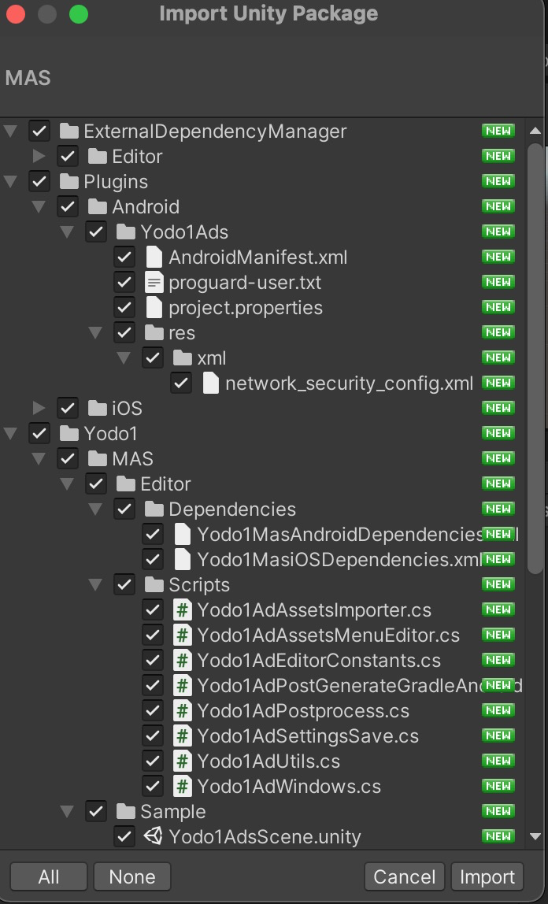
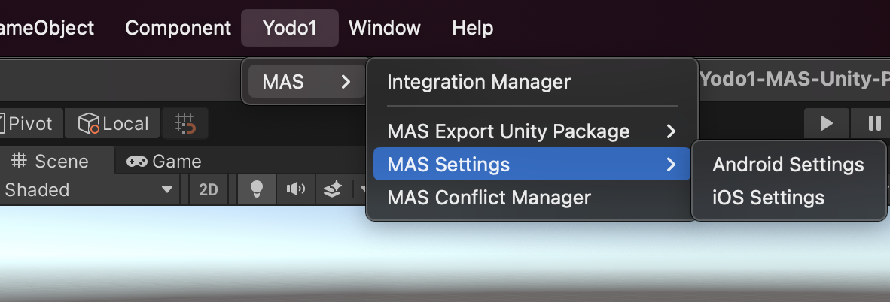

# Unity集成

## 集成步骤

### 1. 下载[Unity插件]()
> * MAS支持Unity 2017.4.37f1+ LTS版本，2018年和2019年通用维护的LTS Unity版本以及以上版本。
> * [Jetifier](https://developer.android.com/jetpack/androidx/releases/jetifier)是Android构建所必需的，可以通过选择 ***Assets > External Dependency Manager > Android Resolver > Settings > Use Jetifier*** 启用
> * CocoaPods是iOS构建所必需的，可以按照[这里](https://guides.cocoapods.org/using/getting-started.html#getting-started)的说明安装。
> * iOS14需要Xcode 12+，请确保你的Xcode是最新的。
> * Unity插件包含示例代码，路径为 ***“/Assets/Yodo1/MAS/Sample”***</br>

### 2. 将SDK集成到项目中
打开你的Unity项目并导入Unity包，双击下载后的Unity插件压缩包图标。文件将自动填充，如下图所示：


### 3. 设置游戏信息
> MAS为Unity提供了一个配置向导来快速配置应用信息，您可以通过 ***"Assets/Yodo1/MAS Settings"*** 打开配置页面。



#### 3.1 设置安卓配置


#### 3.2 设置iOS配置


### 4. 支持AndroidX
#### 4.1 打开下图中的"Settings"，如图：


#### 4.2 勾选"***Use Jetifier***".


### 5. 遵守必要的法律框架(Privacy)
请遵守适用于您的游戏及其用户的所有法律框架。您可以通过这些链接找到相关的法规信息:

* [GDPR]()
* [COPPA]()
* [CCPA]()

<font color=red>重要：</font>不遵守这些框架可能会导致苹果商店或谷歌应用商店拒绝你的游戏，并对你的游戏盈利产生负面影响。

### 6. 初始化SDK
请在应用程序启动时初始化SDK。

```c#
Yodo1U3dMas.InitializeSdk();
```

## 插屏广告
### 1. 设置插屏广告代理方法
```c#
Yodo1U3dMas.SetInterstitialAdDelegate((Yodo1U3dAdEvent adEvent, Yodo1U3dAdError error) => {
    Debug.Log("[Yodo1 Mas] InterstitialAdDelegate:" + adEvent.ToString() + "\n" + error.ToString());
    switch (adEvent)
    {
        case Yodo1U3dAdEvent.AdClosed:
            Debug.Log("[Yodo1 Mas] Interstital ad has been closed.");
            break;
        case Yodo1U3dAdEvent.AdOpened:
            Debug.Log("[Yodo1 Mas] Interstital ad has been shown.");
            break;
        case Yodo1U3dAdEvent.AdError:
            Debug.Log("[Yodo1 Mas] Interstital ad error, " + error.ToString());
            break;
    }
});
```
### 2. 检查插屏广告加载状态
```c#
bool isLoaded = Yodo1U3dMas.IsInterstitialAdLoaded();
```

### 3. 展示插屏广告
```c#
Yodo1U3dMas.ShowInterstitialAd();
```

## 激励视频广告
### 1. 设置激励视频广告代理方法
```c#
Yodo1U3dMas.SetRewardedAdDelegate((Yodo1U3dAdEvent adEvent, Yodo1U3dAdError error) => {
    Debug.Log("[Yodo1 Mas] RewardVideoDelegate:" + adEvent.ToString() + "\n" + error.ToString());
    switch (adEvent)
    {
        case Yodo1U3dAdEvent.AdClosed:
            Debug.Log("[Yodo1 Mas] Reward video ad has been closed.");
            break;
        case Yodo1U3dAdEvent.AdOpened:
            Debug.Log("[Yodo1 Mas] Reward video ad has shown successful.");
            break;
        case Yodo1U3dAdEvent.AdError:
            Debug.Log("[Yodo1 Mas] Reward video ad error, " + error);
            break;
        case Yodo1U3dAdEvent.AdReward:
            Debug.Log("[Yodo1 Mas] Reward video ad reward, give rewards to the player.");
            break;
    }

});
```
### 2. 检查激励视频广告加载状态
```c#
bool isLoaded = Yodo1U3dMas.IsRewardedAdLoaded();
```

### 3. 展示激励视频广告
```c#
Yodo1U3dMas.ShowRewardedAd();
```
## 横幅广告
### 1. 设置横幅广告代理方法
```c#
Yodo1U3dMas.SetBannerAdDelegate((Yodo1U3dAdEvent adEvent, Yodo1U3dAdError error) => {
    Debug.Log("[Yodo1 Mas] BannerdDelegate:" + adEvent.ToString() + "\n" + error.ToString());
    switch (adEvent)
    {
        case Yodo1U3dAdEvent.AdClosed:
            Debug.Log("[Yodo1 Mas] Banner ad has been closed.");
            break;
        case Yodo1U3dAdEvent.AdOpened:
            Debug.Log("[Yodo1 Mas] Banner ad has been shown.");
            break;
        case Yodo1U3dAdEvent.AdError:
            Debug.Log("[Yodo1 Mas] Banner ad error, " + error.ToString());
            break;
    }
});
```
### 2. 检查插屏广告加载状态
```c#
bool isLoaded = Yodo1U3dMas.IsBannerAdLoaded();
```

### 3. 展示横幅广告
```c#
Yodo1U3dMas.ShowBannerAd();
```

## 高级设置
### 广告位
> MAS SDK让你能够设置每个广告单元的放置名称(例如: MainMenu, Upgrade_Level等)。

以下是如何设置插屏广告、奖励广告和横幅广告的示例代码：

**插屏广告**</br>
```c#
Yodo1U3dMas.ShowRewardedAd("MY_INTERSTITIAL_PLACEMENT");
```

**激励视频广告**</br>
```c#
Yodo1U3dMas.ShowInterstitialAd("MY_REWARDED_PLACEMENT");
```

**横幅广告**</br>
```c#
Yodo1U3dMas.ShowBannerAd("MY_BANNER_PLACEMENT");
```

## 更新日志
|  版本   | 发布日期 | 更新内容 |
|  ----  | ------- | ------  |
|           |              |               |
|           |              |               |
