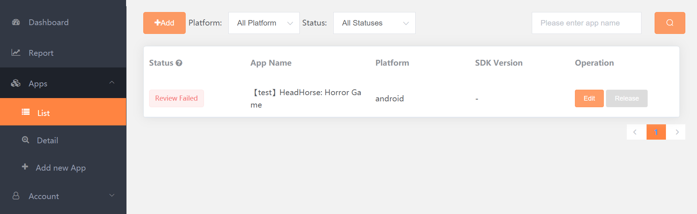

# Key Tasks Checklist

## What is this checklist?

This checklist is designed to make sure you don't miss any steps necessary to make the most revenue possible with MAS. Some tasks don't relate directly to integration, but are vital nonetheless. 

## Task 1: Removing all Ad SDKs

**When?**

At the beginning of integration.

**Why?**

MAS contains the code of several ad SDKs. Removing all other ad SDKs and plugins from your build will eliminate confusing dependency conflicts.

## Task 2: Complying with Privacy Legal Frameworks

**What?**

MAS supports compliance with all major global legal frameworks focused on user data privacy. Please see guides on how to comply with these frameworks. Click here for [COPPA](privacy-coppa.md), here for [CCPA](privacy-ccpa.md), and here for [GDPR](privacy-gdpr.md).

**When?**

The best time to complete this task is during integration. You must add the necessary code to your build before you add the code to initialize the MAS SDK. 

**Why?**

Increasingly, Apple and Google are under pressure to make sure they comply with legal measures taken to protect user privacy. If your game is **played in Europe**, **California**, or is **played by children under 13**, please comply with these frameworks. Failure to do so as a developer may lead to **your games being removed from app stores** or your monetization being negatively impacted.

## Task 3: Submitting Revenue Metrics

**What?**

See [here](submission-revenue-metrics.md) for details.

**When?**

At least 2 days before you release your game integrated with MAS.

**Why?**

Providing your revenue metrics helps Yodo1 optimize the monetization algorithm for your game.

## Task 4: Adding app-ads.txt To Your Game 

**What?**

app-ads.txt is a file created to reduce instances of fraud in the mobile ad industry by making ownership of an app or game clear. Find more information [here](app-ads.md).

**When?**

This file is best added by or before the day you release your game with MAS.

**Why?**

Several ad networks require that you add an app-ads.txt file to your developer website. Without it, you will not receive ad revenue from those networks.

## Task 5: Pressing Release

**What?**

The [MAS Dashboard](https://mas.yodo1.com/) has a button you are required to push to indicate that your game has successfully been released to the Google Play or Apple App Store. 

**When?**

When you submit your game for review by Google Play or the App Store with MAS integrated.

**Why?**

Failure to do so will result in no live ads in your game and thus no ad revenue.

**Where?**

