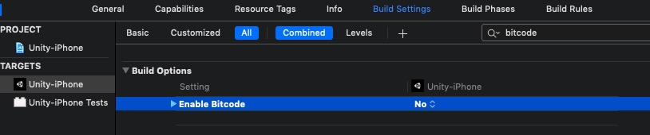

# iOS集成
>* `iOS14`要求`Xcode`版本为`12+`，请务必升级您的`Xcode`版本到`12+`。
>*  `SDK`要求`iOS`的最低版本为`iOS9.0`
>*  最简便的方法就是使用`CocoaPods`, 如果您刚开始接触`CocoaPods`，请参阅其[官方文档](https://guides.cocoapods.org/using/using-cocoapods)，了解如何创建和使用`Podfile`

**重要** 更新MAS Rivendell SDK
- 从较旧的SDK升级到MAS SDK v2，您必须移除所有旧SDK的内容
- 我们对新SDK的接口做出了修改，请仔细参照以下文档进行升级

## 集成步骤
### 1. 将`iOS SDK`添加到项目中
#### 1.1 创建`Podfile`文件</br>
在项目根目录下创建`Podfile`文件
```ruby
touch Podfile
```

#### 1.2 将iOS SDK导入项目</br>
请打开项目的 `Podfile` 文件并将下面代码添加到应用的目标中：

```ruby
source 'https://github.com/Yodo1Games/MAS-Spec.git'
source 'https://github.com/Yodo1Games/Yodo1Spec.git'

pod 'FBSDKCoreKit' # 如果你已经引入FBSDKCoreKit,请忽略
pod 'Yodo1MasSDK', '~> 4.0.0.2'
```

在`终端`中执行如下命令：</br>
```ruby
pod install --repo-update
```

### 2. `Xcode`工程配置
#### 2.1 添加AppLovin SDK Key
请在`Xcode`工程的`Info.plist`中配置`AppLovinSdkKey`
```xml
<key>AppLovinSdkKey</key>
<string>xcGD2fy-GdmiZQapx_kUSy5SMKyLoXBk8RyB5u9MVv34KetGdbl4XrXvAUFy0Qg9scKyVTI0NM4i_yzdXih4XE</string>
```

#### 2.2 `iOS9 App Transport Security`设置
在`iOS9`中，苹果增加了关于`ATS`的控制。为了确保在所有中介网络上不间断地支持MAS广告，需要您在`Info.plist`文件中进行以下设置：

* 添加`NSAppTransportSecurity`，类型为`Dictionary`
* 在`NSAppTransportSecurity`中添加`NSAllowsArbitraryLoads`，类型为`Boolean`，值为`YES`

你也可以直接编辑plist源码(`Open As Source Code`)实现同样的功能，示例如下：
        
``` xml
<key>NSAppTransportSecurity</key> 
<dict> 
    <key>NSAllowsArbitraryLoads</key> 
    <true/> 
</dict>
```

#### 2.3 `iOS14 AppTrackingTransparency`设置
请在`Xcode`工程的`Info.plist`中配置`NSUserTrackingUsageDescription`及描述文案，并对描述文案进行多语言配置。描述文案的多语言配置可以通过如下操作完成：

* 在`XCode`工程中创建名为`InfoPlist.strings`的文件，如图:


* 选中`InfoPlist.string`在`Xcode`的右侧边栏找到`Localization`并点击`Localization`按钮，如图：


* 在`XCode`工程中添加多语言，如图： 


* 将`NSUserTrackingUsageDescription`对应的描述文案添加到InfoPlist.strings(xxx)文件中，如图：


> 此标识符将用于向您发送个性广告
> This identifier will be used to send you personalized ads

#### 2.4 使用`S​​KAdNetwork`跟踪转化
使用`Apple`的转化跟踪`SKAdNetwork`，这意味着即使`IDFA`不可用，广告平台也可以通过这个获取应用安装归因。请参阅`Apple`的`SKAdNetwork`[官方文档](https://developer.apple.com/documentation/storekit/skadnetwork)，以了解更多信息。要启用此功能，您需要在`Info.plist`中添加`SKAdNetworkItems`。

```xml
<key>SKAdNetworkItems</key>
<array>
<dict>
    <key>SKAdNetworkIdentifier</key>
    <string>cstr6suwn9.skadnetwork</string>
</dict>
<dict>
    <key>SKAdNetworkIdentifier</key>
    <string>2u9pt9hc89.skadnetwork</string>
</dict>
<dict>
    <key>SKAdNetworkIdentifier</key>
    <string>4468km3ulz.skadnetwork</string>
</dict>
<dict>
    <key>SKAdNetworkIdentifier</key>
    <string>4fzdc2evr5.skadnetwork</string>
</dict>
<dict>
    <key>SKAdNetworkIdentifier</key>
    <string>7ug5zh24hu.skadnetwork</string>
</dict>
<dict>
    <key>SKAdNetworkIdentifier</key>
    <string>8s468mfl3y.skadnetwork</string>
</dict>
<dict>
    <key>SKAdNetworkIdentifier</key>
    <string>9rd848q2bz.skadnetwork</string>
</dict>
<dict>
    <key>SKAdNetworkIdentifier</key>
    <string>9t245vhmpl.skadnetwork</string>
</dict>
<dict>
    <key>SKAdNetworkIdentifier</key>
    <string>av6w8kgt66.skadnetwork</string>
</dict>
<dict>
    <key>SKAdNetworkIdentifier</key>
    <string>f38h382jlk.skadnetwork</string>
</dict>
<dict>
    <key>SKAdNetworkIdentifier</key>
    <string>hs6bdukanm.skadnetwork</string>
</dict>
<dict>
    <key>SKAdNetworkIdentifier</key>
    <string>kbd757ywx3.skadnetwork</string>
</dict>
<dict>
    <key>SKAdNetworkIdentifier</key>
    <string>ludvb6z3bs.skadnetwork</string>
</dict>
<dict>
    <key>SKAdNetworkIdentifier</key>
    <string>m8dbw4sv7c.skadnetwork</string>
</dict>
<dict>
    <key>SKAdNetworkIdentifier</key>
    <string>mlmmfzh3r3.skadnetwork</string>
</dict>
<dict>
    <key>SKAdNetworkIdentifier</key>
    <string>prcb7njmu6.skadnetwork</string>
</dict>
<dict>
    <key>SKAdNetworkIdentifier</key>
    <string>t38b2kh725.skadnetwork</string>
</dict>
<dict>
    <key>SKAdNetworkIdentifier</key>
    <string>tl55sbb4fm.skadnetwork</string>
</dict>
<dict>
    <key>SKAdNetworkIdentifier</key>
    <string>wzmmz9fp6w.skadnetwork</string>
</dict>
<dict>
    <key>SKAdNetworkIdentifier</key>
    <string>yclnxrl5pm.skadnetwork</string>
</dict>
<dict>
    <key>SKAdNetworkIdentifier</key>
    <string>ydx93a7ass.skadnetwork</string>
</dict>
<dict>
    <key>SKAdNetworkIdentifier</key>
    <string>n38lu8286q.skadnetwork</string>
</dict>
<dict>
    <key>SKAdNetworkIdentifier</key>
    <string>v9wttpbfk9.skadnetwork</string>
</dict>
<dict>
    <key>SKAdNetworkIdentifier</key>
    <string>3sh42y64q3.skadnetwork</string>
</dict>
<dict>
    <key>SKAdNetworkIdentifier</key>
    <string>44jx6755aq.skadnetwork</string>
</dict>
<dict>
    <key>SKAdNetworkIdentifier</key>
    <string>4pfyvq9l8r.skadnetwork</string>
</dict>
<dict>
    <key>SKAdNetworkIdentifier</key>
    <string>5l3tpt7t6e.skadnetwork</string>
</dict>
<dict>
    <key>SKAdNetworkIdentifier</key>
    <string>5lm9lj6jb7.skadnetwork</string>
</dict>
<dict>
    <key>SKAdNetworkIdentifier</key>
    <string>7rz58n8ntl.skadnetwork</string>
</dict>
<dict>
    <key>SKAdNetworkIdentifier</key>
    <string>c6k4g5qg8m.skadnetwork</string>
</dict>
<dict>
    <key>SKAdNetworkIdentifier</key>
    <string>cg4yq2srnc.skadnetwork</string>
</dict>
<dict>
    <key>SKAdNetworkIdentifier</key>
    <string>f73kdq92p3.skadnetwork</string>
</dict>
<dict>
    <key>SKAdNetworkIdentifier</key>
    <string>ggvn48r87g.skadnetwork</string>
</dict>
<dict>
    <key>SKAdNetworkIdentifier</key>
    <string>klf5c3l5u5.skadnetwork</string>
</dict>
<dict>
    <key>SKAdNetworkIdentifier</key>
    <string>p78axxw29g.skadnetwork</string>
</dict>
<dict>
    <key>SKAdNetworkIdentifier</key>
    <string>ppxm28t8ap.skadnetwork</string>
</dict>
<dict>
    <key>SKAdNetworkIdentifier</key>
    <string>uw77j35x4d.skadnetwork</string>
</dict>
<dict>
    <key>SKAdNetworkIdentifier</key>
    <string>v72qych5uu.skadnetwork</string>
</dict>
<dict>
    <key>SKAdNetworkIdentifier</key>
    <string>w9q455wk68.skadnetwork</string>
</dict>
<dict>
    <key>SKAdNetworkIdentifier</key>
    <string>wg4vff78zm.skadnetwork</string>
</dict>
<dict>
    <key>SKAdNetworkIdentifier</key>
    <string>su67r6k2v3.skadnetwork</string>
</dict>
<dict>
    <key>SKAdNetworkIdentifier</key>
    <string>578prtvx9j.skadnetwork</string>
</dict>
<dict>
    <key>SKAdNetworkIdentifier</key>
    <string>ecpz2srf59.skadnetwork</string>
</dict>
<dict>
    <key>SKAdNetworkIdentifier</key>
    <string>22mmun2rn5.skadnetwork</string>
</dict>
<dict>
    <key>SKAdNetworkIdentifier</key>
    <string>238da6jt44.skadnetwork</string>
</dict>
<dict>
    <key>SKAdNetworkIdentifier</key>
    <string>3rd42ekr43.skadnetwork</string>
</dict>
<dict>
    <key>SKAdNetworkIdentifier</key>
    <string>424m5254lk.skadnetwork</string>
</dict>
<dict>
    <key>SKAdNetworkIdentifier</key>
    <string>44n7hlldy6.skadnetwork</string>
</dict>
<dict>
    <key>SKAdNetworkIdentifier</key>
    <string>488r3q3dtq.skadnetwork</string>
</dict>
<dict>
    <key>SKAdNetworkIdentifier</key>
    <string>4dzt52r2t5.skadnetwork</string>
</dict>
<dict>
    <key>SKAdNetworkIdentifier</key>
    <string>5a6flpkh64.skadnetwork</string>
</dict>
<dict>
    <key>SKAdNetworkIdentifier</key>
    <string>bvpn9ufa9b.skadnetwork</string>
</dict>
<dict>
    <key>SKAdNetworkIdentifier</key>
    <string>glqzh8vgby.skadnetwork</string>
</dict>
<dict>
    <key>SKAdNetworkIdentifier</key>
    <string>lr83yxwka7.skadnetwork</string>
</dict>
<dict>
    <key>SKAdNetworkIdentifier</key>
    <string>v79kvwwj4g.skadnetwork</string>
</dict>
<dict>
    <key>SKAdNetworkIdentifier</key>
    <string>zmvfpc5aq8.skadnetwork</string>
</dict>
<dict>
    <key>SKAdNetworkIdentifier</key>
    <string>gta9lk7p23.skadnetwork</string>
</dict>
<dict>
    <key>SKAdNetworkIdentifier</key>
    <string>n9x2a789qt.skadnetwork</string>
</dict>
</array>

```

#### 2.5 禁用`BitCode`
为确保所有中介网络正常工作，请禁用bitcode，如下图所示:


#### 2.6 添加AdMob App ID
* 添加`GADApplicationIdentifier`字段到`Info.plist`文件中，类型为`String`。
* 可以编辑`Info.plist`文件，使用`Open As Source Code`打开文件，并将`GADApplicationIdentifier`添加到文件中。示例:

``` xml
<key>GADApplicationIdentifier</key> 
<string>Your MAS AdMob App ID</string>
```

### 3. 遵守必要的法律框架(Privacy)
请遵守适用于您的游戏及其用户的所有法律框架。您可以通过这些链接找到相关的法规信息:

* [GDPR](privacy-gdpr.md)
* [COPPA](privacy-coppa.md)
* [CCPA](privacy-ccpa.md)

<font color=red>重要：</font>不遵守这些框架可能会导致苹果商店或谷歌应用商店拒绝你的游戏，并对你的游戏盈利产生负面影响。

### 4. 初始化SDK
#### 4.1 导入头文件`Yodo1Mas.h`
``` obj-c
#import <Yodo1MasCore/Yodo1Mas.h>
```

#### 4.2 在 didFinishLaunchingWithOptions 中进行初始化 
``` obj-c
[[Yodo1Mas sharedInstance] initWithAppId:@"你的AppId" successful:^{
    
} fail:^(NSError * _Nonnull error) {
    
}];
```

## 插屏广告集成
### 1. 设置插屏广告代理方法
``` obj-c
[Yodo1Mas sharedInstance].interstitialAdDelegate = self; 

#pragma mark - Interstitial Delegate
- (void)onAdOpened:(Yodo1MasAdEvent *)event {
    
}

- (void)onAdClosed:(Yodo1MasAdEvent *)event {
    
}

- (void)onAdError:(Yodo1MasAdEvent *)event error:(Yodo1MasError *)error {
    
}       
```

### 2. 检查插屏广告加载状态
``` obj-c
BOOL isLoaded = [[Yodo1Mas sharedInstance] isInterstitialAdLoaded];
```

### 3. 展示插屏广告
```obj-c
[[Yodo1Mas sharedInstance] showInterstitialAd];
```

## 激励视频广告集成
### 1. 设置激励视频广告代理方法
``` obj-c
[Yodo1Mas sharedInstance].rewardAdDelegate = self;

#pragma mark - Yodo1MasAdDelegate
- (void)onAdOpened:(Yodo1MasAdEvent *)event {
    
}

- (void)onAdClosed:(Yodo1MasAdEvent *)event {
    
}

- (void)onAdvertError:(Yodo1MasAdEvent *)event error:(Yodo1MasError *)error {
    
}

#pragma mark - Ad Rewarded
- (void)onAdRewardEarned:(Yodo1MasAdEvent *)event {
    
}
```

### 2. 检查激励视频广告加载状态
``` obj-c
BOOL isLoaded = [[Yodo1Mas sharedInstance] isRewardAdLoaded];
```

### 3. 展示激励视频广告
```obj-c
[[Yodo1Mas sharedInstance] showRewardAd]
```

## 横幅广告集成
### 1. 设置横幅广告代理方法
``` obj-c
[Yodo1Mas sharedInstance].bannerAdDelegate = self;

#pragma mark - Yodo1MasAdDelegate
- (void)onAdOpened:(Yodo1MasAdEvent *)event {
    
}

- (void)onAdClosed:(Yodo1MasAdEvent *)event {
    
}

- (void)onAdvertError:(Yodo1MasAdEvent *)event error:(Yodo1MasError *)error {
    
}
```

### 2. 检查插屏广告加载状态
```obj-c
BOOL isLoaded = [[Yodo1Mas sharedInstance] isBannerAdLoaded];
```

### 3. 展示横幅广告
```obj-c
[[Yodo1Mas sharedInstance] showBannerAd];
```

### 4. 关闭横幅广告
```obj-c
[[Yodo1Mas sharedInstance] dismissBannerAd];
```

## 高级设置
### 广告位
> MAS SDK让你能够设置每个广告单元的放置名称(例如: MainMenu, Upgrade_Level等)。

以下是如何设置插屏广告、奖励广告和横幅广告的示例代码：

**插屏广告**</br>
```obj-c
[[Yodo1Mas sharedInstance] showInterstitialAd:@"MY_INTERSTITIAL_PLACEMENT"]
```

**激励视频广告**</br>
```obj-c
[[Yodo1Mas sharedInstance] showRewardAd:@"MY_REWARDED_PLACEMENT"]
```

**横幅广告**</br>
```obj-c
[[Yodo1Mas sharedInstance] showBannerAd:@"MY_BANNER_PLACEMENT"]
```

## 更新日志
|  版本   |  发布日期  | 更新内容 |
|  ----  | ------- | ------  |
|           |              |               |
|           |              |               |


​    
