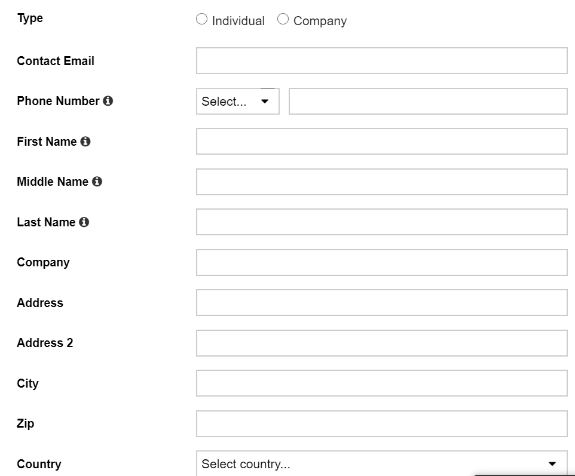
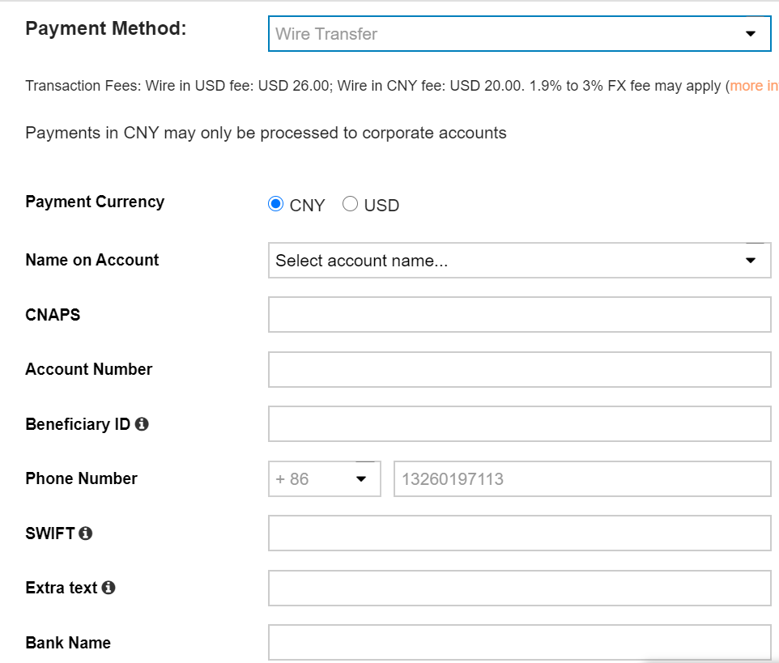

# Submitting Your Payment Information

## 1. What is payment information?

Payment information is the information Yodo1 needs to pay you for your game. We make payments to individuals and companies, so your payment information should correspond to your personal or company information.

## 2. How do I submit my payment information?

Visit mas.yodo1.com and navigate to Payments-> Payment Info

## 3. What information do I need to submit for payments?

### 3.1 Personal/Company Information

Please submit your personal/company information, as depicted below. 

**IMPORTANT!** Please select "Individual" or "Company" based on your situation. In the case of company, First, Middle, and Last name are the contact person at your company.

### 3.2 Choose Your Payment Method

Yodo1 offers three payment methods: 

**Wire Transfer**

Wire transfers are an efficient and effective method of issuing payment. Please be aware that there is a transaction fee for all wire transfers (see below).

**IMPORTANT!** Refer to the "i" text to help you complete the task. For further information, see the FAQ below.

**Paypal**

Yodo1 will gladly issue your payment via Paypal. This is often a great solution for solo developers. To get payment from Paypal, complete the form as depicted below.

**Check**

Checks are a simple method of payment with a lower transaction fee, but they do require a 14 day wait time. Please complete the form as depicted below for payment by check.

## FAQ

### 1. How can I find my SWIFT code?
Please consult this link to access the SWIFT code for your country. https://www.theswiftcodes.com/country/a

### 2. What is "Extra Text" in the Wire Transfer form?
In some countries or regions, banks may require you to submit extra information for Yodo1 to use in order to pay you. Please submit this information here.

### 3. Can I get paid in my local currency?
Yes. However, only with certain payment methods. For best results, we recommend Paypal.
