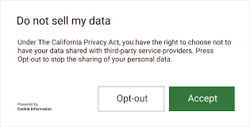

# CCPA

## 1. What is CCPA?

CCPA is a legal framework created by the state of California, in the USA, to protect privacy. Read [this FAQ](https://oag.ca.gov/privacy/ccpa) for details.

## 2. CCPA Compliance With MAS
>*Note: If you do not have a large user base in California, please ignore the information below.*

1) Determine the user's location.

2) Use the location to trigger a message which asks users whether or not they consent to having their data collected. Here is an example, though we suggest changing the wording to better suit your audience.

<center class="half">
     
</center>

3) Use the input to trigger a CCPA compliance method.

If the user has opted out,
>IMPORTANT! Please add the relevant code below BEFORE initializing the MAS SDK.

**Unity**

```c#
Yodo1U3dMas.SetCCPA(true);
```

**Android**

```java
Yodo1Mas.getInstance().setCCPA(true);
```

**iOS**

```obj-c
[Yodo1Mas sharedInstance].isCCPADoNotSell = Yes;
```

If the user has NOT opted out,
>IMPORTANT! Please add the relevant code below BEFORE initializing the MAS SDK.

**Unity**

```c#
Yodo1U3dMas.SetCCPA(false);
```

**Android**

```java
Yodo1Mas.getInstance().setCCPA(false);
```

**iOS**

```obj-c
[Yodo1Mas sharedInstance].isCCPADoNotSell = NO;
```
